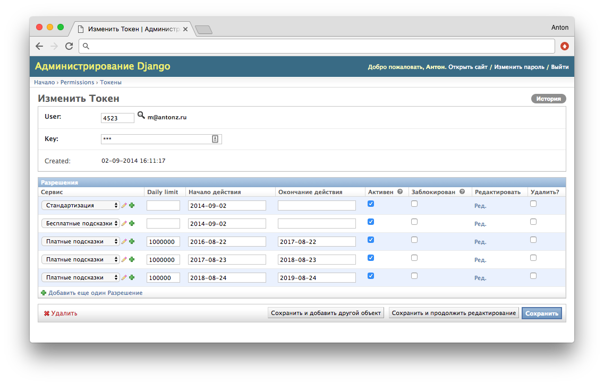

+++
date = 2018-02-21T09:31:05Z
description = "Когда есть универсальная админка."
slug = "admin-ui"
tags = ["interface", "60-sec"]
title = "Когда дизайн не нужен"
subscribe = "dangry"
+++

Я вообще большой поклонник интерфейсов «под задачу». Таких, чтобы удобно закрывали конкретные пользовательские сценарии, а не пытались быть конструкторами под любые требования (чем часто грешат в корпоративном софте).

Но есть одно исключение — админки. Админка — это интерфейс над данными (клиентами, товарами, заказами, любыми объектами предметной области) с базовыми возможностями вроде поиска, фильтрации и редактирования. Работают с админкой исключительно сотрудники бэкофиса: техподдержка, контент-менеджеры, администраторы.

Я за универсальные админки, которые работают «из коробки», вообще без участия дизайнера и разработчика. Да, там иногда приходится поработать напильником, но выигрыш от готового интерфейса колоссальный. А освободившееся время и ресурсы лучше направить на проработку интерфейса для конечных пользователей.

Готовые админки вроде есть под все популярные фреймворки разработки. Самая известная, конечно — Django (Python). Но и других хватает: RailsAdmin (Ruby), Spring Roo и Grails (Java), Play Framework (Scala), KeystoneJS (JavaScript).

Рекомендую.
