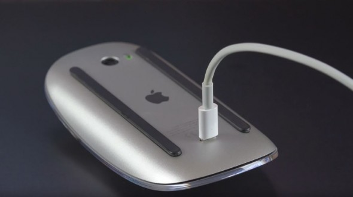

+++
date = 2018-05-16T10:20:09Z
description = "Ничего такого я от Эпла уже не ждал, а вот поди ж ты."
image = "/airpods/cover.png"
slug = "airpods"
tags = ["life"]
title = "Apple и вау-продукты"
+++

После выпуска айпода Эпл постоянно ищет новый вау-продукт — такой, чтобы не просто популярный, а аж дух захватывало.

- Сначала получилось с айфоном.
- Потом не получилась с айпадом — оказалось, что планшеты людям не особо нужны.
- Потом не получилось с макбуком. Эйр не слишком зашёл, а прошки постепенно стали хуже чем были.
- Потом не получилось с часами — тут история как с планшетами.
- Из нового захода на айфон получилось это убожество с ушами, о котором даже говорить неудобно.

<figure>
  
  <figcaption>Картина «Мышь капитулирует перед инженерным гением дизайнеров» // <a href="https://www.geek.com/apple/design-before-function-apple-magic-mouse-2-cant-be-used-while-charging-1636939/">geek.com</a></figcaption>
</figure>

В общем, ничего такого я от Эпла уже не ждал. Пока не попробовал новые наушники — эйрподы, которые похоже на свисающие из ушей сигареты.

И знаете, мне всё равно, на что они похожи. Наушники дико удобные — практически не ощущаются и не ограничивают движения.

Работают как гарнитура — можно вообще только одно ухо вставить, а второе отдать кому-нибудь — получится телеконференция. Раньше я пользовался Plantronics Legend, и при всём уважении к Плантрониксу, эйрподы уделывают его в ноль.

    

Работают с андроидом (когда такое было вообще). Больше того, для счастливых обладателей ведра бонус: двойное постукивание по наушнику работает как play / pause. На айфоне оно по умолчанию вызывает Сири, ха-ха (ещё одна неудавшаяся эпловая поделка).

Для меня Эпл наконец сделали сказочный продукт. Это 🔥

