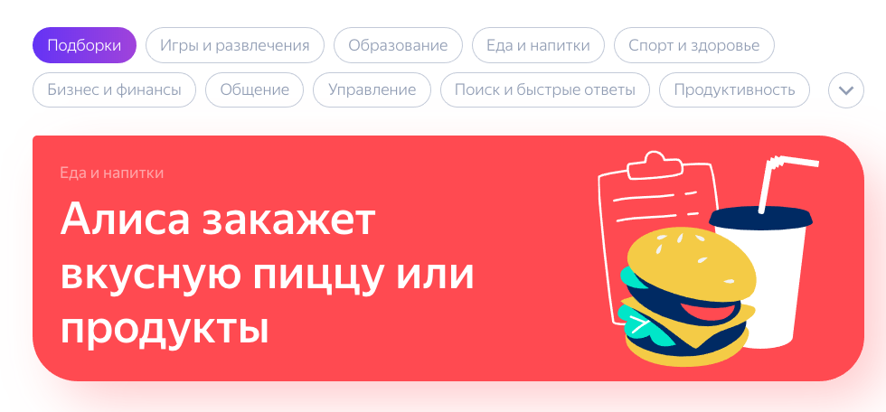
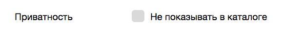
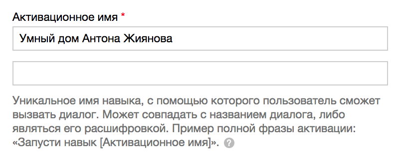

+++
date = 2018-08-22T07:54:27Z
description = "Почему голосового помощника не получится научить хорошему."
image = "/alice/cover.png"
slug = "alice"
tags = ["interface", "development"]
title = "Алиса, всё грустно"
+++

Голосовой помощник Яндекса — «Алиса» — работает на смартфонах, в автомобилях и в Яндекс-станции. Алиса обладает «навыками»: человек спрашивает и командует, Алиса отвечает и выполняет.

Есть стандартные навыки («какая сейчас погода»). Можно делать собственные: «включи свет», «проверь почту», «закажи пропуск». В теории выглядит красиво.

<figure>
  
  <figcaption>У Яндекса целый каталог навыков</figcaption>
</figure>

Я посмотрел, как «нестандартные» навыки работают на практике. Резюме такое, что для «умного» дома или офиса они совсем не годятся.

### 1. Нельзя сделать навык только для себя

Есть как бы «приватные» навыки, но приватность заключается только в том, что они скрыты в каталоге. На самом деле — доступны всем. То есть если создать навык, который проверяет почту и зачитывает письма — изучить ваш почтовый ящик сможет любой, кто услышит, как вы обращаетесь к Алисе.

<figure>
  
  <figcaption>Многообразие настроек приватности</figcaption>
</figure>

Вряд ли кто-то захочет, чтобы другие люди читали его письма, командовали светом в квартире или тем более банковским счётом ツ

Это было бы поправимо, если бы не следующая проблема:

### 2. Нет автоматической авторизации

«Алиса» не умеет отличить человека по голосу или привязать навыки к учётной записи. Если хотите настоящей приватности — реализуйте авторизацию самостоятельно.

А поскольку авторизовать по голосу — задача нетривиальная, скорее всего придётся ограничиться секретным словом и привязкой к устройству. Не слишком удобно в повседневном использовании.

### 3. Нельзя просто так взять и попросить

Нельзя просто сказать «Алиса, включи свет в прихожей». Сначала придётся активировать навык:

> Алиса, запусти навык «умный дом»

И затем уже командовать:

> Включи свет в прихожей
 
Да быстрее самому включить ツ

Но дело ещё хуже. Фраза для активации должна быть глобально уникальной среди всех существующих в мире навыков. То есть «умный дом» не подойдёт, придётся говорить что-то типа такого:

> Алиса, запусти навык «Умный дом Антона Жиянова». Включи свет в прихожей.

<figure>
  
  <figcaption>Фраза для активации, она же «активационное имя», должна быть уникальной</figcaption>
</figure>

И это мне ещё с редкой фамилией повезло. Готовьтесь испытать муки творчества, сравнимые с придумыванием домена или адреса электронной почты.

### 4. На выходе — вахтёр

Новый навык обязательно проходит модерацию, даже если пользоваться им будете только вы. В чате разработчиков говорят, модераторы имеют склонность отклонять навыки, предназначенные для личного использования.

Модерация занимает 1–3 дня.

⌘ ⌘ ⌘

Собственные навыки Яндекс запустил только в этом году, так что со временем проблемы починят, надеюсь. А пока и Алиса, и Станция — больше игрушки, чем реальные помощники.

<em>Заметка из телеграм-канала <i class="far fa-star color-sin"></i> «<a href="https://t.me/dangry">Интерфейсы без шелухи</a>»</em>

