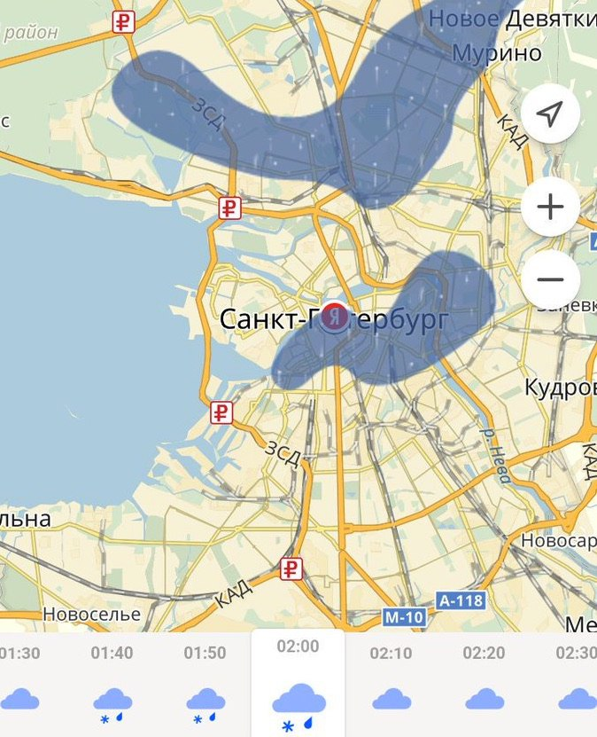

+++
date = 2018-04-11T14:39:00Z
description = "Ничто так не оживляет софт, как перевыполнение ожиданий человека."
slug = "boring-apps"
tags = ["interface", "60-sec"]
title = "Оживляж для скучного приложения"
+++

Алиса Котляренко написала любопытную статью о том, каким должен быть интерфейс у скучных продуктов. Она выделяет такие приёмы: геймификация, анимация, иллюстрация, маскоты, юмор и настроение.

Я не проводил объективных исследований, поэтому могу говорить только за себя. У меня из перечисленного не работает ничего, кроме лёгкого, уместного юмора в интерфейсных текстах. Геймификация — ну такое, анимация и иллюстрации — безразлично, маскоты (aka Скрепыш в Ворде и обезьяна в Мейлчимпе) — раздражают.

Для меня самое классное в скучном продукте — когда он неожиданно обнаруживает человечность или делает чуть больше, чем я ожидал.

Например, есть Яндекс.Погода (что может быть скучнее). Ну там всё как у всех: погода сейчас, на ближайшие часы, красивая графика, аккуратная анимация. Но есть фишка, которая греет душу — «карта осадков».

<figure>
  
  <figcaption>Перемещаешься во времени и видишь, как дождь двигается по карте города. Мегаполезная штука, которую не ожидаешь увидеть, а она есть.</figcaption>
</figure>

Вот это круто. А ачивки и ужимки с животными — да ну нафиг.

Читатели «интерфейсов без шелухи» согласны, вот результаты опроса:

<em>Что лучше всего работает для вас?</em>

Превосходит ожидания – 453 
👍👍👍👍👍👍👍 64%

Настроение в тексте – 110 
👍👍 16%

Анимация и графика – 104 
👍👍 15%

Геймификация – 24 
▫️ 3%

Маскоты – 14 
▫️ 2%

[Статья Алисы](https://www.smashingmagazine.com/2018/04/designing-emotional-interfaces-boring-apps/)

<em>Заметка из телеграм-канала <i class="fa fa-star-o color-sin"></i> «<a href="tg://resolve?domain=dangry">Интерфейсы без шелухи</a>»</em>

