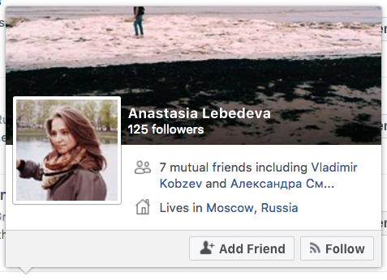
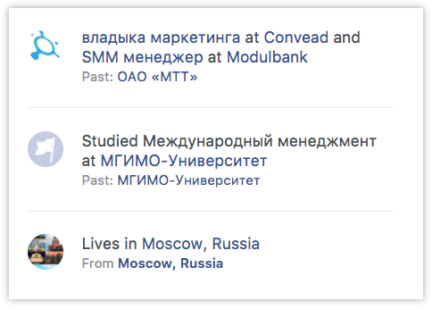

+++
date = 2018-04-28T10:18:34Z
description = "Тупо запилить заголовок, аватарку и кнопку действия — недостаточно"
image = "/cards/cover.png"
slug = "cards"
tags = ["interface", "60-sec"]
title = "Карточки в интерфейсе"
+++

Карточки помогают компактно показать сложный объект:

<figure>
  
  <figcaption>Карточка статьи на Медиуме</figcaption>
</figure>

Понятно, что в компактном представлении все характеристики объекта не покажешь. Поэтому грамотные дизайнеры подбирают содержимое карточки под сценарий использования. Например, для Медиума это:

- иллюстрация (привлечь внимание);
- заголовок (понять, о чём статья);
- аватарка и имя автора (заинтересовать, если автор знаком читателю);
- количество аплодисментов (социальное доказательство ценности);
- время чтения (принять решение: читать сейчас, добавить в закладки или вовсе не читать).

У Фейсбука на первый взгляд тоже всё хорошо:

<figure>
  
  <figcaption>Карточка пользователя Фейсбука</figcaption>
</figure>

Но не очень:

- Чуть ли не на самом выигрышном месте — количество фолловеров (что это? зачем? почему не написать там про общих друзей?)
- Непонятно, кем и где человек работает (мешает узнать малознакомого человека или заинтересоваться незнакомым)

Отсутствие информации о работе — это прямо провал. При этом фейсбук умеет компактно показывать место работы:

<figure>
  
  <figcaption>Владыка маркетинга в Convead и SMM менеджер в Modulbank В прошлом: ОАО «МТТ»</figcaption>
</figure>

Но на карточке почему-то не пишет ¯\\_(ツ)\_/¯

⌘ ⌘ ⌘

Если формулировать правила для содержимого карточки, я бы предложил такие:

1. Хорошая карточка отвечает на главные вопросы пользователя в этой точке сценария использования.
2. И помогает разработчику достичь бизнес-целей (увеличить конверсию, вовлечение, виральность и т.п.)

<em>Заметка из телеграм-канала <i class="fa fa-star-o color-sin"></i> «<a href="tg://resolve?domain=dangry">Интерфейсы без шелухи</a>»</em>

