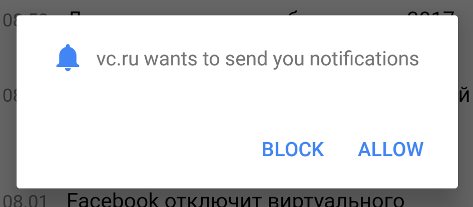

+++
date = 2018-01-12T08:41:33Z
description = "Как блестящие умы из команды Хрома улучшили пуш-оповещения."
image = "/chrome-push/cover.png"
slug = "chrome-push"
tags = ["interface", "60-sec"]
title = "Пуш-оповещения и гении из Гугла"
+++

Люди терпеть не могут пуш-оповещения на сайтах. Но когда те же самые люди делают собственные сайты, что-то у них в мозгу щёлкает и они обязательно добавляют запрос на нотификации, непременно на главную страницу.

Когда-то Хром (самый популярный браузер, на Андроиде работает по умолчанию) показывал такие запросы в маленькой всплывашке, которая не особо мешала работать с сайтом.

Потом команда Хрома исследовала вопрос и обнаружила: 90% запросов на пуш-оповещения люди игнорируют.

Какой вывод из этого сделал бы рядовой обыватель:

> Пуш-оповещения никому не нужны, давайте их отключим.

Какой вывод сделала команда блестящих инженеров и дизайнеров Гугла:
> Несчастные ублюдки не в состоянии заметить нашу маленькую всплывашку. Ну так мы им поможем, мухахахахаха.

С тех пор Хром показывает запрос на пуш-оповещения в модальном окне, которое блокирует работу, пока человек не выберет — разрешить или нет.

<figure>
  
</figure>

Гениально.

