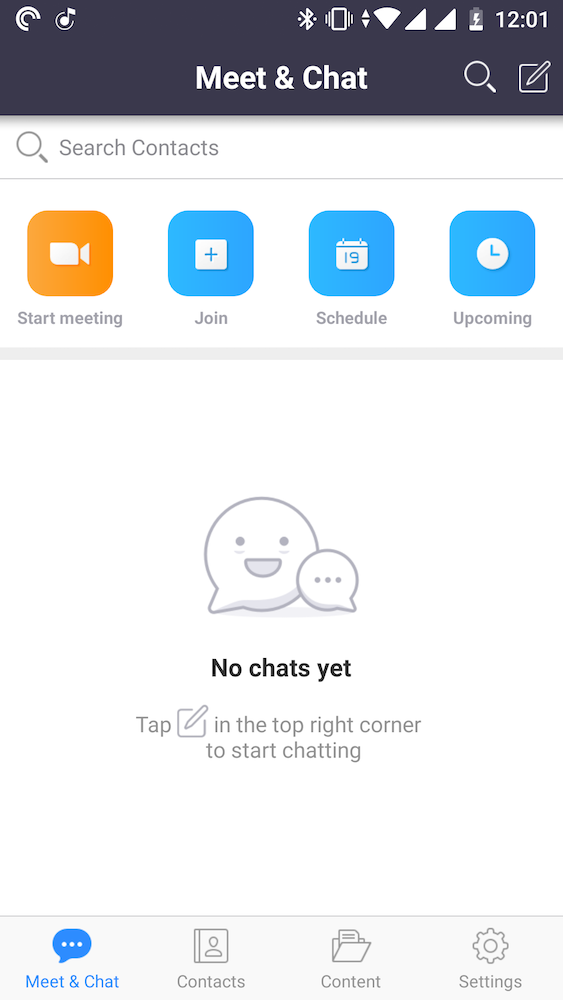
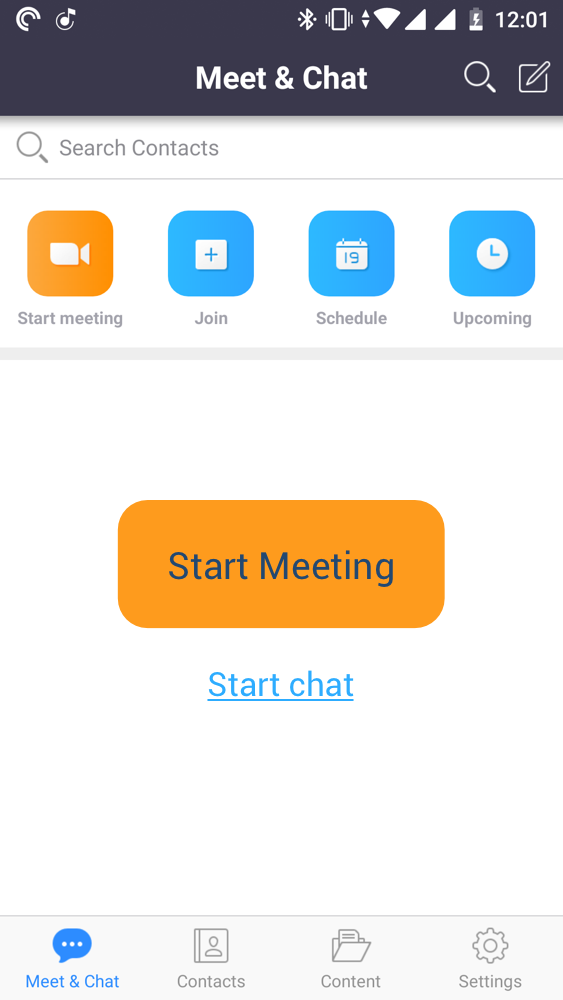
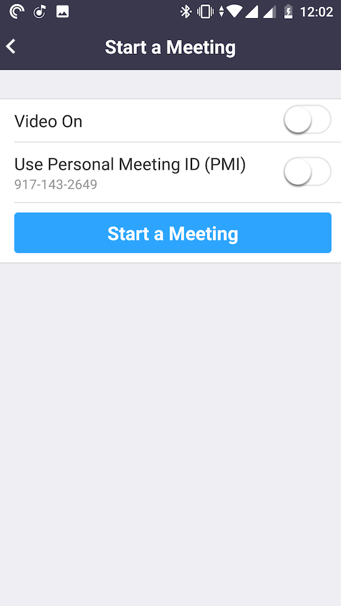
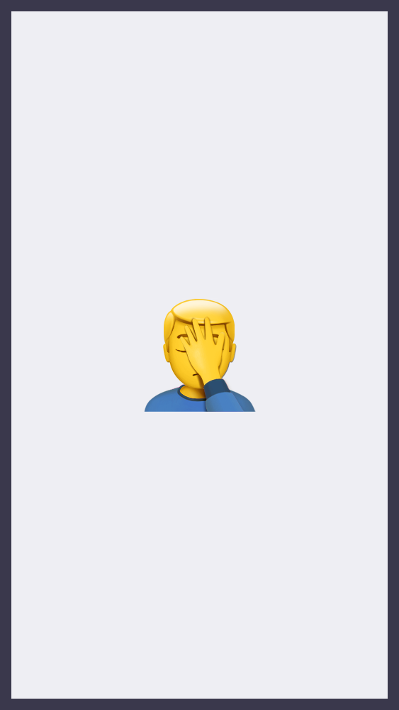
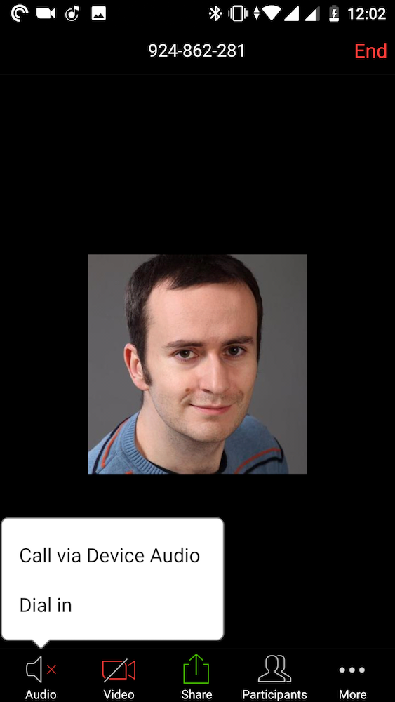
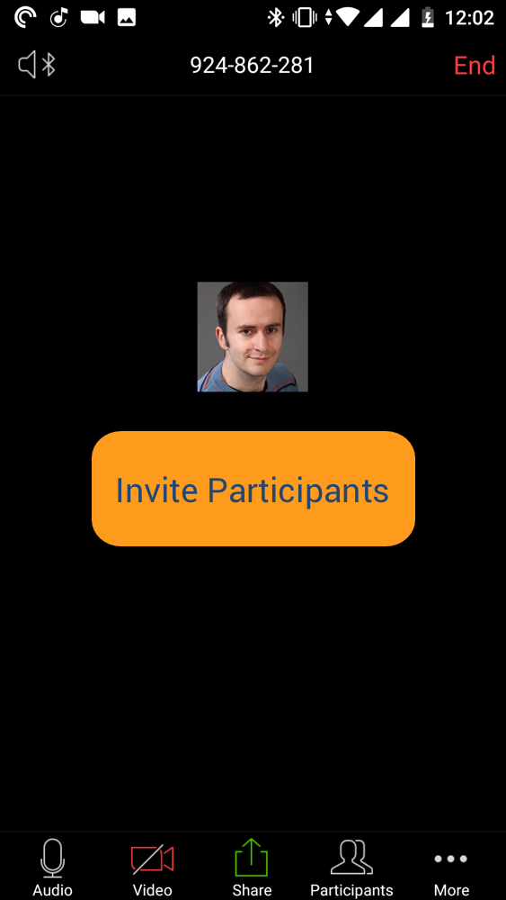
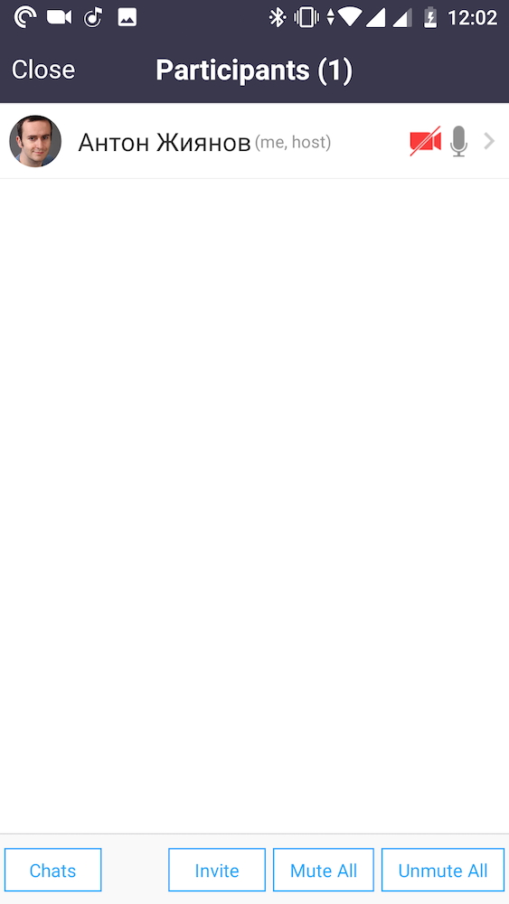
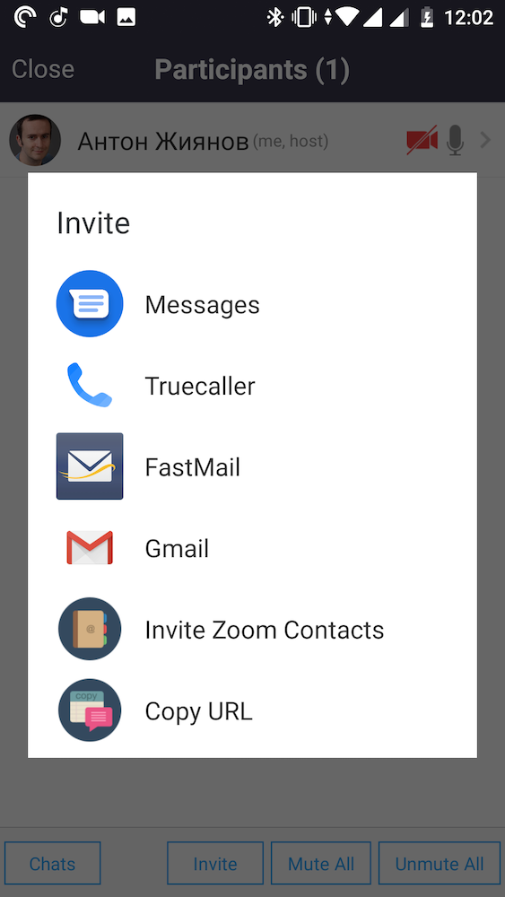
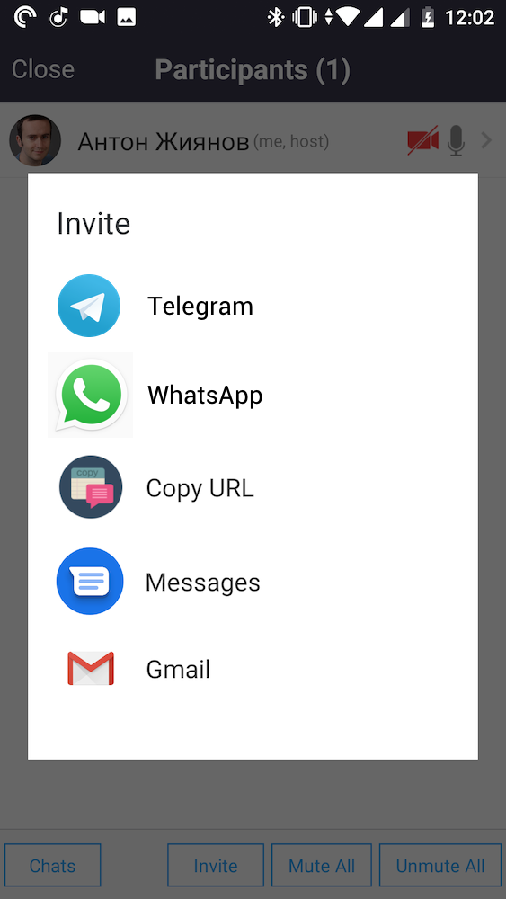

+++
date = 2018-12-26T15:30:45Z
description = "Пользуйтесь им, чтобы ошеломить конкурентов."
featured = true
image = "/common-sense-design/cover.png"
slug = "common-sense-design"
tags = ["interface"]
title = "Дизайн — это здравый смысл"
+++

Чтобы создать хороший интерфейс, дизайнеру требуется:

- 80% здравого смысла,
- 19% знания предметной области,
- 1% дизайн-мышления, дизайн-систем, насмотренности и прочего, про что дизайнеры любят писать статьи на Медиуме.

То есть главное в дизайне — здравый смысл. Чтобы доказать это утверждение, я сделаю «редизайн» популярного приложения Zoom (замена скайпу для видео- и аудио-конференций) с позиции обычного здравомыслящего человека, не дизайнера.

Не буду рисовать красивые макеты, а грубо покажу на скриншотах, что можно сделать иначе, если включить голову.

## 1. Главное действие

Какое главное действие на основном экране приложения для конференций?

<figure>
  
  <figcaption><strong>Ответ дизайнера Зума</strong> Главное действие — начать чатик. Мы сделали маленькую кнопочку для этого и спрятали её в уголок. А поскольку она стала незаметна, крупно написали в центре экрана, что надо пойти в уголок и нажать на эту кнопочку. Логично же вроде, да?</figcaption>
</figure>

<figure>
  
  <figcaption><strong>Ответ нормального человека</strong> Главное действие — начать конференцию. Бахните здоровенную кнопку про это в центр экрана.</figcaption>
</figure>

## 2. Как начать конференцию

Хьюстон, у нас проблемы: пользователь не закрыл с отвращением приложение, а ткнул в «Start meeting» на главном экране. Что делать?

<figure>
  
    <figcaption><strong>Ответ дизайнера</strong> Надо спросить, а точно ли он уверен, что хочет начать конференцию. Хорошо бы ещё предложить загадочную опцию «Use Personal Meeting ID», про которую никто не знает, что это такое и на кой чёрт оно нужно.</figcaption>
</figure>

<figure>
  
  <figcaption><strong>Ответ человека</strong> Вы не поверите, но после нажатия на «Start meeting» надо <em>начать конференцию</em>. Если опция «Use Personal Meeting ID» безумно дорога вам, <em>в первый раз</em> напишите для чего она и скажите, что в будущем можно сменить её в настройках. Во второй раз и во все последующие — просто <em>начните драную конференцию</em>.</figcaption>
</figure>

## 3. Как включить звук

Кожаный мешок не сдаётся и нажал на «Start a Meeting» на предыдущем экране. Что делать?

<figure>
  
    <figcaption><strong>Ответ дизайнера</strong> Надо спросить, как включить звук — как это делают все нормальные приложения или через дозвон?</figcaption>
</figure>

<figure>
  
  <figcaption><strong>Ответ человека</strong> Дозвон? Алё, какой сейчас год на дворе? Просто молча включите чёртов микрофон и начните уже конференцию. Если функция дозвона безумно дорога вам, расскажите про неё на онбординге, но не показывайте больше никогда.</figcaption>
</figure>

## 4. Как всё-таки начать конференцию

Человечишка включил микрофон. Что ему предложить?

<figure>
  
    <figcaption><strong>Ответ дизайнера</strong> Чёт даже не знаю. Давайте покажем крупно его фото. Я не знаю, что дальше делать, серьёзно. Может он сам разберётся?</figcaption>
</figure>

<figure>
  
  <figcaption><strong>Ответ человека</strong> Это <em>конференция</em>, чуваки, в ней участвуют <em>несколько</em> людей. Дайте мне возможность их пригласить.</figcaption>
</figure>

## 5. Как пригласить собеседников

Методом революционной интуиции юзер допёр, что надо нажать на «Participants». Что делаем дальше? Так далеко ещё никто не проходил.

<figure>
  
    <figcaption><strong>Ответ дизайнера</strong> О, это просто. Покажем пустой список участников — их ведь нет, верно?</figcaption>
</figure>

<figure>
  
  <figcaption><strong>Ответ человека</strong> 🤦🤦🤦</figcaption>
</figure>

## 6. Как всё-таки пригласить собеседников

Нам попался сообразительный засранец: он нашёл маленькую кнопку «Invite» и нажал на неё. Какие варианты предложим?

<figure>
  
    <figcaption><strong>Ответ дизайнера</strong> Нууу, смс, почта. Что ещё, я не знаю. Эээ, скопировать ссылку?</figcaption>
</figure>

<figure>
  
  <figcaption><strong>Ответ человека</strong> Сейчас люди в основном переписываются в <em>мессенджерах</em>. Может, вы слышали — вотсап, телеграм, вот это всё?</figcaption>
</figure>

## 7. Поехали

Дизайнер: это было несложно, да?

Человек: дизайнер, ты реально упоротый.

⌘&nbsp;⌘&nbsp;⌘

Здравый смысл, ребята. Пользуйтесь им.

<em>Заметка из телеграм-канала <i class="far fa-star color-sin"></i> «<a href="tg://resolve?domain=dangry">Интерфейсы без шелухи</a>»</em>

