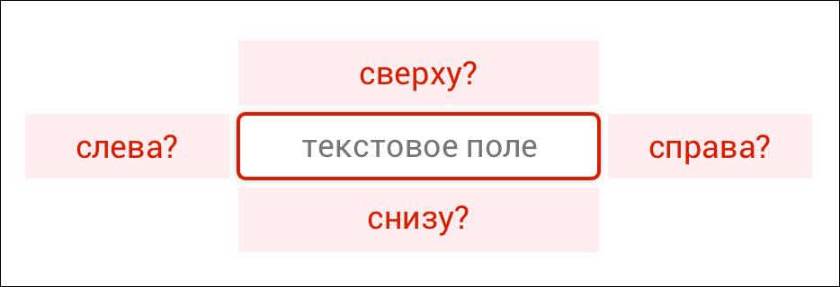

+++
date = 2018-05-07T14:50:00Z
description = "Солидные господа из Швейцарии провели исследование, а 1000 дизайнеров его опровергли."
slug = "error-position"
tags = ["interface", "60-sec"]
title = "Где расположить ошибку"
+++

Сыграл с читателями «[интерфейсов без шелухи](tg://resolve?domain=dangry)» в моего любимого супергероя — Капитана Очевидность.

Солидные господа из Швейцарии провели исследование: где лучше всего показывать сообщение об ошибке при заполнении текстового поля на форме. Речь шла о десктопах, потому что в Швейцарии смартфоны не признают.

1000 дизайнеров использовали капитанское супероружие — здравый смысл — чтобы получить такие результаты:

<em>Где расположить сообщение об ошибке (относительно текстового поля)?</em>

↓ снизу — 616 
👍👍👍👍👍👍👍 59%

справа → — 268 
👍👍👍 26%

↑ сверху — 127 
👍 12%

← слева — 16 
▫️ 2%

↓↓↓ внизу формы — 13 
▫️ 1%

Не могу сказать, что капитан победил. Швейцарцы выяснили, что удобнее всего человеку видеть сообщения об ошибках *справа* от текстового поля. Но они исследовали десктопные интерфейсы. На мобильных, естественно, лучше всего показывать сообщения *под* текстовым полем.

Так что ничья ツ

[Отчёт об исследовании](http://doc.rero.ch/record/304897/files/iwc24-0107.pdf)

