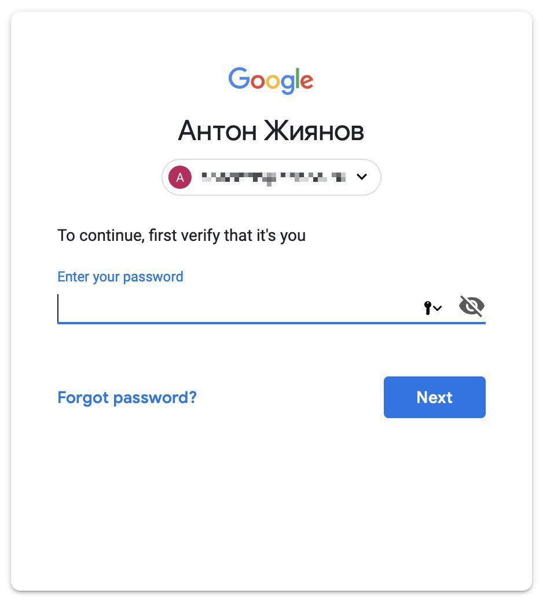

+++
date = 2018-11-16T16:40:00Z
description = "Как разозлить пользователя на ровном месте"
image = "/assets/projects/sin-2.jpg"
slug = "first-verify"
tags = ["interface", "60-sec"]
title = "Человек! Докажи, что это ты"
+++

Терпеть не могу Гугл и его сервисы, но на работе вынужден пользоваться Gmail. С периодичностью несколько раз в неделю Гугл выкидывает меня из почты и говорит:

<figure>
  
  <figcaption>Человек, докажи, что это ты</figcaption>
</figure>

Если у Гугла есть специальные люди, которые пишут текст для интерфейса, то в средневековой Японии им пришлось бы сделать сеппуку за такую формулировку.

По-своему это даже красиво: одним предложением указать пользователю его место в иерархии «человек-программа». Докажи, что это ты, жалкий червь. Иначе ты недостоин продолжать наслаждаться сервисами Гугла.

А ведь можно было просто написать:

> Чтобы продолжить, введите пароль

В идеале, конечно, диалог с требованием что-то там подтвердить вообще не должен возникать. Но это отдельный разговор.

<em>Заметка из телеграм-канала <i class="far fa-star color-sin"></i> «<a href="https://t.me/dangry">Интерфейсы без шелухи</a>»</em>

