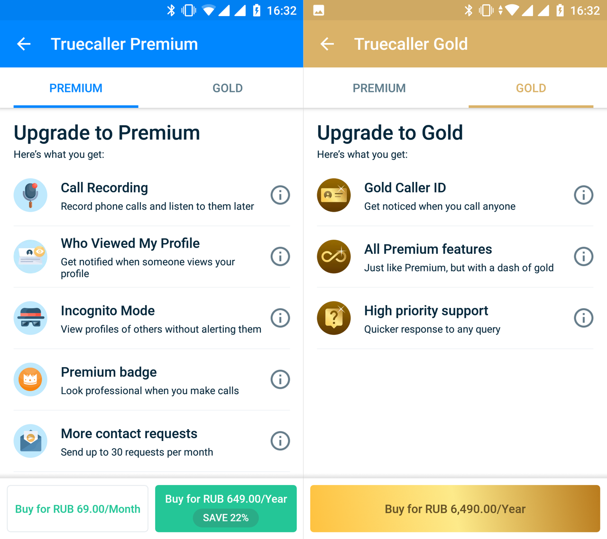

+++
date = 2018-11-16T12:59:47Z
description = "Заплати в 10 раз больше и получи значок «я не лох»."
image = "/gold-pricing/cover.png"
slug = "gold-pricing"
tags = ["productology", "60-sec"]
title = "​Премиальный и золотой тарифы"
+++

Наткнулся на забавный пример ценообразования. Есть приложение «Труколлер» — оно помогает распознавать телефонных спамеров. В базовом варианте бесплатное, но, разумеется, есть платный тариф (Premium). В нём типовой набор плюшек — нет рекламы, дополнительные приятные возможности, всякое такое. Обычное дело.

Но сегодня я заметил, что у «Труколлера» есть и «золотой» (Gold) тариф — ровно в 10 раз дороже «премиального». Смотрите, чем он отличается:

1. Приоритетная техническая поддержка
2. Почётный золотой значок (sic!)

<figure>
  
  <figcaption>Заплати в 10 раз больше и получи значок «я не лох»</figcaption>
</figure>

Переплачивать за быструю техподдержку — стандартная практика в корпоративном сегменте. Всякие Ораклы, IBM и прочие SAP в «базовом» варианте даже бровью не поведут, если у заказчика возникли проблемы с их софтом. Чтобы добиться от них хоть какой-то внятной помощи, крупные компании покупают «золотые» и «платиновые» тарифы с конским ценником. Это оправданно.

Но «Труколлер»? Если с ним возникают проблемы, проще снести приложение и поставить аналог, чем обращаться в поддержку. И уж точно нет смысла платить 10x за приоритетный саппорт.

Почётный золотой значок — это вообще волшебно. Я сразу вспомнил приложение «I am Rich» для айфона, которое стоило $1000 и прожило в апсторе ровно 1 день. Ну там хоть понятно — это был чистый стёб разработчика. Но кто станет платить 7К в год за золотой значок, серьёзно?

Может маркетологи из «Труколлера» тоже так развлекаются, конечно. Тогда я бы им предложил добавить по-настоящему золотую фичу: посмотреть, под каким именем ты записан у других людей в контактах. Ну и переименовать тариф в «платиновый», конечно ツ

<em>Заметка из телеграм-канала <i class="far fa-star color-sin"></i> «<a href="https://t.me/dangry">Интерфейсы без шелухи</a>»</em>

