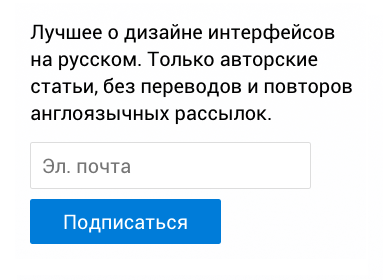
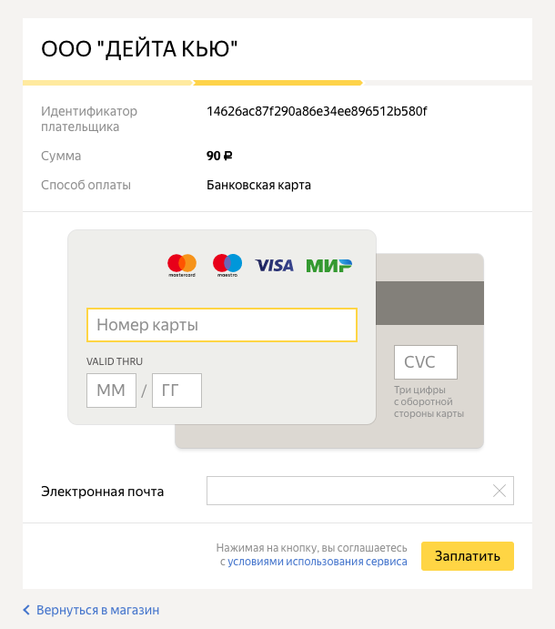
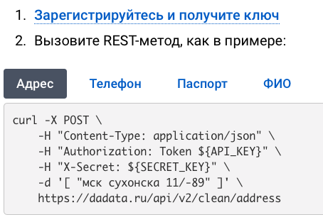
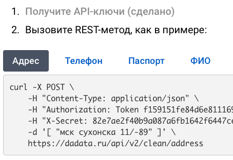
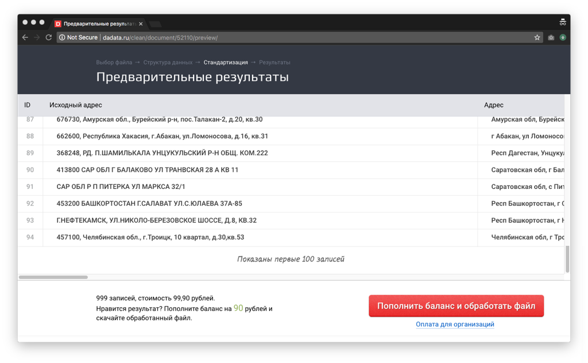
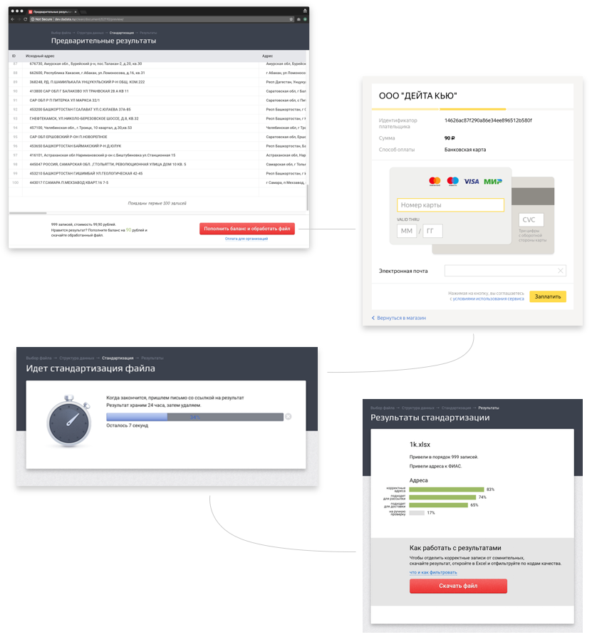

+++
date = 2018-01-19T10:01:45Z
description = "Когда работаешь с «необходимым злом», главное — минимизировать боль и сохранять контекст."
featured = true
image = "/necessary-evil/cover.png"
slug = "necessary-evil"
tags = ["interface"]
title = "Регистрация и оплата как необходимое зло"
subscribe = "dangry"
+++

Два самых распространённых «необходимых зла» в интерфейсе — регистрация и оплата. 

- зло — потому что пользователю они не нужны, у него другая задача;
- необходимое — потому что без них не получить результат.

Когда работаешь со «злом», главное — минимизировать боль и сохранить контекст.

## Минимизировать боль

Чем быстрее человек преодолеет препятствие, тем лучше. Поэтому из регистрации имеет смысл выкинуть всё лишнее, обойдясь необходимым минимумом.

<em>Плохая регистрация</em>
<figure>
  
  <figcaption>Подписка на емейл-рассылку Сони настолько ужасна, что даже по-своему прекрасна</figcaption>
</figure>

<em>Хорошая</em>

<figure>
  
  <figcaption>Удивительно, но емейла вполне достаточно. Надо бы тоже добавить страну проживания и группу крови</figcaption>
</figure>

Из оплаты всё не выкинешь, но можно оставить только платёжные реквизиты:

<figure>
  
  <figcaption>Например, фамилия и имя при оплате картой не нужны</figcaption>
</figure>
    

Правило: отвлекать человека как можно меньше, чтобы побыстрее вернуть его к основной задаче.

## Сохранить контекст

После того, как человек закончил с регистрацией или оплатой, хороший интерфейс вернёт его ровно туда, где он до этого остановился.

Регистрация должна возвращать на тот же экран, но актуализировать состояние интерфейса:

    
<em>До регистрации</em>

<figure>
  
  <figcaption>Заглушки API_KEY и SECRET_KEY — ключи для работы с программой, которые до регистрации неизвестны.</figcaption>
</figure>

    
<em>После регистрации</em>

<figure>
  
  <figcaption>Тот же экран, но раз человек зарегистрировался — вместо заглушек реальные значения.</figcaption>
</figure>

Оплата должна переводить на следующий шаг. Допустим, потребовалась заплатить посередине пользовательского сценария, потому что не хватает денег, чтобы его завершить:

<figure>
  
  <figcaption>«Дадата» просит доплатить, чтобы хватило на обработку файла</figcaption>
</figure>

Если после оплаты человека выкинет на главную страницу или в начало сценария — это не дело. Лучше продолжить сценарий с той точки, где отвлеклись на оплату:

<figure>
  
  <figcaption>Началась обработка → отвлеклись на оплату → обработка продолжилась → готов результат</figcaption>
</figure>

Правило: вернуть человека туда, где он остановился, чтобы побыстрее закончить начатое.

⌘ ⌘ ⌘

«Необходимое зло» — не только регистрация и оплата. Бывает, не хватает данных, и приходится запрашивать их у человека. Бывает, надо подождать завершения другой операции. Бывает, требуется подтверждение третьей стороны.

Правила для таких ситуаций одни и те же:

<blockquote class="big">
Минимизировать боль и сохранить контекст
</blockquote>
