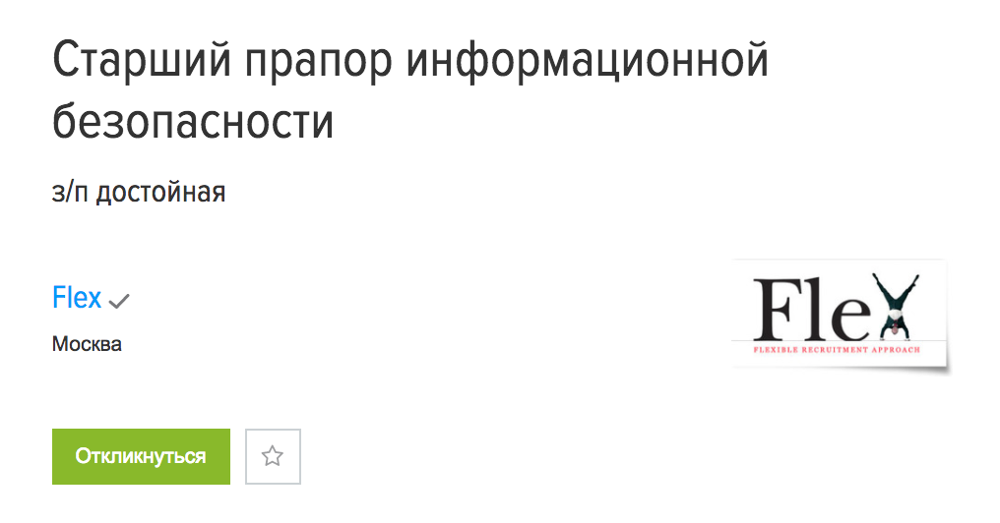

+++
date = 2018-06-08T09:53:47Z
description = "Как суверенный вариант чуждого западного officer."
image = "/officer/cover.png"
slug = "officer"
tags = ["life"]
title = "Прапор информационной безопасности"
+++

У американцев предусмотрен вагон должностей вида «чототам officer». Типа «Data Protection Officer» или «Information Security Officer».

Традиционно их переводят на русский как «офицеров». Это неправильно, потому что ну какие они к чёрту офицеры. В то же время, превращать officer в какого-нибудь «специалиста» или «менеджера» тоже нехорошо.

И вот сегодня меня осенило. Officer — это же «прапор»! Послушайте, как хорошо:

- прапор информационной безопасности
- прапор защиты данных
- старший прапор маркетинга

<figure>
  
  <figcaption>Уже на Хедхантере</figcaption>
</figure>

Прапор идеально подходит. Он не офицер, но в то же время и не рядовой. Он близок нам по армейскому фольклору. Он звучный и образный, в конце концов.

Officer в бизнесе = прапор!

