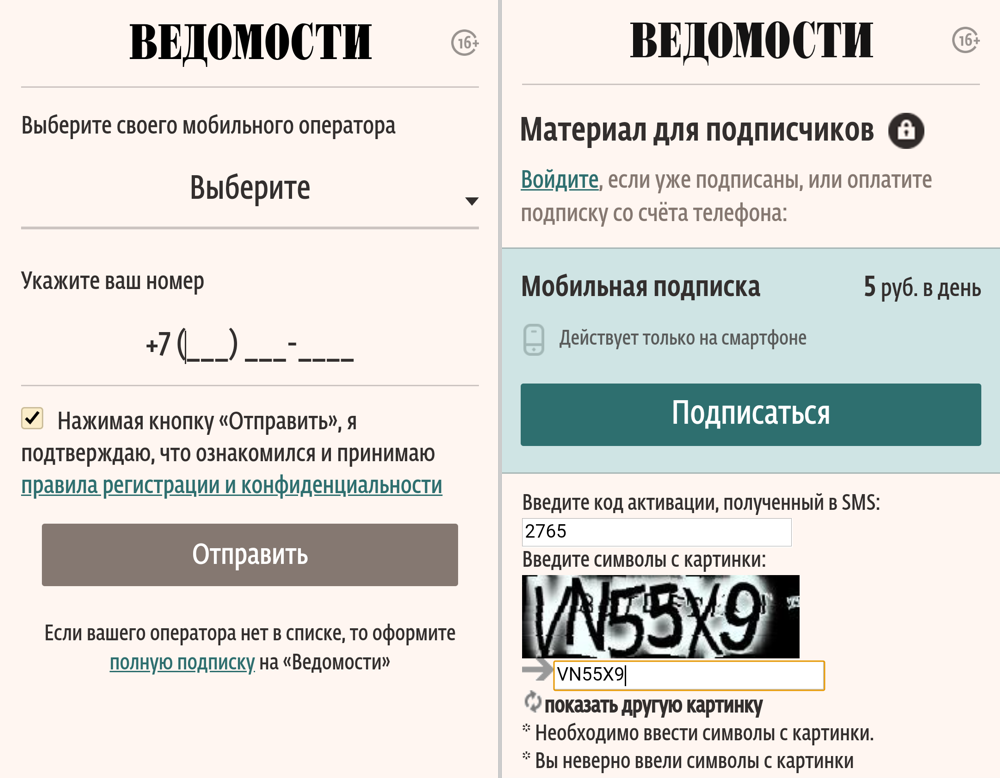
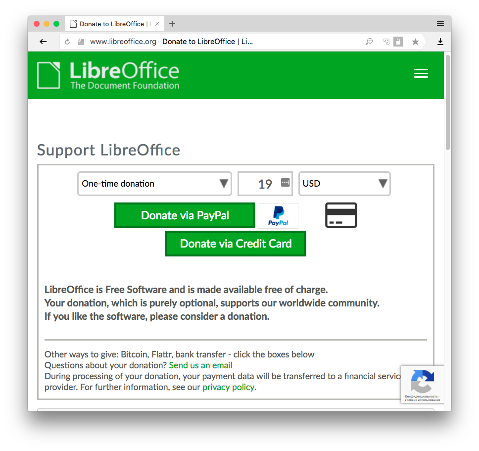
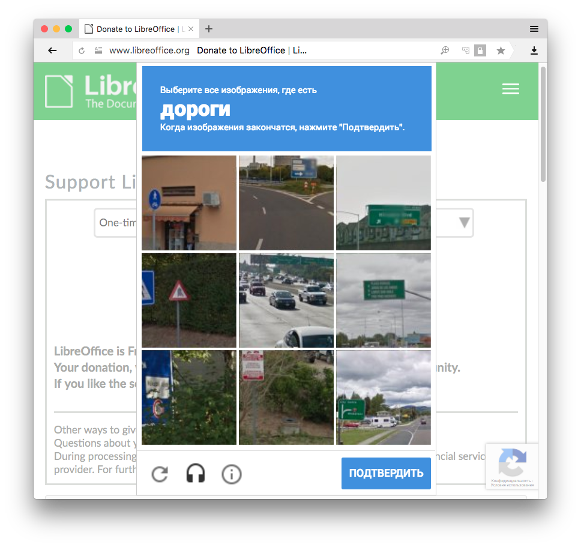

+++
date = 2018-08-17T10:58:08Z
description = "И вообще уберите."
image = "/payment-captcha/cover.png"
slug = "payment-captcha"
tags = ["interface"]
title = "Уберите капчу при оплате"
+++

«Спасибо, кэп! Какой чудак будет ставить капчу на форму оплаты?». А таких много. В этой заметке я покажу примеры и выведу универсальное правило применения капчи.

## Капча для подписчика

У газеты «Ведомости» есть платная подписка:

<figure>
  
  <figcaption>Указываешь номер телефона, получаешь код по СМС, подтверждаешь.</figcaption>
</figure>

На втором шаге человека встречает капча. Она не решает ровным счётом ни одной задачи, кроме как убить конверсию:

1. Ведомости *уже* потратились на отправку СМС, а значит отсеивать ботов несколько поздновато.
2. Человек подтверждает свою человечность, вводя код из СМС. Капча проверяет непонято что.

Представим теперь, что капчу убрали. И нашёлся такой умный бот, что получил СМС, и ввёл код, и подписался на Ведомости. Что плохого произойдёт для газеты? Ничего. Капча не нужна.

    
Заметка на полях. Дорогие «Ведомости», по номеру телефона можно автоматически определить <a href="https://dangry.ru/ken/provider-by-phone/">мобильного оператора</a>. Даже если человек перешёл от одного оператора к другому с сохранением старого номера. Воспользуйтесь этим и не заставляйте подписчиков выполнять тупую работу за вас.

    
А ещё кнопка «Подписаться» должна быть <em>под</em> текстовым полем с кодом активации, а не над ним.

## Капча при оплате

Популярный пакет офисных программ LibreOffice принимает пожертвования на сайте:

<figure>
  
  <figcaption>Выглядит как обычная форма пожертвования</figcaption>
</figure>

<figure>
  
  <figcaption>Но стоит нажать на кнопку...</figcaption>
</figure>

Нажимаешь на Donate, получаешь в благодарность капчу. Если разгадал — так уж и быть, можешь заплатить. Не разгадал или бот — ха-ха, неудачник, не видать ЛибреОфису твоих денежек! Хм.

Как и с «Ведомостями», капча ЛибреОфиса эффективно решает единственную задачу — собрать как можно меньше денег. Не думаю, что это достойная цель.

Если убрать капчу, то бот отвалится на этапе ввода карточки или подтверждения платежа. Что плохого произойдёт для ЛибреОфиса? Ничего. Капча не нужна.

## Выводы и правила

Первое, консервативное правило капчи:

<blockquote class="big">
Уберите капчу, если расходы на борьбу с ботами меньше упущенной прибыли от потерянных клиентов
</blockquote>

Например, ваш сервис без капчи привлекает 100 клиентов в месяц и 500 ботов, а с капчей — 50 клиентов и 0 ботов. Пусть средний чек на клиента — 1000 ₽ в месяц.

Значит, на капче вы теряете 50 * 1000 = 50 000 ₽ в месяц. А если убрать капчу, получите 500 ботов. Обойдутся ли эти боты вам дороже 50 000 ₽? Если да, ставьте капчу. Если нет — к чёрту её.

Если последовательно применять консервативное правило капчи, рано или поздно придёте ко второму, радикальному:

<blockquote class="big">
Не используйте капчу
</blockquote>

Люди придумали много неинвазивных методов борьбы с ботами. Если ваши программисты утверждают, что капча — единственный вариант, дайте им по жопе и отправьте в гугл. Ну или у меня пусть спросят.

Но если от радикального правила внутри всё бурлит и клокочет — консервативное всегда к вашим услугам.

<em>Специально для подписчиков <i class="far fa-star color-sin"></i> «<a href="https://t.me/dangry">Интерфейсов без шелухи</a>»</em>

