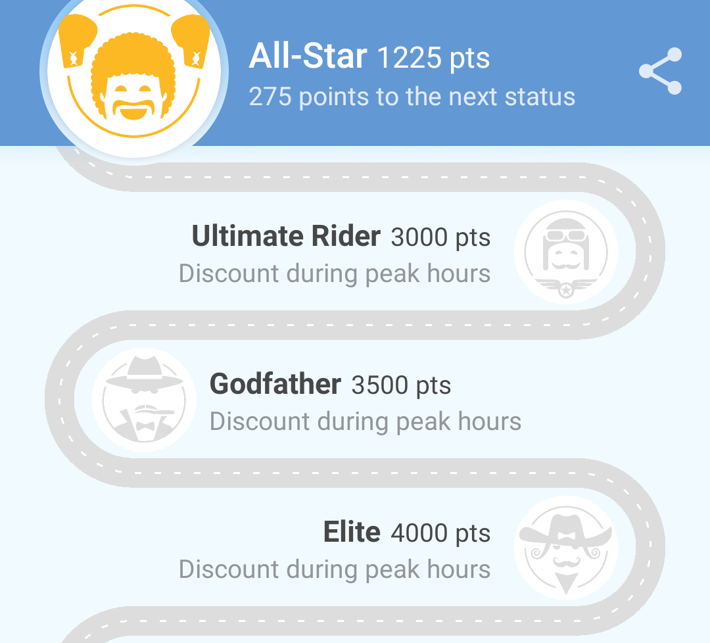

+++
date = 2018-02-28T11:07:08Z
description = "Мотивация усиливается, когда виден прогресс. Но только если понятно, в чём награда."
image = "/progress-and-reward/cover.png"
slug = "progress-and-reward"
tags = ["interface", "60-sec"]
title = "Если нет награды, прогресс бесполезен"
+++

Мотивация усиливается по мере приближения к цели. Особенно хорошо это работает, если человек видит прогресс.

Продукты и сервисы вовсю этим пользуются. Хрестоматийный пример — LinkedIn с его «прогрессом заполнения профиля», но вообще приём используется повсеместно. Даже на форме заявки на кредитку пишут «шаг 1 из 4» — это тоже визуализация прогресса.

Приём работает при одном условии — человек понимает, в чём награда. Прогресс сам по себе не особо мотивирует, если я не понимаю, что получу взамен.

Яркий анти-пример — приложение заказа такси Gett. У них есть программа лояльности со статусами вроде «суперзвезда», «вожак стаи» и «босс». Но статусы ничем не отличаются, кроме названия и количества очков, которые надо набрать.

Так было несколько лет. Потом, похоже, кто-то в Gett заметил, что программа лояльности никого не делает лояльнее, и задумался о наградах. И придумал «скидку в часы пик».

И теперь эту скидку написали всем статусам выше определённого уровня. Одну и ту же ツ Но если награда везде одна и та же — это всё равно что её нет.

В общем, если показывать прогресс достижения цели — то вывесить понятную награду. А если у цели несколько уровней, то и награды должны быть разными.

<em>Заметка из телеграм-канала <i class="fa fa-star-o color-sin"></i> «<a href="https://t.me/dangry">Интерфейсы без шелухи</a>»</em>

