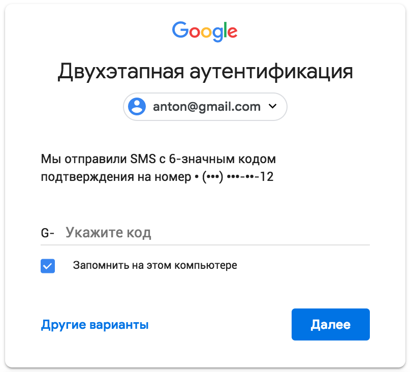
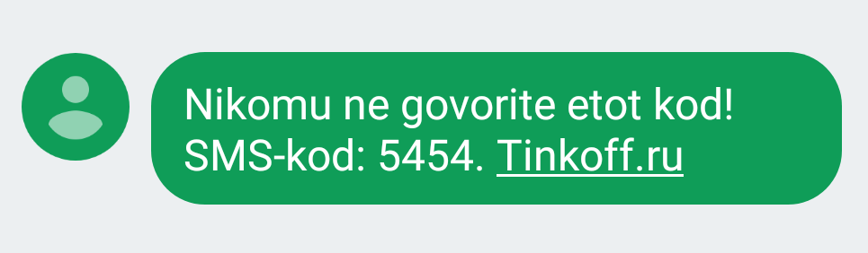

+++
date = 2018-08-08T14:43:35Z
description = "Всё, что вы хотели знать: удобство vs безопасность, шансы и злодеи, повторы в цифрах."
featured = true
image = "/security-code/cover.png"
slug = "security-code"
tags = ["interface", "productology"]
title = "О кодах подтверждения"
+++

Банки и другие сервисы используют коды подтверждения для защиты от мошенников. Обычно код выглядит как число из 4–6 цифр, которое приходит по СМС или пуш-оповещением.

В этой заметке я расскажу об удобстве и безопасности разных вариантов.

## Какие бывают коды

Дизайн кода подтверждения — классическая проблема, когда кажется, что безопасность конфликтует с удобством использования. Безопасники хотят сделать код как можно длиннее, чтобы злодей не смог его подобрать. А продуктовые ребята наоборот, хотят коды покороче, чтобы человеку было проще запомнить.

<figure>
  
  <figcaption>Коды подтверждения помогают удостоверить личность и авторизовать действия с деньгами</figcaption>
</figure>

Я попросил участников чата «Интерфейсов без шелухи» прислать примеры кодов подтверждения от разных сервисов. Всего в выборку попало 30 сервисов, вот статистика:

- 45% сервисов используют коды из 6 цифр
- 41% используют 4 цифры
- 14% используют 5 цифр

## Какой длины кода достаточно

Если у вас в компании есть безопасник — наверняка он ответит «шесть цифр и никак не меньше». 6 цифр — это 1 миллион комбинаций. Если дать злодею возможность беспрепятственно вводить коды каждую секунду, ему потребуется 11 дней, чтобы угадать.

Понятно, что беспрепятственно вводить коды никто не даст: сервисы ограничивают количество ошибочных попыток (а ещё время жизни кода и как часто можно генерить новые коды). Поэтому 6 цифр — это неоправданно много.

Код из 4 цифр даёт 10 тысяч комбинаций. Если разрешить 3 попытки ввода, шанс угадать составит 0,03%. Другими словами, злоумышленнику придётся попытать счастья с 3300 человек, прежде чем у него что-то получится. Не слишком интересный расклад для злодея ツ

## Правда ли, что цифры в коде повторяются

Это довольно распространённая точка зрения. Хочется думать: родной банк так заботится о твоём удобстве, что генерит коды с повторяющимися цифрами — чтобы легче было запомнить:

- 134571
- 85651
- 6411

В большинстве случаев это заблуждение. Чем длинее код, тем больше вероятность, что цифры в нём повторятся сами собой, без всяких усилий сервиса. Например, для кода из 4 цифр вероятность повторения хотя бы одной цифры — 50%. А для кода из 6 цифр — уже 85%.

<figure>
  
  <figcaption>Теория вероятности играет за вас! Шанс получить код с повтором весьма велик</figcaption>
</figure>

Ради интереса я взял сервисы, по которым собрал больше всего данных, и проверил, какова доля кодов с повторами в цифрах. У большинства распределение получилось несмещённое, то есть специально они одинаковые цифры не генерят.

Единственное исключение — «Тиньков»: у него 65% кодов с повторами против ожидаемых 50%.

## Что, если всегда генерить код с повторами

Допустим, наш супер-дружественный сервис решил генерить 4-значные коды, в которых хотя бы одна цифра повторяется. Это примерно 5000 комбинаций — всего в два раза меньше, чем на «обычном» 4-значном коде.

Шанс угадать такой код на 3 попытках — 0,06% или 1650 бесплодных злодейских заходов. Как по мне, вполне надёжно. Хотя ваш безопасник будет против, конечно ツ

⌘&nbsp;⌘&nbsp;⌘

Резюмирую:

- Никогда, никогда, никогда не делайте коды длиннее 6 цифр.
- 4-значный код — хороший баланс между удобством и безопасностью.
- Попробуйте генерить коды с повторами, пользователям понравится.

А ещё, пишите код [в начале сообщения](/sms-password/).

<em>Заметка из телеграм-канала <i class="far fa-star color-sin"></i> «<a href="tg://resolve?domain=dangry">Интерфейсы без шелухи</a>»</em>

