+++
date = 2018-04-16T08:06:09Z
description = "Исправляем проблемы и рассматриваем альтернативы."
featured = true
image = "/signup-puzzle/cover.png"
slug = "signup-puzzle"
tags = ["interface", "puzzle"]
title = "Задачка: регистрация с фото и паспортом"
+++

Я предложил читателям телеграм-канала «<a href="https://t.me/dangry" class="nowrap">интерфейсов без шелухи</a>» такую задачку:

На просторах фейсбука встретил скрины регистрации в довольно типичном приложении, которому надо идентифицировать человека. Так обычно работают каршеринги и всяки уберо-подобные сервисы, которым не обойтись просто электронной почтой.

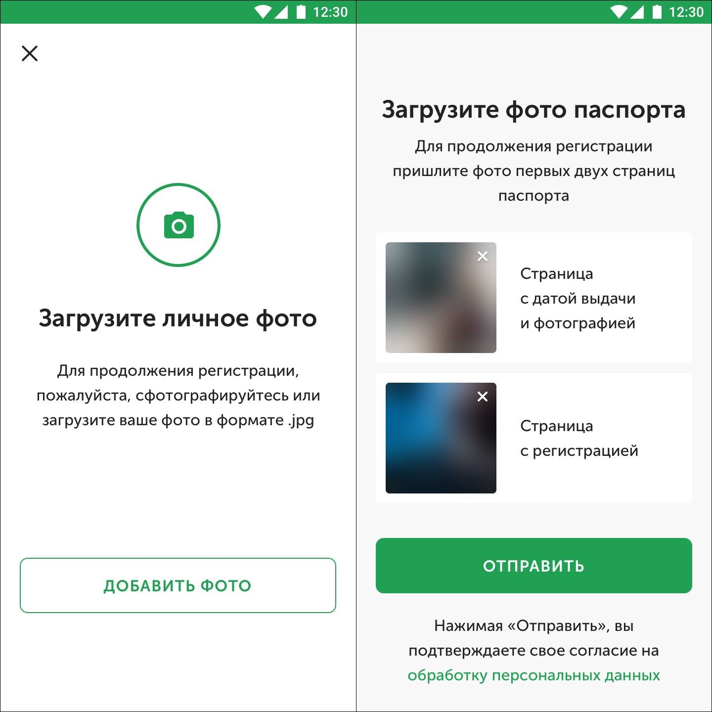

Интерфейс достаточно аккуратный, явно делал дизайнер. Но, думаю, есть что улучшить. Попробуем?

Спасибо всем, кто прислал свои варианты! Давайте разберём решение. Начнём с исправления проблем в существующем интерфейсе, а закончим альтернативными вариантами.

Будем исходить из того, что и личное фото, и фото паспорта действительно нужны сервису (допустим, юристы требуют). В противном случае решение было бы слишком простым ツ

## Редизайн: личное фото

Непонятно, зачем на первом экране крестик, да ещё в левом верхнем углу. Если фото требуется для продолжения регистрации, какой смысл закрывать? Если это возврат к предыдущему шагу, то для него на Андроиде есть кнопка «назад».

Сначала кажется, что инструкция предельно понятна: «загрузите личное фото». Полагаю, надо ткнуть на изображение камеры и сделать селфи. Но зачем тогда внизу кнопка «добавить фото»? Из текста под заголовком становится понятно, что можно загрузить уже готовое фото.

Это плохо: мы сразу перегрузили экран и усложнили пользователю жизнь, поставив его перед выбором. Очевидно, что большинство пользователей не держат под рукой готовое фото. Поэтому лучше просто предложить сделать селфи, а уже на экране селфи дать возможность загрузить файл:

<figure>
  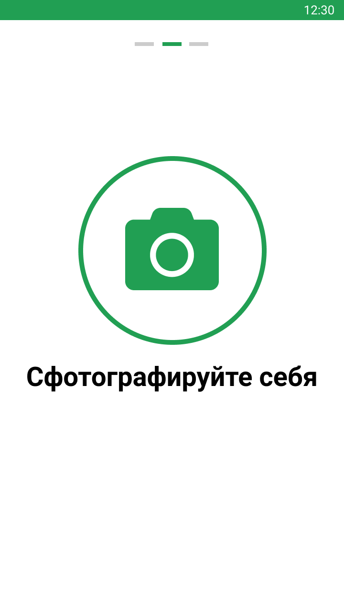
  <figcaption>Предлагаем сделать селфи…</figcaption>
</figure>

<figure>
  
  <figcaption>…и делаем его</figcaption>
</figure>

В поясняющем тексте было много мусора. «Пожалуйста» лишнее, «для продолжения регистрации» — тоже. Требование загрузки в формате .jpg — просто абсурд. А поскольку мы убрали вариант с загрузкой, от пояснения удалось целиком избавиться.

## Редизайн: фото паспорта

Текст под заголовком повторяет очевидное — из заголовка и следующих двух блоков и так понятно, что надо сделать.

Непонятно, зачем разноцветные блюры на фотографиях. Пока фото не сделано, лучше показывать схематичное изображение разворота паспорта. Когда сделано — его и показывать.

Крестик удаления фото микроскопический — сложно будет попасть пальцем. Да и зачем удалять фотографию? Если получилась неудачная, можно просто переснять.

Исправляем:

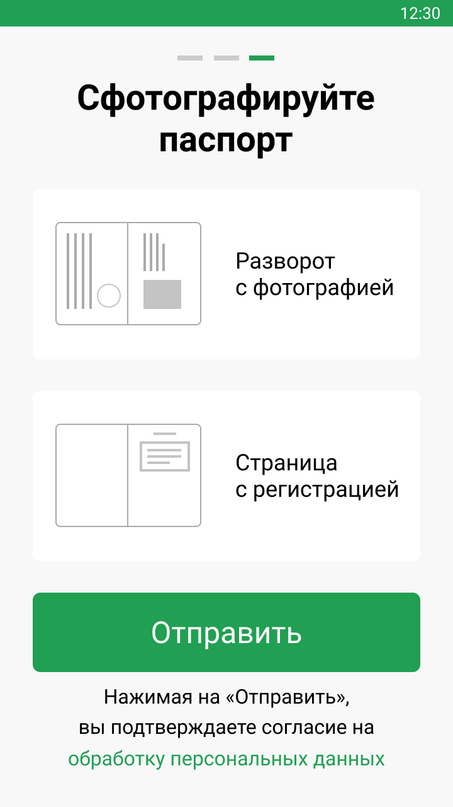

  
Схематичные изображения страниц помогут открыть нужный разворот паспорта

## Альтернатива: отдельные экраны

С первым экраном (личное фото) есть проблема: он предлагает лишнее действие. Можно без потери смысла фотографировать сразу на нём. Тогда логично и фото паспорта разнести по отдельным экранам. Такой вариант предложил [Алексей Демьяновских](https://t.me/ademyanovskih) (макеты участника с моими правками):

<figure>
  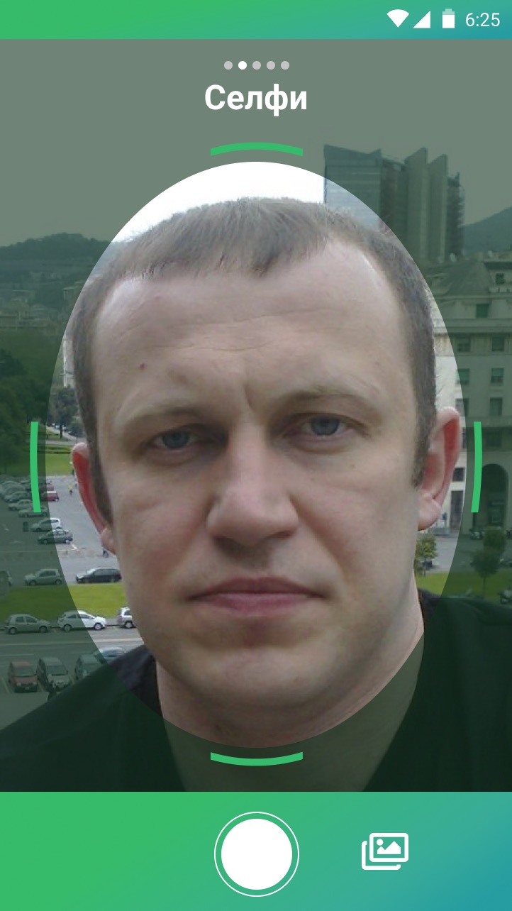
      <figcaption>Не предлагаем сделать фото, а сразу включаем фронтальную камеру</figcaption>
</figure>

<figure>
  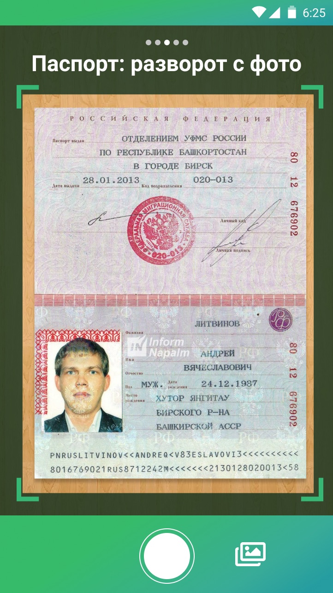
  <figcaption>Рамки помогут правильно расположить паспорт</figcaption>
</figure>

<figure>
  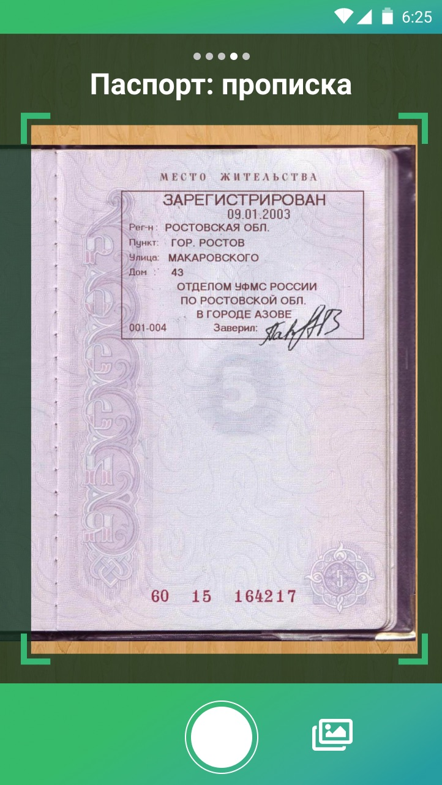
  <figcaption>Шагов много, не забываем показывать прогресс вверху</figcaption>
</figure>

<figure>
  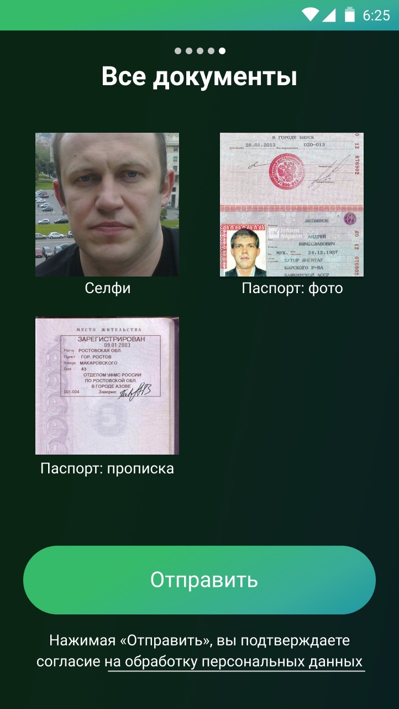
      <figcaption>Если какое-то фото не получилось, можно ткнуть на него и переснять</figcaption>
</figure>

<figure>
  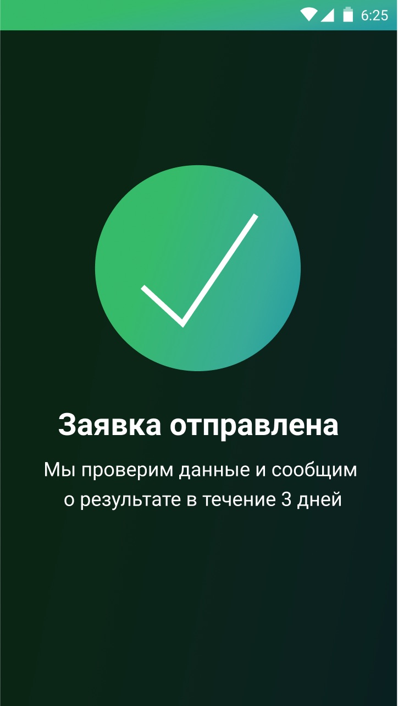
  <figcaption>Ура!</figcaption>
</figure>

## Альтернатива: длинный экран

Возможно, при регистрации помимо фотографий требуются и другие данные. Если приложение не умеет распознавать текст с фотографий, то придётся указывать и ФИО, и дату рождения, и номер-серию паспорта вручную. Это значит, что получается минимум три экрана: текстовые данные, личное фото, фото паспорта.

Можно упаковать всё в один длинный экран. Чуть менее наглядно, но зато сразу видно всё, что требует приложение для регистрации. И легко вернуться к предыдущему шагу. Пример из приложения Belka Car:

<figure>
  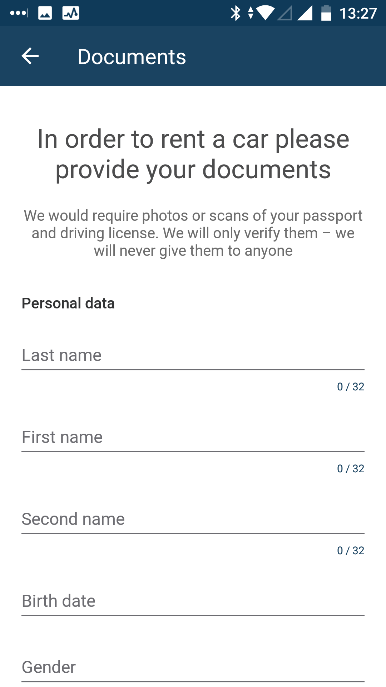
  <figcaption>Вводим персональные данные…</figcaption>
</figure>

<figure>
  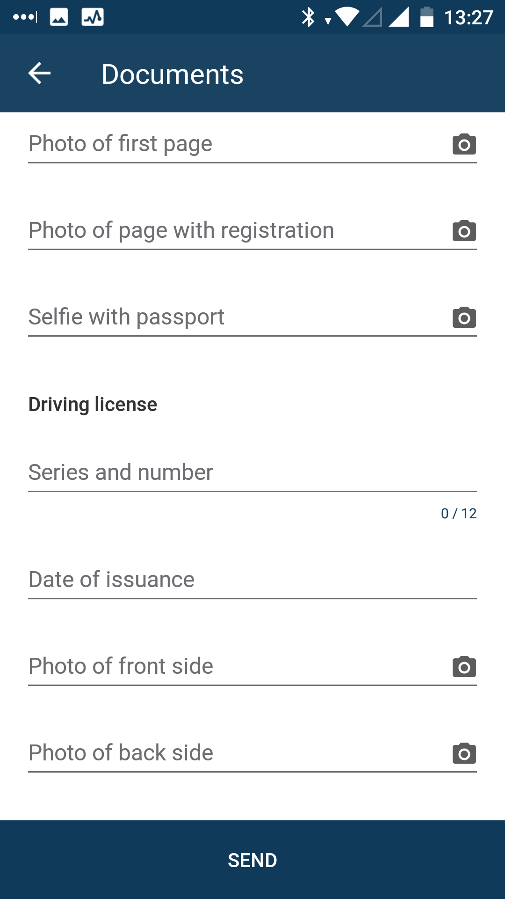
  <figcaption>…и делаем фото</figcaption>
</figure>

Ну или хотя бы сделать общий экран с фотографиями. Макет прислал анонимный участник:

  
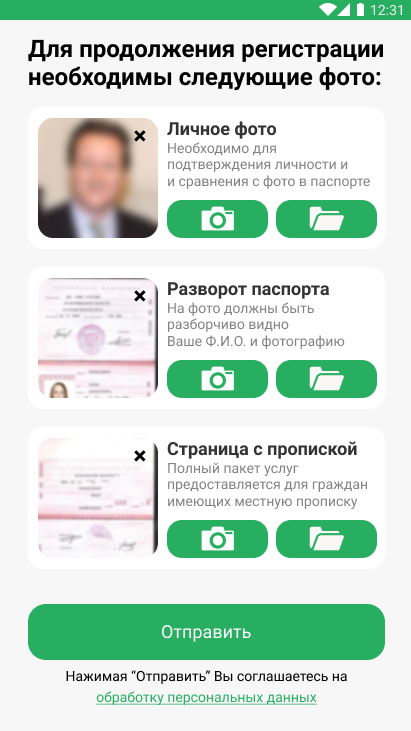

  
Первым экраном могут быть текстовые данные, вторым — фото документов

Если оставлять отдельные экраны, хорошо бы добавить индикатор прогресса («шаг 2 из 3»). На это указали многие участники, а [Антон Лютиков](http://antonlyutikov.webflow.io/) отрисовал весь сценарий:

<figure>
  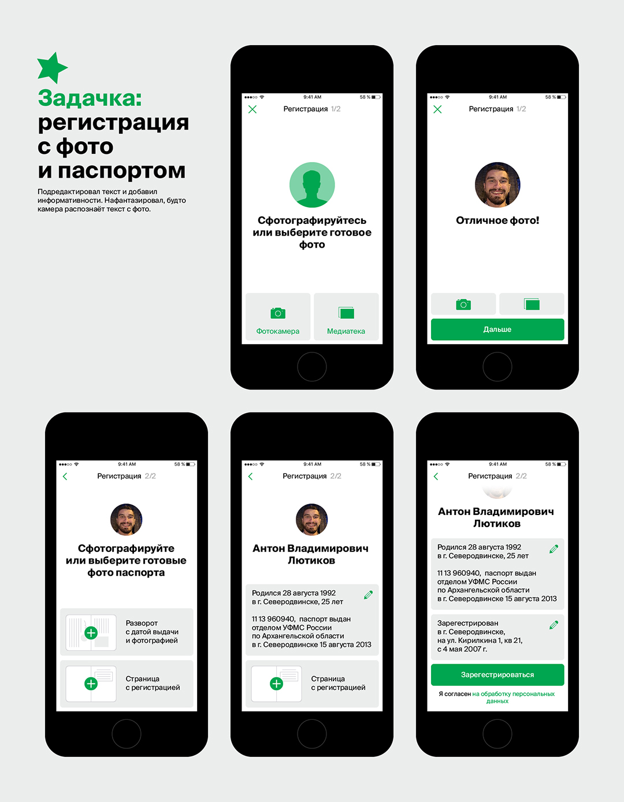
  <figcaption>Приложение распознаёт текст с фото документов и предлагает исправить, если что-то не так</figcaption>
</figure>

## Альтернатива: чат

[Олег Бухтияр](https://t.me/uuhbuh) обратил внимание на вариант с «чат-ботом», который использует Яндекс.Драйв:

<figure>
  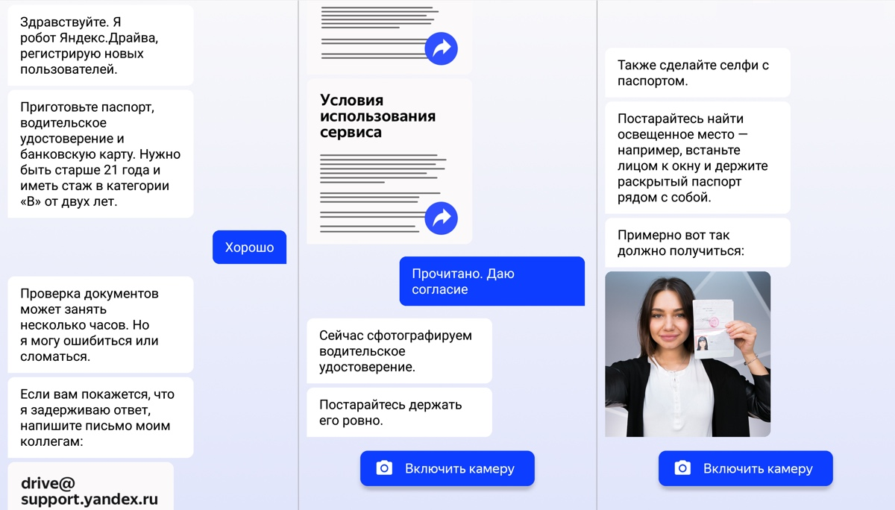
  <figcaption>Бот пишет короткими простыми фразами, как это обычно делают люди в чатах</figcaption>
</figure>

Это, пожалуй, самый естественный по нынешним временам вариант. Бот пишет конкретные короткие указания, пользователь выполняет. Ошибиться почти невозможно. Отсюда и минусы:

- невозможно вернуться к предыдущему шагу,
- непонятно, сколько ещё шагов впереди.

## Бизнес-логика: пропустить шаги

Слава Соколов справедливо заметил:

> Должна быть возможность пропустить шаги с добавлением фотографий. Человек сможет пользоваться приложением, просто не все функции будут доступны. Актуально, если, например, паспорта под рукой нет.

Если разработчики не готовы «пустить» человека в приложение до проверки паспорта, стоит хотя бы сохранять уже введённые данные — и не требовать их, когда пользователь через два дня вернётся с паспортом.

⌘ ⌘ ⌘

Было ещё несколько предложений, которые не кажутся мне удачными:

- *Брать личное фото из паспорта*. Паспорт действует 25 лет и больше, люди на фото мало похожи на себя нынешних. Да и фото там так себе. Если брать откуда-то готовое фото, я бы скорее предложил соцсети (заодно и ФИО получаешь автоматом).
- *Регистрация через Госуслуги (ЕСИА)*. Вообще, идея богатая. Коммерческие компании действительно могут использовать «Единую систему», чтобы идентифицировать пользователей (причём это юридически значимая идентификация). Но пока на Госуслугах зарегистрировано только 50% взрослого населения (в 2018 собираются довести до 70%). Так что регистрация через Госуслуги как единственный вариант не подойдёт.

Ещё раз спасибо всем участникам! Мы продолжим ツ

<em>Решайте задачки на канале <i class="fa fa-star-o color-sin"></i> «<a href="https://t.me/dangry">Интерфейсы без шелухи</a>»</em>

