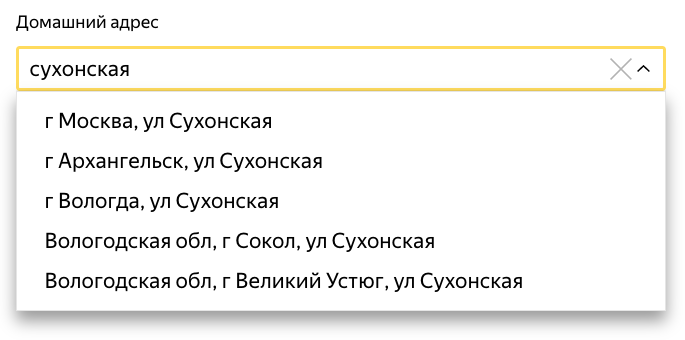
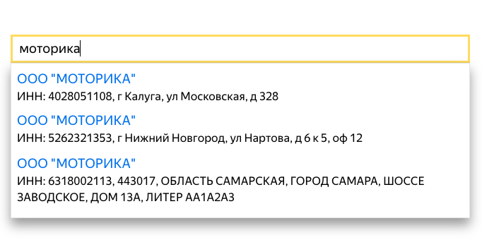
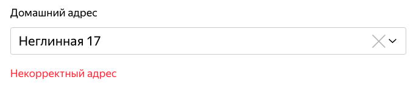

+++
date = 2018-06-04T17:29:32Z
description = "Ограничивать пользователя фиксированным списком вариантов — плохая идея."
featured = true
image = "/suggestions-vs-validation/cover.png"
slug = "suggestions-vs-validation"
tags = ["interface"]
title = "Автокомплит и проверка данных"
+++

Чтобы помочь человеку правильно ввести сложные данные, часто используют автокомплит (он же «подсказки»):

    <figure>
      
      <figcaption>Например, по адресу</figcaption>
    </figure>

    <figure>
      
      <figcaption>Или по компании</figcaption>
    </figure>

Когда программист видит автокомплит — немедленно совмещает его с проверкой. Программист думает так:

> Если пользователь хочет ввести что-то непредусмотренное автокомплитом, следует сурово его покарать.

Нельзя допустить, чтобы человек вводил отсебятину, думает программист:

<figure>
  
  <figcaption>Плохой адрес, плохой. Уходи, негодный человек!</figcaption>
</figure>

Люди спокойно вешают такие проверки на формы заказа в интернет-магазинах, например. Их не смущает, что покупатель, получив свой «некорректный адрес» (или ещё лучше — «некорректное ФИО»), просто уйдёт.

Мы в «<a href="https://dadata.ru/suggestions/">Дадате</a>» как раз занимаемся автокомплитом по разным видам данных, и не проходит и недели, чтобы в техподдержку не пришёл очередной программист с вопросом «как запретить вводить данные, которых нет в подсказках».

Нормальное решение только одно:

<blockquote class="big">
Не использовать автокомплит для проверки данных
</blockquote>

Подсказки помогают человеку быстро и правильно ввести данные: домашний адрес, марку автомобиля, реквизиты компании. Они не предназначены для проверки:

- Если покупатель в магазине указал неизвестный автокомплиту дом — ничего страшного. Менеджер потом перезвонит и уточнит.
- Если человеку нравится указывать машину как «BMW X5 3.0 SD», а подсказки знают только «BMW 5-Series» — не надо рассказывать, что записаться в сервис никак невозможно.
- Если предприниматель два часа назад зарегистрировал компанию в налоговой, и облачная бухгалтерия ещё не успела подтянуть данные — не надо отказывать в регистрации, пусть введёт реквизиты вручную.

Бывают, конечно, ситуации, когда уместно жёстко ограничить варианты — например, если выбирают пункт выдачи товара или аэропорт вылета. Но чаще встречаются «открытые» списки.

Простая эвристика:

<blockquote class="big">
Автокомплит — для помощи человеку, не для проверки
</blockquote>

<!-- 

<em>И подписывайтесь на <i class="far fa-star color-sin"></i> «<a href="tg://resolve?domain=dangry">Интерфейсы без шелухи</a>»</em>

-->

