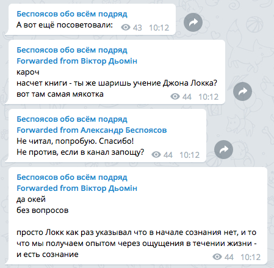
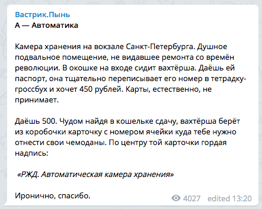
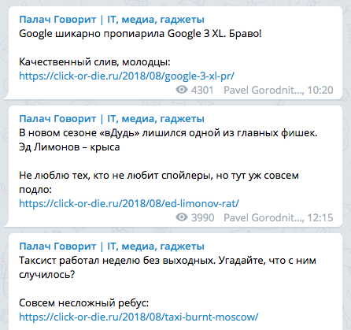
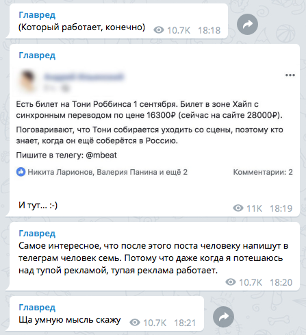
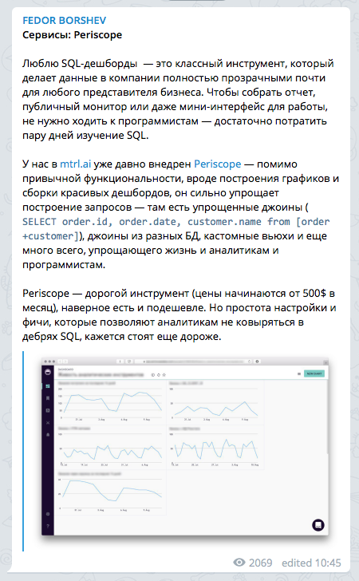
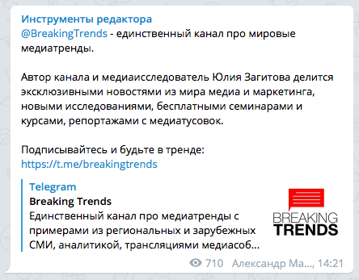
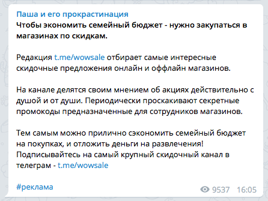

+++
date = 2018-08-24T12:42:12Z
description = "Правила гигиены, которых стоит придерживаться."
image = "/telegram-etiquette/cover.png"
slug = "telegram-etiquette"
tags = ["life", "telegram"]
title = "Этикет ведущего телеграм-канала"
+++

Это правила гигиены, которых я придерживаюсь в канале «<a href="https://t.me/dangry">Интерфейсов без шелухи</a>». Подойдут не всем, но пригодятся многим.

## 1. Не размазывать мысль по нескольким сообщениям

Лучше сначала внятно сформулировать мысль целиком, и потом опубликовать одним постом — а не серией уточнений самого себя, как мы привыкли делать это в чатах.

<em>Поток сознания</em> 
    

<em>Оформленная мысль</em> 
    

А ещё — перечитайте пост перед отправкой и исправьте очевидные проблемы в формулировках. Никто не хочет читать полуфабрикат.

## 2. Ограничиться одним постом в день

Если у вас не новостной канал, конечно. Учитывая бешеную активность в чатах и группах, читателю не очень радостно получать десяток дополнительных сообщений ежедневно.

<em>Новостник, ему можно</em> 
    

<em>А этот мог бы и не частить</em> 
    

Один пост, максимум два — самое то.

## 3. Отключить оповещения

В ваших заметках нет ничего настолько срочного, чтобы тыкать в подписчика пуш-оповещениями. Конечно, многие и так мьютят все каналы, но хорошо позаботиться об остальных и самостоятельно выключить колокольчик:

<figure>
  
  <figcaption>Silent broadcast — ваш друг</figcaption>
</figure>

## 4. Выносить длинные посты в Телеграф

Из-за узкого экрана длинные сообщения превращаются в простыню, которую тяжело читать. Лучше вынести пост в Телеграф или отдельный блог. Телеграфные статьи в телеграме вообще показываются нативно, спасибо Instant View.

## 5. Использовать форматирование

Отформатированный пост приятно выглядит, да и читать его легче:

<figure>
  
  <figcaption>Идеальный аккуратный пост</figcaption>
</figure>

Вот что поможет:

- жирный заголовок,
- ссылки в конце, а не по тексту,
- минимум эмодзи,
- иллюстрация, если уместно.

## 6. Обозначать рекламу

Элементарная порядочность: ставишь рекламу — напиши, что это она. Не надо маскировать под рекомендации или «кстати, наткнулся тут».

<em>Не надо так</em> 
    

<em>Хештег «реклама», всё честно</em> 
    

