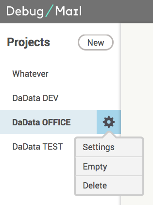
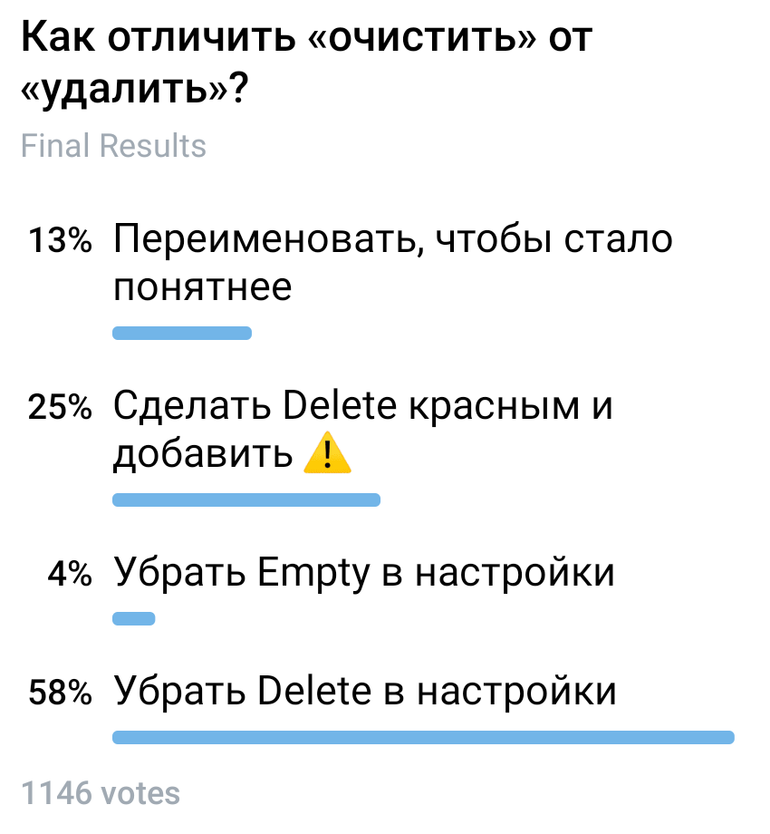

+++
date = 2019-01-24T12:24:40Z
description = "Как исключить путаницу между созвучными действиями в интерфейсе"
image = "/empty-vs-delete-puzzle/cover.png"
slug = "empty-vs-delete-puzzle"
tags = ["interface", "puzzle"]
title = "Задачка: «очистить» vs «удалить»"
subscribe = "dangry"
+++

На скриншоте интерфейс управления почтовыми ящиками. В контекстном меню есть действия *Empty* (очистить ящик) и *Delete* (удалить ящик). Я постоянно их путаю, и удаляю ящики, вместо того, чтобы очистить.

Вопрос: Как минимально изменить интерфейс, чтобы уменьшить вероятность ошибки?

## Решение

Вот результаты голосования подписчиков:

<figure>
  
  <figcaption>Победитель — убрать Delete в настройки</figcaption>
</figure>

Я согласен с большинством — лучше убрать *Delete* в настройки. Удаление почтового ящика — редкая операция, ей нечего делать в контекстном меню. *Empty* же используется часто: это тестовая почта, ящики время от времени чистят.

Почему остальные варианты нравятся меньше:

- *Переименовать, чтобы стало понятнее*. Как не переименовывай, оба пункта останутся близкими по смыслу, а значит ошибки никуда не уйдут.

- *Сделать Delete красным и добавить иконку*. Это, скорее всего, сработает. Но визуальный акцент на редкой операции — так себе решение.

- *Убрать Empty в настройки*. Этот вариант я специально добавил, чтобы чуть усложнить выбор ツ Думаю, тут всё понятно.

В личку несколько раз прислали ещё один вариант:

- *Добавить подтверждение на Delete*. Оно там и так есть, ничуть не помогает. Подтверждения не работают, потому что для рутинных операций люди их не читают

Перенос Delete в настройки решает задачу, делает интерфейс проще и лёгок в реализации. Лучший вариант!
