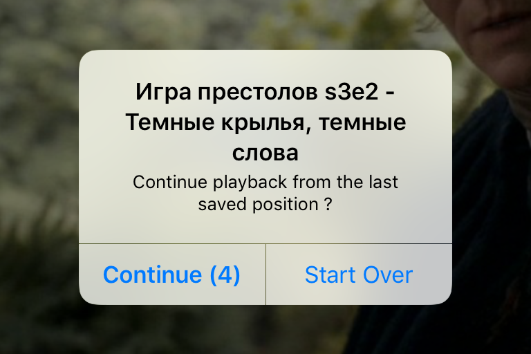
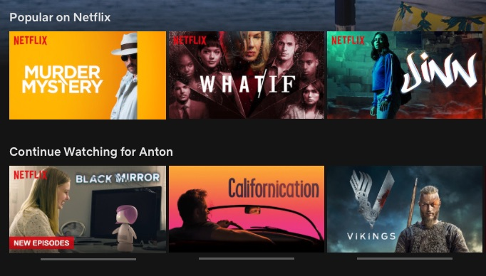

+++
date = 2019-06-15T14:06:52Z
description = "Когда не грех подсмотреть (спойлер: всегда)"
image = "/assets/projects/sin-2.jpg"
slug = "feature-copy"
tags = ["productology", "interface"]
title = "Копировать у конкурентов"
subscribe = "dangry"
+++

Шансы на то, что вы делаете уникальный продукт — мизерные. У любого сервиса наверняка есть конкуренты и аналоги. А значит, можно и нужно подсматривать у лучших из них.

Удивительно, что не все этим пользуются. Вот, например, сериальный сервис «Амедиатека». Даже далёкие от темы люди знают, что самый популярный в мире аналог — «Нетфликс». Казалось бы, заплати $10, посмотри, как у них всё устроено, и перенимай хорошие решения. Но нет.

Могу ещё понять, что у ребят не работает нормально синхронизация: заходишь в приложение на айпаде и не видишь, какие серии уже посмотрел с компа. Вообще это провал, но, допустим, там всё дико сложно технически, и быстро исправить не получается.

Но что может быть проще, чем кнопки паузы и перемотки? У Амедиатеки они мизерных размеров внизу экрана — попробуй, попади. У Нетлифкса — здоровенные и по центру. Что мешает сделать нормально — загадка.

Или вот функция «продолжить воспроизведение». Как это работает у Амедиатеки:

1. Тыкаешь на серию, которую уже смотрел раньше.
2. Вылезает попап (натурально, модальное окно!) с надписью «Continue playback?» и кнопками «Continue» и «Start Over».

<figure>
  
  <figcaption>Погоди смотреть, человек! Сначала сделай нелёгкий выбор.</figcaption>
</figure>

Как это должно работать, исходя из здравого смысла: тыкаешь на серию и смотришь с того момента, где остановился — без лишних вопросов. Потому что перемотать на начало, если что, всегда можно одним движением. Нетрудно догадаться, что у Нетфликса сделано именно так.

Или то, что человек видит после логина. У Амедиатеки:

<figure>
  
  <figcaption>Набор случайных кадров без подписей, как удобно! Странно, что больше никто до такого не додумался.</figcaption>
</figure>

У Нетфликса:

<figure>
  
  <figcaption>Вот популярное, а вот то, что я уже смотрю. Окей, продолжаю.</figcaption>
</figure>

Или функция skip intro / skip recap. Отличная штука, экономит от 30 до 120 секунд на серию, в зависимости от любви постановщиков к длинным вступлениям. Есть она у Нетфликса? Конечно. А у Амедиатеки? Пффф, разумеется нет.

Или... продолжать можно долго. Вывод простой — копировать удачные решения у лучших. И не костылить неудобное «ноу-хау».
