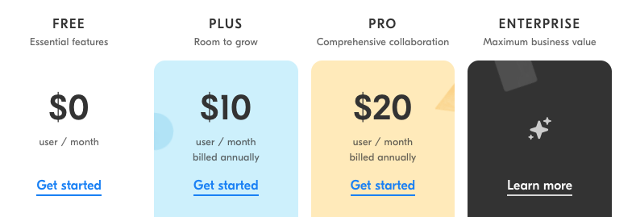

+++
date = 2019-02-11T13:18:13Z
description = "Как мы показали цены на все тарифы и к чему это привело."
featured = true
image = "/pricing-contact-us/cover.png"
slug = "pricing-contact-us"
tags = ["productology", "dadata"]
title = "Тарифный план «свяжитесь с нами»"
subscribe = "dangry"
+++

Облачные сервисы для бизнеса обычно делают несколько тарифов с понятной ценой и один топовый в стиле «свяжитесь с нами».

<figure>
  
  <figcaption>Вот «Интерком» предлагает «chat with us»</figcaption>
</figure>

<figure>
  
  <figcaption>А вот Airtable рисует звёздочки вместо ценника</figcaption>
</figure>

 

У «[Дадаты](https://dadata.ru)» тоже так было:

<figure>
  
  <figcaption>Свяжитесь с нами, чтобы узнать, сколько стоит получить все-все фичи</figcaption>
</figure>

Не берусь судить, насколько такой подход хорош или плох в общем случае. Наверняка, у «Интеркома» и «Эйртейбла» он оправдан. Но по личному опыту в «Дадате» — от скрытого ценника одни проблемы:

- Одни спрашивают «сколько стоит», потому что им действительно нужен топовый тариф.
- Другие хотят купить «расширенный», но боятся, что позже потребуется «всё включено». Вдруг он неадекватно дорог? Тоже спрашивают.
- Третьи вообще ничего покупать не собираются, но им очень любопытно узнать цену.

В результате у поддержки много времени уходит на расчёт цены вместо реальной помощи людям.

Со временем нам это надоело, и теперь тарифы выглядят так:

<figure>
  
  <figcaption>Теперь топовый тариф можно купить точно так же, как остальные</figcaption>
</figure>

Человек сам выбирает нужное количество запросов, цена меняется соответственно.

Вопросы о цене почти полностью прекратились, а покупать меньше не стали.

⌘&nbsp;⌘&nbsp;⌘

Затем мы взялись за «коробку». Коробка — это версия, которую можно поставить на свой сервер. Почти у всех известных мне сервисов стоимость «коробки» на сайте не разглашают. Так было и у «Дадаты»:

Поток любопытствующих о цене коробки был нескончаемым. Каждый второй веб-мастер с виртуальным хостингом непременно хотел себе коробочную версию — пока не узнавал стоимость.

Мы решили её не скрывать:

Ценник сразу отсекает тех, кто не готов платить больше за персональную «коробку» на собственном сервере. Это хорошо, потому что такие люди всё равно не покупали.

При этом понятно, что вот так сходу покупать софт за 400К ₽ мало кто будет — сначала люди хотят узнать подробности установки, настройки и поддержки. Поэтому осталась кнопка, которая приглашает к диалогу — теперь она называется «запросить договор».

За год после нововведения мы стали тратить меньше времени на ответы о цене, а «коробок» продали больше, чем прежде.

⌘&nbsp;⌘&nbsp;⌘

Конечно, это не универсальный рецепт. Если у вашего продукта расчёт цены требует специально обученного человека, а удержать все нюансы ценообразования в голове невозможно, то кнопка «свяжитесь с нами» — единственный рабочий вариант.

Но если тарифная сетка достаточно простая, зачем её скрывать? Так и вопросов меньше, и покупателям удобнее.
