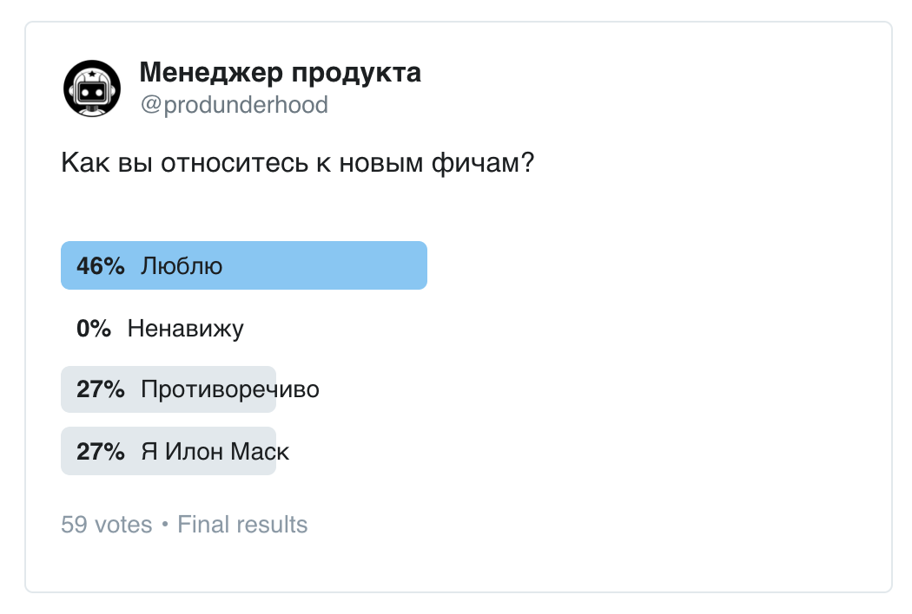
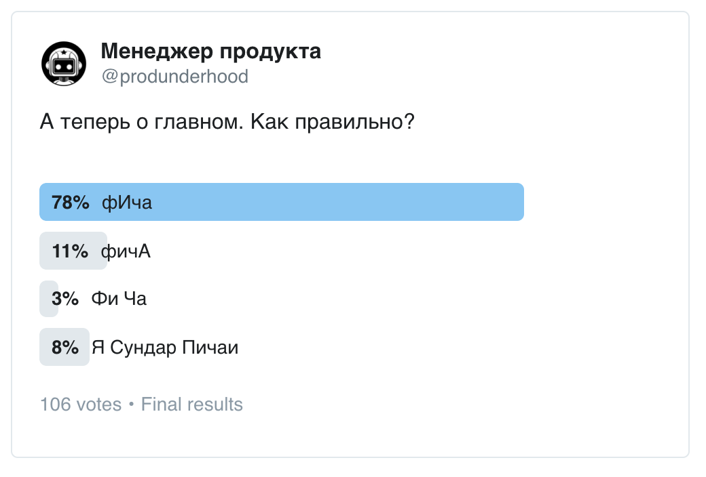
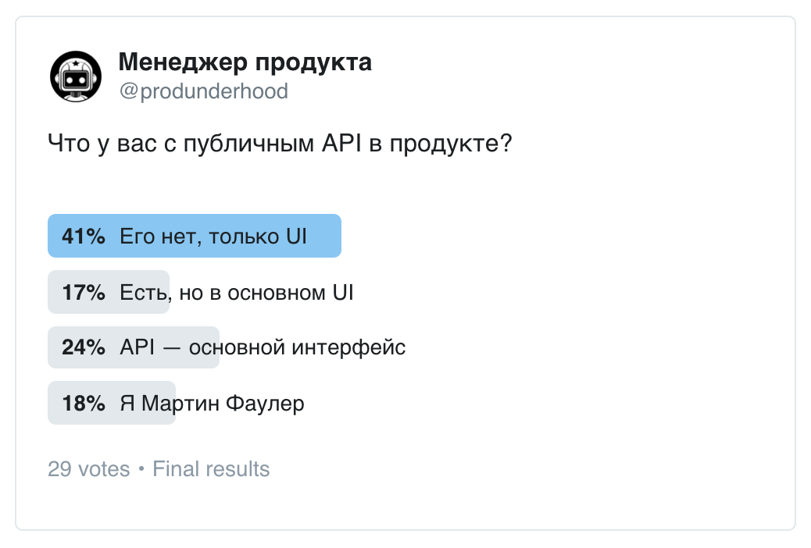
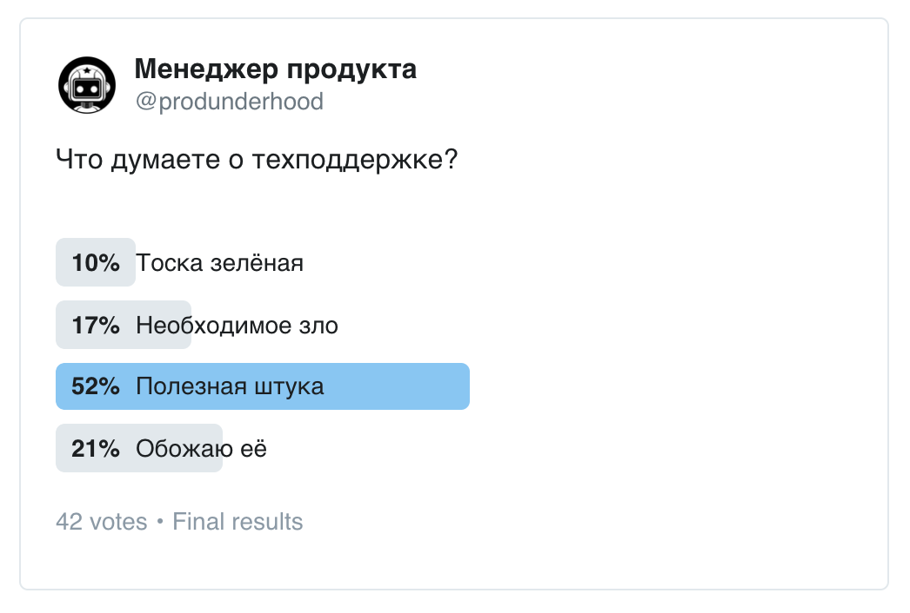

+++
date = 2019-03-11T09:59:57Z
description = "7 лет опыта разработки и развития облачного B2B-сервиса в одной статье."
featured = true
image = "/productology/cover.png"
slug = "productology"
tags = ["productology"]
title = "О продуктоводстве"
+++

*7 лет опыта разработки и развития облачного B2B-сервиса в одной статье.*

Привет! Я Антон Жиянов, техлид в [dadata.ru](https://dadata.ru). Разрабатываю опенсорс, веду курсы, пишу про Python, SQL, открытые данные и облачные сервисы ([много всего](/projects/)).

Пара слов о «Дадате», чтобы задать контекст. Облачный B2B, основное использование — через API, маленькая распределённая команда, несколько десятков тысяч пользователей.

Ничего не буду писать о метриках, гроус-хакинге, касдеве, эджайле, митапах и других традиционных развлечениях продактов. Во-первых, вы это лучше меня знаете. Во-вторых, мне интереснее говорить о другом:

<ul>
  <li><a href="#features">продукт и фичи</a></li>
  <li><a href="#b2b">B2B и кровавый энтерпрайз</a></li>
  <li><a href="#api">API и документация</a></li>
  <li><a href="#support">техподдержка</a></li>
  <li><a href="#development">разработка</a></li>
  <li><a href="#ui">интерфейс</a></li>
  <li><a href="#people">люди</a></li>
</ul>

Дисклеймер: я часто пишу резко и категорично. Если вдруг вы не согласны — вы правы, а я нет. Не принимайте близко к сердцу, не теряйте чувство юмора.

<h2 id="features">Продукт и фичи</h2>

У меня скорее смешанное отношение к новым фичам. Конечно, люблю бизнес-фичи, которые увеличивают прибыль и охват. Они такие вкусные, ммм.

<figure>
  
  <figcaption>Большинство нежно любят новые фичи, а второе место love/hate делят с Маском.</figcaption>
</figure>

Легко и приятно делать всякую мелкую полезную фигню. Доработать слегка демку, сделать понятнее что-нибудь в личном кабинете, добавить красивую страницу для ошибки.

Радостно уменьшать хаос и увеличивать порядок в продукте. Упорядочить документацию, сделать нормальное сравнение тарифов, поменять формулировки в интерфейсе, которые всех путают.

<figure>
  
  <figcaption>Как видит продакт VS как понимают пользователи</figcaption>
</figure>

Весело пилить performance-фичи. Тут достаточно намекнуть разработчику и подождать, пока он всё отлично сделает. А потом ходишь надутый от гордости и всем рассказываешь, как МЫ увеличили скорость в два раза. Разве не ради этого мы стали продактами, друзья?

Скучновато делать всякие вспомогательные штуки, хотя понятно, что без них никуда. Поменять тарифные правила, переколбасить в очередной раз промо-страницы, доработать интеграцию с платёжной системой.

Категорически не годится брать в работу непрофильную муть, которая размывает фокус продукта. «Мы же обрабатываем адреса для интернет-магазинов, так давайте заодно агрегатор доставки сделаем». Ну уж нет.

Но ничто не сравнится с удовольствием УНИЧТОЖАТЬ старые фичи. Например, у нас была регистрация через соцсети с дополнительным экраном в конце. С каким удовольствием я его выпилил!

[Как издеваться над фичами](/shoot-the-feature/)

### Собирательство фич

Типичная проблема продакта: начали делать фичу, она не зашла, а бросить жалко (и «а вдруг взлетит»). Так и тащат за собой [недостроенную звезду смерти](/abandoned-features/).

«Собирательству» фич подвержены даже лучшие из нас. Первые версии iOS были логичными и выверенными до мелочей. Сейчас айось — это какой-то безумный игровой автомат: куда не ткни случайно, отовсюду что-то выезжает и выскакивает.

Другая западня — добавить фичу, потому что потенциальный клиент говорит «добавьте, и тогда я куплю». Ага, конечно. Я вообще считаю, что к мнению неплатящих пользователей стоит относиться ооочень скептически.

<figure>
  
  <figcaption>Если все согласны, что правильно фИча, почему в подкастах я постоянно слышу фичА? 🤔</figcaption>
</figure>

### Спецификации

Поскольку люди в отрасли не могут жить спокойно, каждые три года они придумывают новую концепцию. Персоны, юзкейсы, юзер стори, джоб стори, CJM, whatever. Всё это лирика.

Реально важно одно:

<blockquote class="big">Для каждой фичи или сценария понимать, кто потребитель и зачем это ему.</blockquote>

Выясняется [серией вопросов постановщику задачи](/persona-jtbd-cargo/).

Кто и зачем — это важно. Конкретная методика — карго-культ.

### Бодрость и свежий взгляд

Главная проблема «долгоживущих» продакт-менеджеров и вообще любых сотрудников: со временем у человека замыливается глаз. Команда перестаёт видеть очевидные извне проблемы продукта и упускает возможности.

Знаю один сервис, где нельзя зарегистрировать двух пользователей с одинаковым именем (то есть не может быть две «Анны», например). Основатель мне на полном серьёзе объяснял, что это фича и так и должно быть.

Хотя со стороны очевидно, что это полная дичь.

Поэтому, если вы только пришли в проект, самое время вскрывать нелепые «багофичи», пока у вас свежий взгляд. Выписывайте всё, что кажется странным. Расспрашивайте коллег о причинах. Думайте, как достичь цели по-человечески, без костылей.

А если вы на проекте давно, то не отметайте с ходу «глупые» вопросы новичков. Лучше задумайтесь — вдруг люди «снаружи» считают вашу фичу глупым багом?

<h2 id="b2b">B2B и кровавый энтерпрайз</h2>

Делать продукты для бизнеса одно удовольствие! Люди настолько привыкли к плохим продуктам и плохому сервису, что когда вы делаете хорошо — работает как вау-фактор.

<figure>
  
  <figcaption>B2B оказался лишь чуть популярнее роботов 🤷</figcaption>
</figure>

B2C в этом смысле труднее, потому что там у людей завышенные ожидания. А в B2B — наоборот, заниженные. Хотя и в B2C плохих продуктов хватает. Особенно плохо с саппортом — обычно он предельно механистичный и бездушный, и чем крупнее сервис, тем хуже.

В B2B сложнее, что логика продукта сильно более навороченная. Не получится взять три простых юзкейса, зато «вылизать» их до идеала.

B2B тоже бывает очень разный. Есть low-touch sales, когда сайт продаёт сам, без сейлов, только за счёт маркетинга. Это достаточно похоже на B2C, «Дадата» именно так работает.

А есть high-touch aka «кровавый энтерпрайз», где отдельные продавцы, выездные демонстрации, пресейлы, пилотные проекты и вот это всё. Это уже совсем другая история, сильно отличная от B2C.

У Страйпа есть [неплохая статья о разновидностях B2B](https://stripe.com/atlas/guides/business-of-saas).

### Счета и акты

Самое «весёлое» в российском B2B — это документооборот, так же известный как «счета и акты». Если вы прискакали из мира мобилок на розовом пони, эта штука срежет вас как наточенный серп.

Бухгалтеры через одного не умеют платить без счёта (хотя вообще-то прекрасно можно жить без него). Сначала мы пытались бороться и объяснять, потом плюнули и сделали [волшебную страничку](/too-simple/).

С актами сложнее, поэтому мы честно печатали их каждый квартал, подписывали и рассылали по почте. Но с сотнями клиентов это превратилось в АД. Да ещё 20% актов теряла либо почта, либо бухгалтерия клиента.

Спас только переход на электронный документооборот (мы используем «[Диадок](https://www.diadoc.ru)»). Теперь электронный акт у нас бесплатный, а бумажный — только курьером за отдельные деньги. Это прям хорошо помогло.

Да, и еще. Не позволяйте бухгалтеру [рулить бизнесом](/little-accountant-syndrome/).

### Договор

Веселее счетов и актов может быть только ДОГОВОР! Каждый третий клиент хочет его заключить, обязательно на бумаге, с мокрой печатью и подписью директора собственной кровью.

- Как это у вас нет договора? Вы работаете по оферте? Хорошо, нам подходит. Распечатайте её, подпишите, поставьте печать и высылайте Почтой России.
- Как это оферта не требует согласования и подписания? Ну хорошо, можете не присылать бумагу, пришлите скан.
- У наших юристов нашлось 128 замечаний к вашей оферте. Можете оперативно внести исправления? Заранее спасибо.
- Ну хорошо, мы согласны работать по оферте. Давайте только сначала подпишем соглашение о работе по оферте.
- Нет, мы категорически не согласны работать по оферте, обязательно нужен договор. Сколько-сколько он стоит? Мы готовы работать по оферте.

И вот это всё продолжается в бесконечных вариациях. Доброжелательность и терпение — ваши друзья.

### Тарифы и цены

Тарифные планы в B2B обычно сложные. У нас, например, есть подписка с лимитами по фичам и объёмам, и есть отдельная оплата за каждую запись, да ещё с несколькими слоями скидок. Всё это усложняет жизнь как клиентам, так и команде.

Вот хороший обзор разных [ценовых моделей для облачных сервисов](https://vc.ru/flood/24898-types-of-monetization).

Часто B2B прячут цены. Хотя мы [сделали всё прозрачно](/pricing-contact-us/), и прекрасно зашло.

### Ловушки

В B2B клиенты любят (1) требовать сроки по конкретным фичам и (2) просить индивидуальные доработки. Называть сроки — плохая идея. А индивидуальные доработки — ОЧЕНЬ плохая идея.

Мы обычно называем сроки с точностью до года 🤷 Сильно реже — до квартала. Точнее — никогда.

На грабли с индивидуальной доработкой достаточно наступить один раз, чтобы отбить охоту заниматься этим на всю жизнь. Я, как полагается, разок наступил.

Самое неприятное, что эту ошибку тяжело исправить. Ненужную фичу приходится бесконечно тащить с собой в прекрасное будущее. Немного помогает плотно покрыть её автотестами и спрятать из документации, чтобы никто не догадался, что ЭТО существует.

### Кровавый энтерпрайз

Самый насупленный и серьёзный B2B — это не облако, а «коробка», которая настраивается и внедряется под специфику заказчика. Там прямо чувствуешь, как у тебя отшелушивается худи и начинает расти галстук.

На самом деле, над такими продуктами очень интересно работать, если команда хорошая. Но важно немножко хулиганить, а иначе можно в корпоративного зомбаря превратиться. В этом помогают [пасхалки](/easter-egg/), например.

Но лучше всего — живительные пинки здравого смысла от коллег, конечно.

Так что если вы всю жизнь в B2C и приуныли, можно попробовать коробочный B2B. Море интересных ощущений гарантирую. У меня коллега так сделал, и в результате столько добра причинил, что его просто ложками можно есть (добро, не коллегу).

<h2 id="api">API и документация</h2>

С одной стороны, делать API легче и приятнее, чем UI. Никакой тебе мудрёной логики взаимодействия, никаких Реактов и извратных UI-библиотек для мобилок.

С другой, стороны, неудачные решение в UI легко поменять. А ошибки в API остаются на всю жизнь, и это большая боль.

<figure>
  
  <figcaption>Большинство ребят работает над B2C, поэтому и API у них нет</figcaption>
</figure>

Конечно, в книжках вам расскажут про версионирование API, но по факту всё обычно останавливается на второй-третьей версии, и дальше API только обрастает «мясом», постепенно теряя простоту и логичность.

Не знаю здесь универсальных рецептов. «Дадате» помогают две вещи:

1. Сначала делать как можно проще, усложнить всегда успеем
2. Писать понятную документацию (OpenAPI — НЕ понятная документация)

Понятная документация — это, прежде всего, примеры. Они помогают разработчикам работать даже с самым извратным API. И наоборот — без примеров даже над самым простым API приходится ломать голову.

Шикарная документация у Страйпа. [Посмотрите](https://stripe.com/docs/api) и сравните с обычной автогенерённой по OpenAPI докой. А вот как у Страйпа реализовано [версионирование API](https://stripe.com/blog/api-versioning) «под капотом».

Очень помогает сделать по примеру на каждый популярный юзкейс. Хорошо предусмотреть популярные языки — JS, PHP, Python, C#, Java. Для этого можно использовать [Postman](https://www.postman.com/), например — он умеет генерить код на разных языках.

### Сторонние модули

Самое веселье начинается, когда сторонние компании начинают делать интеграции к вашему продукту. Например, «Дадата» интегрируется с Битриксом, amoCRM, и кучей других сервисов. Всё это — партнёрские интеграции.

Обеспечить стабильно высокое качество сторонней интеграции нереально без огромных трудозатрат на проверку и контроль за партнёрами. Дело осложняется тем, что партнёрский модуль для того же Битрикса потенциально может конфликтовать с миллионом других модулей.

В итоге неизбежно появляются глючные интеграции. Винят за них, естественно, вас, а не партнёра (ಠ_ಠ)

Бывают реально странные случаи. Один человек сделал модуль для нашего бесплатного сервиса. Я посмотрел, вроде всё ОК, выложил на сайт. И тут люди начинают жаловаться, что с них списывают деньги за использование модуля. Начинаю разбираться, залезаю в исходники. А там аккуратно в самом сердце модуля спрятан вызов другого нашего сервиса, уже платного. Зачем разработчик так сделал? Непонятно.

Хеппи-энда для партнёрских интеграций я не вижу. Смотрел, как дела у других крупных сервисов. Везде одно и то же: где модули пишут сторонние разработчики — там сразу проблемы. Пользовательский рейтинг немного улучшает положение, но тоже не панацея.

### Инструменты

Про Postman я уже сказал — он просто маст хэв.

[httpbingo](https://httpbingo.org/) показывает приходящие в него запросы, заголовки и прочую хурму. Помогает, если нужно посмотреть, в чём проблема с запросами пользователя. Ещё более мощная штука — [mitmproxy](https://mitmproxy.org)

С помощью [APIembed](https://apiembed.com) можно встроить примеры вызова API на разных языках.

Совершенно гениальная штука [badssl.com](https://badssl.com) — он имитирует все возможные проблемы с SSL-сертификатами и конфигурациями.

<h2 id="support">Техподдержка</h2>

Обожаю её. Нигде вы не получите столько честной обратной связи, как в саппорте. Касдев отдыхает.

Многие продакты изо всех сил огораживаются от саппорта, и достучаться до них через техподдержку нереально. Считаю это огромной ошибкой.

Обращения в техподдержку как прожектором подсвечивают все проблемы продукта — глупо этом не пользоваться. Я до сих пор читаю все тикеты, на некоторые сам отвечаю. Бодрит невероятно, всем рекомендую.

Саппорт не только показывает проблемы, но и подсказывает новые фичи. Главное — не верить «плюсам», которые пользователи ставят при голосовании, а выяснять конкретный [сценарий использования](/users-not-backlog/) в каждом случае.

<figure>
  
  <figcaption>Торжество здравого смысла в голосовании по саппорту</figcaption>
</figure>

Саппорт — это ещё и невероятно увлекательно. Нигде вы не встретите столько новых людей и офигительных историй, как в техподдержке.

Например, благодаря саппорту я умею вызывать API «Дадаты» на C#, Java, JS, Python, PHP, Go, Delphi, VBScript и PL/SQL. Некоторые из этих примеров я предпочёл бы забыть.

### Обратная связь

Интересно вышло с оценкой качества поддержки. Интерком начал использовать шкалу из 5 эмодзи:

😠 🙁 😐 😃 😍

Многие скопировали. А Интерком через два года заменил 😍 на 🤩 — потому что мужики отказывались ставить сердечки другим мужикам ツ

Лично я предпочитаю [бинарную шкалу](/rating-as-feedback/) «понравилось / нет» + текстовый комментарий. Но все гуру поддержки такой подход категорически осуждают.

### Инструменты

Самый известный, конечно, [Intercom](https://intercom.com). Мы используем [Userecho](http://userecho.com) — он не такой проработанный в мелочах, но зато обладает ОГРОМНЫМ количеством фич.

Если продукт как-то связан с JS (у нас, например, js-виджет, который использует куча пользователей), то незаменимая штука — [Codepen](https://codepen.io). Там и примеры, и воспроизведение проблем, и всё что хочешь. Намного приятнее, чем JSFiddle. Советуют еще [CodeSandbox](https://codesandbox.io/), но я не пробовал.

Если надо получить информацию о браузере пользователя, то [yandex.ru/internet](https://yandex.ru/internet/) (хотя там внизу дурацкая надпись «Если вы лично не обращались в службу поддержки Яндекса, не передавайте никому данные с этой страницы»)

Если какая-то замороченная проблема, которую не получается воспроизвести на Codepen, можно попросить человека записать все запросы через Хром и [прислать HAR-архив](https://support.zendesk.com/hc/en-us/articles/204410413-Generating-a-HAR-file-for-troubleshooting).

<h2 id="development">Разработка</h2>

Вывел для себя два правила:

1. Всегда лучше брать готовое, чем писать самим.
2. Автоматизировать процесс только после того, как отработали вручную.

Для любых «непрофильных» фич лучше использовать готовые решения. У нас это весь бэкофис, саппорт, счета и акты, платежи, метрики, админка.

Бэкофис для небольшой команды вообще прекрасно делается на гуглодоках или Airtable. Ещё интересно выглядит [Retool](http://tryretool.com), но в работе я его не пробовал. Вообще, если нравятся no-code решения, посмотрите [n8n.io](https://n8n.io/) — это такой опенсорсный Zapier.

Одна из главных печалек для меня — что пришлось делать собственный биллинг. Сейчас в Европе или США можно взять Stripe, а для России до сих пор ничего нет. Интересно выглядел [PricePlan](https://priceplan.ru/ru/), но у него безумная комиссия и не видно развития.

### Not invented here

Not Invented Here у продактов в России цветёт буйным цветом. Главная заповедь плохого продакта:

<blockquote class="big">Лучше сами, но никогда, чем чужое, но сейчас</blockquote>

Реально, сколько раз сталкивался. Говоришь им «ребята, у вас с вводом адреса беда, возьмите „Дадату“ и исправьте за неделю». Отвечают «да, мы знаем, но сторонних решений не надо, все сделаем сами, уже в беклог добавили». Заходишь через два года проверить — ничего не изменилось. ЗАТО САМИ.

### MVP и говнокод

Очень опасная тема. Я думаю, что говнокодить можно, только если вы 100% знаете, что код на выброс или будет полностью переписан в течение года.

Конечно, не стоит впадать и в противоположную крайность, и сразу начинать строгать дизайн-систему, распределённую архитектуру, и прочую хурму, которая оправдана только для больших систем.

По моим наблюдениям, нормальный модульный код с разумно организованными зависимостями и тестами подходит для 95% случаев. Оставшиеся 5%, когда можно яростно говнокодить, в реальности встречаются редко.

<h2 id="ui">Интерфейс</h2>

В B2B продуктах особые красоты не требуются, достаточно аккуратного UI без явных косяков. Главное — понятность.

Часто встречаю: нарисовали красиво, а основной сценарий в интерфейсе не проработан. Вплоть до того, что баннер «СКИДКА 10%» напрочь закрывает кнопку покупки. Это провал.

Ещё беда: идиотские ограничения. Имя «Ян» ввести нельзя, слишком короткое. С емейлом info@dadata.ru регистрироваться нельзя, слишком общий. Адрес без улицы ввести нельзя — программист не знает, что существуют деревни. Тоже провал.

И ещё: настройки. Это бич продуктов, боритесь с ними всеми силами. Для простоты можно считать, что каждая новая настройка — это признание вашего продуктового бессилия ツ Немного радикально, но задаёт нужный ход мыслей. 

А вот [как проектировать настройки](https://medium.com/@imran_parvez/designing-settings-b2a96878961b).

Если продакт считает, что в интерфейсах должен понимать только дизайнер — продукт гарантированно будет отстойный. Понимать должны все — и сам продакт, и разработчики фронтенда, и тестировщики, и саппортеры.

Чтобы объяснить программисту, что дизайн интерфейса — это не про анимацию и игры со шрифтами, покажите ему статью про [законы робототехники в интерфейсе](/laws/).

<h2 id="people">Суперсила продакта</h2>

Напоследок пара слов о продакт-менеджерах в целом. Я думаю, что суперсила продакта — это здравый смысл. Пока всех остальных участников команды вечно заносит чёрти куда, продакт сохраняет здоровый скепсис и критическое мышление.

Поэтому я не верю в чуваков, которые думают, что голая пассионарность приведёт продукт к цели. Давайте начистоту, ребята:

<blockquote class="big">Мы ни разу не Джобсы и не Маски</blockquote>

Наша задача — не бежать впереди толпы с горящим сердцем в руке. Наша задача — баланс.

И точно так же не верю в ребят, которые обмазались со всех сторон метриками, и думают, что данные дают ответы на все вопросы. Продукт — больше про людей, чем про данные. Ну, если у вас не фейсбук, конечно.

Хорошего продакта не бывает в отрыве от предметной области. Поэтому я не понимаю коллег, которые сегодня делают ритейл, завтра такси, а послезавтра финтех.

По-настоящему хорошие продуктовые решения возможны, только когда ты погружён в предметку. Если продакт каждый год на новом проекте — это всё равно что его нет. Зачем он такой нужен?

Продакт-менеджмент, как и любой менеджмент — не универсальная дисциплина. Универсальный продакт — плохой продакт. Продакт, который нежно любит предметку — хороший, берегите его.

⌘&nbsp;⌘&nbsp;⌘

Здесь могли бы быть рекомендации книг, курсов и телеграм-каналов. Но вместо этого лучше рекомендую побольше полагаться на критическое мышление. Очень помогает отсеивать шлак и оставлять ценное — как на работе, так и по жизни.

Спасибо! И подписывайтесь в твитере — [@nalgeon](https://twitter.com/nalgeon)

<em>Специально для подписчиков <i class="far fa-star color-sin"></i> «<a href="tg://resolve?domain=dangry">Интерфейсов без шелухи</a>»</em>

