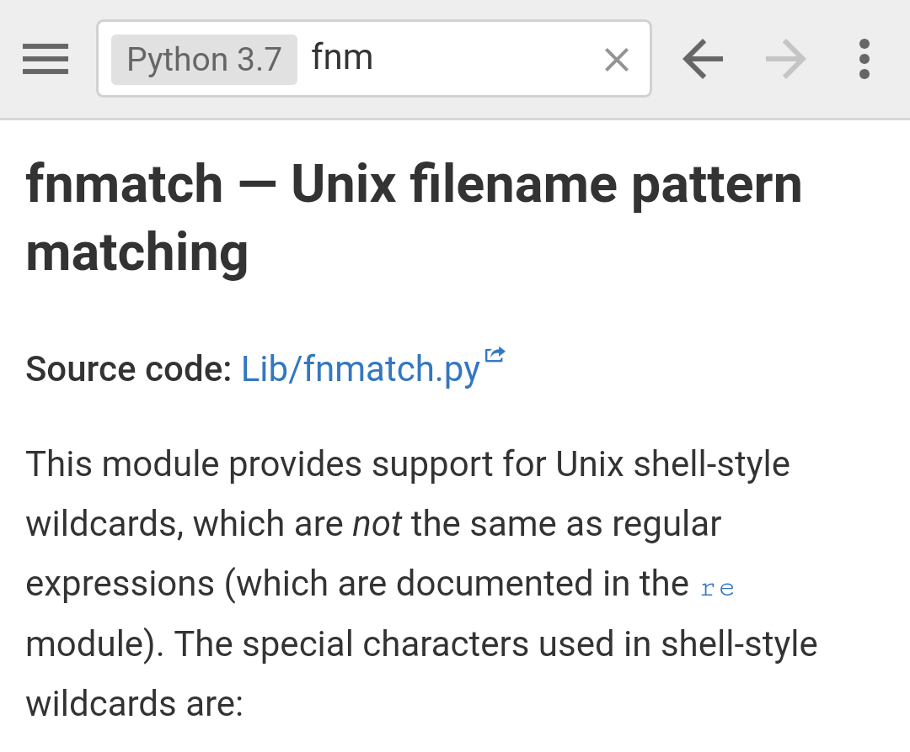

+++
date = 2019-01-03T12:34:26Z
description = "Загляните в них."
image = "/assets/projects/ohmypy-2.jpg"
slug = "python-sources"
tags = ["ohmypy"]
title = "Python. Исходники стандартной библиотеки"
+++

У большинства питонячих модулей хорошее описание: написано доходчиво, часто есть примеры. Но ничто не заменит исходного кода, если что-то непонятно или хочется понять, как та или иная штука реализована.

Core-разработчик Питона [Реймонд Хеттингер](https://twitter.com/raymondh) тоже это заметил, и поэтому в документации к каждому модулю стандартной библиотеки первым делом идёт ссылка на исходники этого самого модуля на гитхабе.

<figure>
  
  <figcaption>Модуль fnmatch — «лайтовая» альтернатива регулярным выраженияем. Хотите узнать, как он проверяет строки по паттернам? Загляните в исходники.</figcaption>
</figure>

Если вы прочитали описание функции или класса, а вопросы остались — не стесняйтесь пойти в исходный код и посмотреть, как оно там устроено. Большинство модулей отлично написаны, код понятный, в меру откомментирован.

<em>Заметка из телеграм-канала <i class="fas fa-kiwi-bird"></i> «<a href="https://t.me/ohmypy">Oh My Py</a>»</em>

