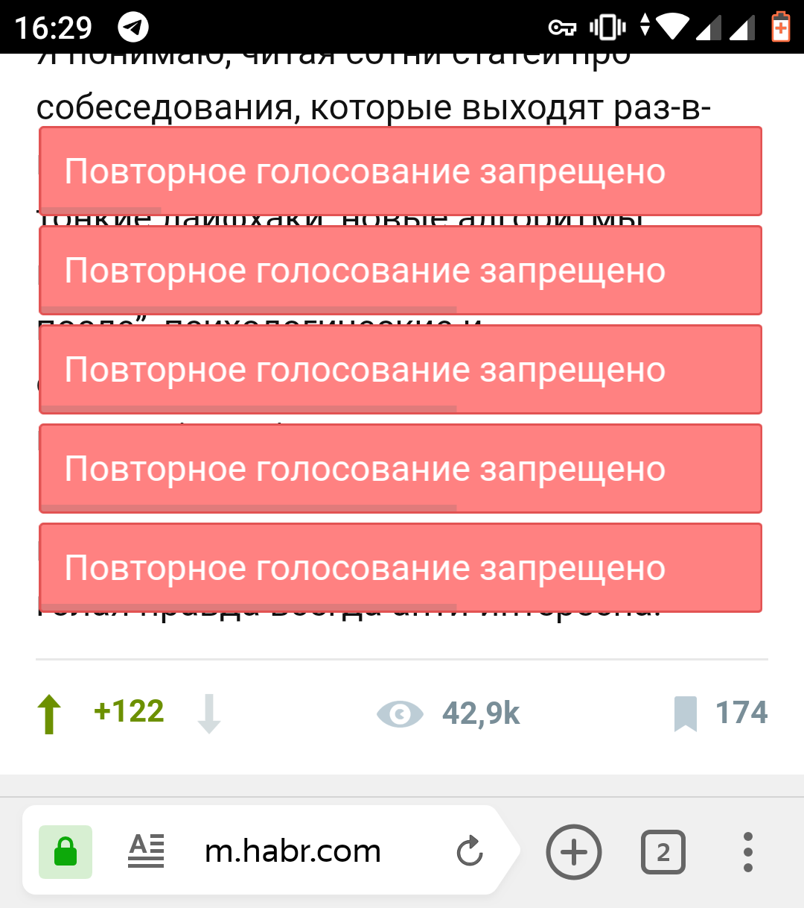
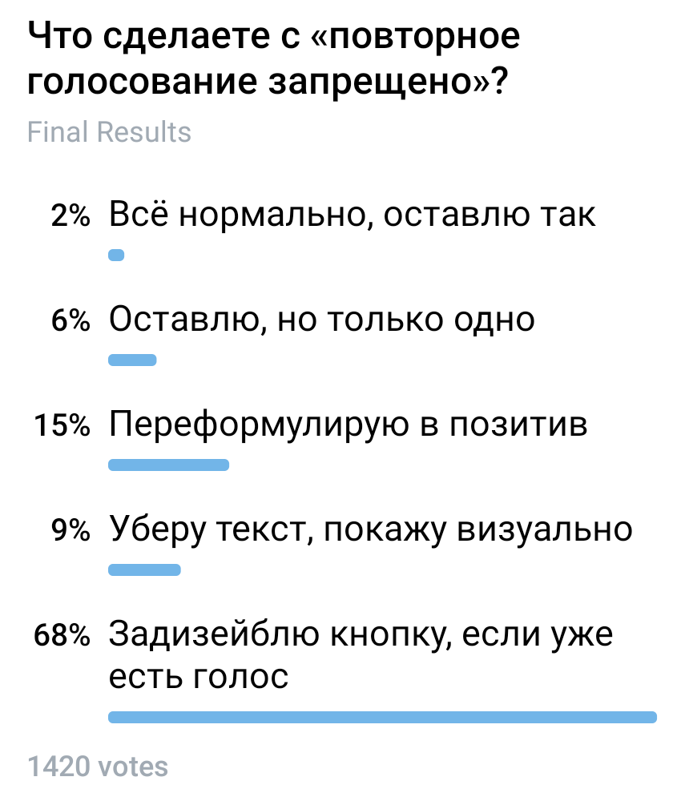
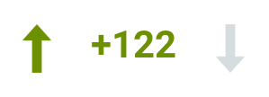

+++
date = 2019-02-21T12:13:51Z
description = "Как не грозить пальцем человеку без необходимости."
image = "/watchman-puzzle/cover.png"
slug = "watchman-puzzle"
tags = ["puzzle", "interface"]
title = "Задачка: айти-вахтёр"
+++

По моим наблюдениям, разработчики (и дизайнеры, в меньшей степени) очень любят запрещать. Я это называю «синдром айти-вахтёра».

Например, есть известная коллективная блог-площадка. Там можно голосовать за статьи, и если случайно ткнуть на голосовалку дважды, получаешь суровое:

> Повторное голосование запрещено

А если нажать много раз — будет чудесная картина, которая изображена на скриншоте. Присмотритесь, у каждого сообщения есть собственный прогресс-бар обратного отсчёта. Инженерный дизайн ツ

  

Вопрос: Как бы вы поступили с этим сообщением?

## Решение

Вот результаты голосования подписчиков:

<figure>
  
  <figcaption>Победитель — деактивировать кнопку</figcaption>
</figure>

Приятно видеть такое единодушие ツ Разберём варианты:

### Всё нормально, оставлю так

Понимаю, жаль отказываться от такой красоты. Там целая система! Мало того, что у каждого сообщения собственный обратный отсчёт. Так ещё если сообщений больше 5, то дополнительные становятся в очередь и выскакивают только после того, как закрылись предыдущие. Кто-то явно потрудился над этим ツ

Но всё же для пользователя сообщение бесполезно.

### Переформулирую в позитив

Формулировать сообщение об ошибке в позитиве («вы уже проголосовали» вместо «повторное голосование запрещено») — хорошая мысль, если сообщение действительно нужно. Здесь оно ничем не помогает, так что смысла нет.

### Уберу текст, покажу визуально

Подходящий способ для валидации обязательного поля на форме, например. Здесь же нет пользовательской ошибки, повторное голосование никому не мешает, так что сигнализировать о нём не стоит.

### Задизейблю кнопку, если уже есть голос

Простой и рабочий вариант. Если человек уже проголосовал «в плюс», то дальнейшие тыки на кнопку можно спокойно игнорировать. Нет ошибки, нет проблемы, все счастливы.

При этом визуально кнопка не должна дизейблиться (становиться серой) — чтобы не смущать человека. Достаточно деактивировать её, то есть игнорировать повторные нажатия.

После голосования кнопка остаётся визуально «нажатой», чтобы человеку было понятно — голос уже отдан:

### Снимать голос при повторном тыке
Этот вариант предложили в личке. Мне он не очень нравится. Если бы действие было одно (как лайк в фейсбуке) — да, логично, при повторном нажатии отменять его (снимать лайк).

Но тут в интерфейсе два раздельных действия (плюс и минус). И снимать плюс при повторном нажатии на плюс — нелогично.

<em>Заметка из телеграм-канала <i class="far fa-star color-sin"></i> «<a href="https://t.me/dangry">Интерфейсы без шелухи</a>»</em>

