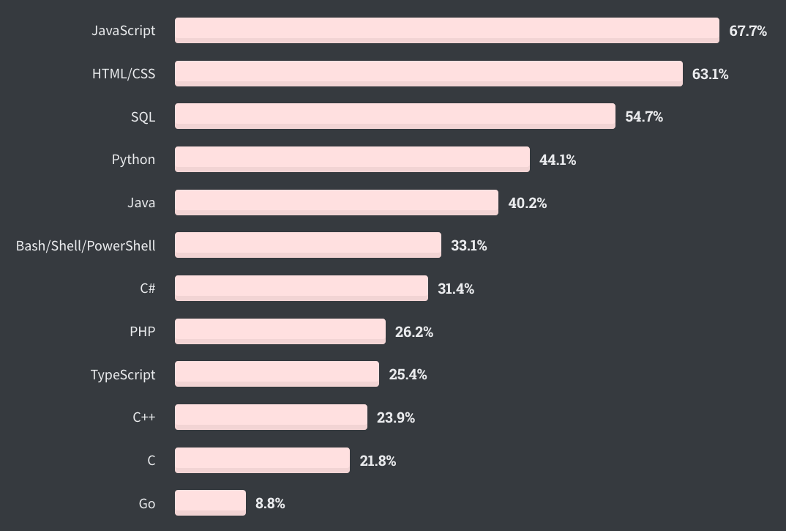
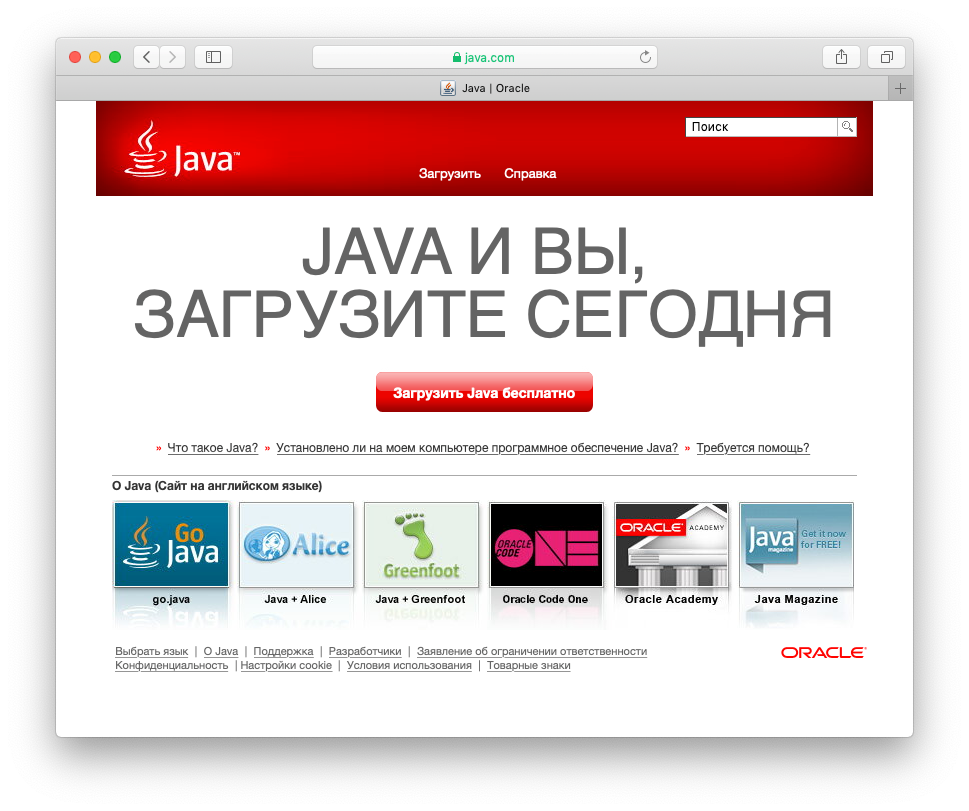
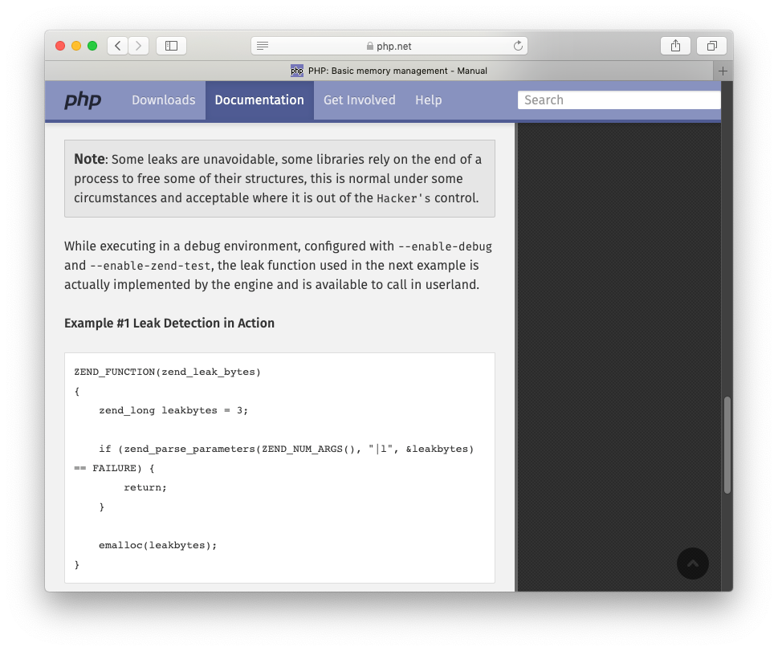

+++
date = 2020-07-06T09:08:48Z
description = "На примере Go и топ-10 языков программирования."
image = "/language-doc/cover.png"
slug = "language-doc"
tags = ["development"]
title = "Плохая и хорошая документация языка"
+++

Язык Go не отличается красотой. Кто-то называет его «намеренно простым», кто-то уродливым. Но с чем у Go действительно всё классно — так это с документацией. Там много хорошего, но вот главное, на мой взгляд:

1. [A Tour of Go](https://tour.golang.org/) — интерактивное введение в язык.
2. [Effective Go](https://golang.org/doc/effective_go.html) — книга о том, как писать идиоматичный код на Go.
3. Ссылки из документации на исходники каждой функции стандартной библиотеки (например, [Max](https://golang.org/src/math/dim.go?s=816:846#L25)).

Для сравнения я взял топ-10 языков из [StackOverflow Developer Survey](https://insights.stackoverflow.com/survey/2020#most-popular-technologies) и посмотрел, как у них дела с этими тремя пунктами.

<figure>
  
  <figcaption>Рейтинг популярных языков по версии StackOverflow</figcaption>
</figure>

## 1. JavaScript

У языка даже своего сайта нет ツ Есть миллион обучалок, но единого авторитетного источника — нет. Документация по языку есть только благодаря [Мозилле](https://developer.mozilla.org/en-US/docs/Web/JavaScript/Reference/Global_Objects). Ссылок на исходники нет, конечно. Зато по каждой функции есть [интерактивный пример](https://developer.mozilla.org/en-US/docs/Web/JavaScript/Reference/Global_Objects/Object/defineProperty), это отлично.

## 2. SQL

Всё как у JS, только хуже — в мире SQL не нашлось своей Мозиллы, которая бы сделала документацию с примерами. Где свой SQL получали, там и ищите.

Кстати, если вы уже знаете основы SQL и хотите прокачать понимание индексов, оптимизацию запросов и всякое такое — посмотрите онлайн-книгу <a href="https://use-the-index-luke.com/">Use The Index, Luke</a>, она хороша.

## 3. Python

Первый язык в топе с собственным сайтом. Есть ссылка *Get Started*, но дальше разбегаются глаза — что выбрать? Вместо рекомендованной авторами базовой обучалки вываливают на новичка [простыню ссылок](https://wiki.python.org/moin/BeginnersGuide/Programmers). [Официальный туториал](https://docs.python.org/3/tutorial/index.html) найти можно только каким-то нетривиальным способом. Интерактива нет. Незачёт.

Исходников отдельных функций нет, исходники модулей — только если они написаны на Python (например, для [heapq](https://docs.python.org/3/library/heapq.html) исходники есть, а для [itertools](https://docs.python.org/3/library/itertools.html) — нет).

## 4. Java

Язык принадлежит компании Оракл, этим всё сказано. Заходите на официальный сайт [посмеяться](https://www.java.com/ru/).

<figure>
  
  <figcaption>Это весь сайт. Вот прям совсем весь. Учитесь!</figcaption>
</figure>

Если пройтись по ссылкам дальше, попадаешь на страницу Learn Java Skills, где Оракл любезно предложит прикупить семинар. Если ну очень постараться, можно набрести на документацию по языку, даже [с примерами](https://docs.oracle.com/en/java/javase/11/docs/api/java.base/java/util/stream/package-summary.html). Странно, что за доступ не надо платить или хотя бы регистрироваться в Oracle Developer Network — надеюсь, эту недоработку скоро исправят.

## 5. Bash

Не ожидал, но у него есть [сайт](https://www.gnu.org/software/bash/) и [документация](https://www.gnu.org/software/bash/manual/bash.html). Спасибо и на том.

## 6. С#

Первый язык родом из нового тысячелетия в списке. Есть [интерактивный туториал](https://docs.microsoft.com/en-us/dotnet/csharp/tutorials/intro-to-csharp/hello-world), [тур по языку](https://docs.microsoft.com/en-us/dotnet/csharp/tour-of-csharp/) и [руководство разработчика](https://docs.microsoft.com/en-us/dotnet/csharp/programming-guide/). Неплохо! В документации есть интерактивные примеры, а вот ссылок на исходники нет.

## 7. PHP

Первое, что встречает на официальном сайте — *Please DO NOT use this version in production, it is an early test version*. Спасибо, да. Я бы вообще сделал *DO NOT use this in production* официальным слоганом языка. Кхм, пардон, отвлёкся. Есть неинтерактивная [обучалка](https://www.php.net/manual/en/tutorial.php), неплохая документация со статическими примерами и комментариями сообщества, и, неожиданно — аж целая книга [PHP at the Core: A Hacker's Guide](https://www.php.net/manual/en/internals2.php).

<figure>
  
  <figcaption>Some leaks are unavoidable, объясняют нам знатоки PHP.</figcaption>
</figure>

## 8. TypeScript

Новейший язык, 2012 года выпуска. Несколько [введений](https://www.typescriptlang.org/docs/handbook/typescript-from-scratch.html), местами интерактивные. Подробный [учебник](https://www.typescriptlang.org/docs/handbook/intro.html), который начинается как интерактивный, но быстро превращается в статический (как так?). Ссылок на исходники нет, но они особо и не нужны — у тайп-скрипта нет собственной стандартной библиотеки.

## 9. C++

Есть интерактивный тур по языку! Шучу, конечно. Тур выложен [в PDF](https://isocpp.org/images/uploads/2-Tour-Basics.pdf), что тут скажешь. Зато есть [Core Guidelines](http://isocpp.github.io/CppCoreGuidelines/CppCoreGuidelines) о том, как писать правильный код.

## 10. C

Сайта нет, ничего нет, населена роботами.

⌘&nbsp;⌘&nbsp;⌘

Счёт 10-0 в пользу Go.

<em>Заметка из телеграм-канала <i class="fab fa-telegram-plane"></i> «<a href="https://t.me/thank_go">Thank Go</a>»</em>

