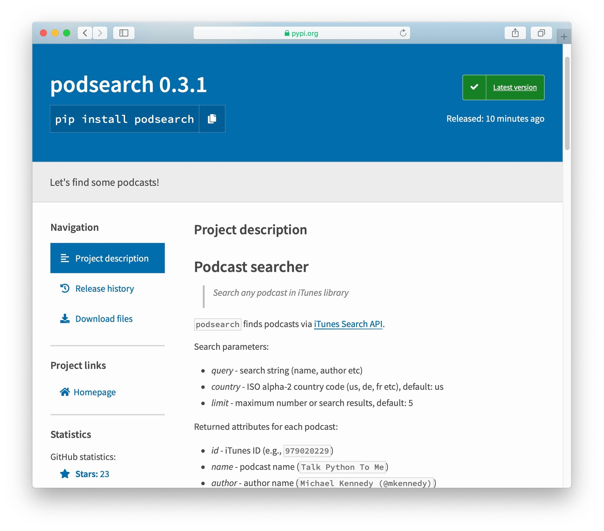
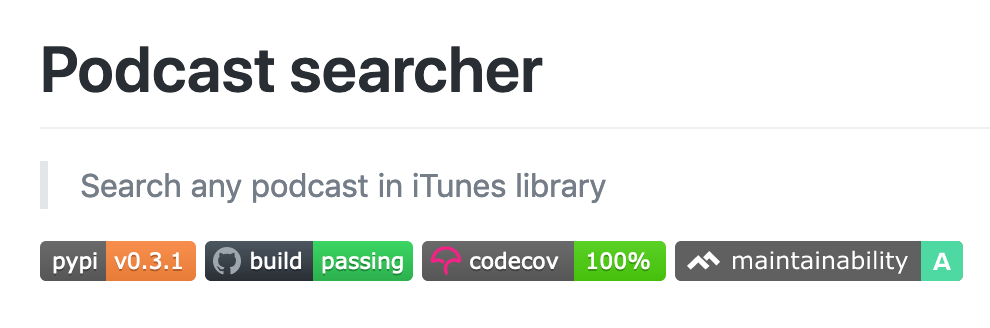

+++
date = 2020-05-15T07:58:16Z
description = "Такой, чтоб не стыдно было показать коллегам."
featured = true
image = "/packaging/cover.png"
slug = "packaging"
tags = ["development", "ohmypy"]
title = "Как сделать классный Python-пакет"
+++

*Версия от апреля 2021 года*

Бывает, напишешь какую-нибудь полезную утилиту на питоне, и хочется поделиться ей с коллегами. Лучший способ для этого — сделать пакет (package): он устанавливается одной командой и спасает от копипасты.

Если вы, как и я раньше, думаете, что создание пакетов в питоне — большая головная боль, то знайте, что это не так. Чтобы не быть голословным, я сделал это пошаговое руководство. Три основных шага и несколько вспомогательных, со ссылками на гитхаб. Убедитесь сами:

## 1. Заглушка

Будем делать `podsearch` — утилиту, которая ищет подкасты в айтюнсе. Создадим каталог и виртуальное окружение:

```
$ mkdir podsearch
$ cd podsearch
$ python3 -m venv env
$ . env/bin/activate
```

Создадим минимальную структуру пакета:

```
.
├── .gitignore
└── podsearch
    └── __init__.py
```

```python
"""Let's find some podcasts!"""

 __version__ = "0.1.0"


 def search(name, count=5):
     """Search podcast by name."""
     raise NotImplementedError()
```

## 2. Тестовый пакет

Исторически создание пакета в питоне — дело хлопотное. К счастью, есть отличная маленькая утилита [flit](https://flit.readthedocs.io/en/latest/), которая упрощает его до предела. Установим её:

```
pip install flit
```

И создадим описание пакета:

```
$ flit init
Module name [podsearch]: 
Author [Anton Zhiyanov]: 
Author email [m@antonz.org]: 
Home page [https://github.com/nalgeon/podsearch-py]:                                     
Choose a license (see http://choosealicense.com/ for more info)
1. MIT - simple and permissive
2. Apache - explicitly grants patent rights
3. GPL - ensures that code based on this is shared with the same terms
4. Skip - choose a license later
Enter 1-4 [1]: 1

Written pyproject.toml; edit that file to add optional extra info.
```

[pyproject.toml](https://github.com/nalgeon/podsearch-py/blob/main/pyproject.toml)

Flit создал файл с метаданными проекта `pyproject.toml`. В нём уже есть всё необходимое для публикации пакета в публичном репозитории — PyPi.

Зарегистрируемся на [TestPyPi](https://test.pypi.org/) (тестовый репозиторий) и [PyPi](https://pypi.org/) (основной). Они полностью независимы, так что потребуются две учётные записи.

Настроим доступ к репозиториям в файле `~/.pypirc`:

```ini
[distutils]
index-servers =
  pypi
  pypitest

[pypi]
username: nalgeon  # replace with your PyPI username

[pypitest]
repository: https://test.pypi.org/legacy/
username: nalgeon  # replace with your TestPyPI username
```

И опубликуем наш пакет в тестовом репозитории:

```
$ flit publish --repository pypitest
Found 4 files tracked in git
...
Package is at https://test.pypi.org/project/podsearch/
```

Готово, пакет доступен на [TestPyPi](https://test.pypi.org/project/podsearch/).

## 3. Публичный пакет

Доработаем утилиту, чтобы она реально искала подкасты:

```python
# ...

SEARCH_URL = "https://itunes.apple.com/search"

@dataclass
class Podcast:
    """Podcast metadata."""

    id: str
    name: str
    author: str
    url: str
    feed: Optional[str] = None
    category: Optional[str] = None
    image: Optional[str] = None


def search(name: str, limit: int = 5) -> List[Podcast]:
    """Search podcast by name."""
    params = {"term": name, "limit": limit, "media": "podcast"}
    response = _get(url=SEARCH_URL, params=params)
    return _parse(response)
```

И опубликуем в основном репозитории — PyPi. Выполняйте этот шаг только после того, как у вашего пакета готов рабочий код, который делает что-то полезное. Не стоит публиковать нерабочие пакеты и пакеты-заглушки.

```
flit publish
```

Готово! Можно [делиться с коллегами](https://pypi.org/project/podsearch/).

А чтобы пакетом было приятно пользоваться, рекомендую выполнить ещё несколько шагов.

## А. Ридми и ченжлог

Никто не любит писать документацию. Но без неё вряд ли люди захотят устанавливать ваш пакет, так что добавим `README.md` и `CHANGELOG.md`.

- [README.md](https://github.com/nalgeon/podsearch-py/blob/main/README.md)
- [CHANGELOG.md](https://github.com/nalgeon/podsearch-py/blob/main/CHANGELOG.md)

Заодно в `pyproject.toml` настроим, чтобы ридми показывался на странице пакета в PyPi:

```
description-file = "README.md"
```

И укажем минимальную версию питона, с которой работает утилита:

```
requires-python = ">=3.7"
```

Обновим версию в `__init__.py` и опубликуем пакет через `flit publish`. Красота:

<figure>
  
  <figcaption class="align-center">Страница пакета на PyPi</figcaption>
</figure>

## Б. Линтеры и тесты

Позаботимся о форматировании (`black`), тестовом покрытии (`coverage`), качестве кода (`flake8`, `pylint`, `mccabe`) и статическом анализе (`mypy`). Будем выполнять это всё через `tox`.

```
$ pip install black coverage flake8 mccabe mypy pylint pytest tox
```

Создадим конфигурацию для `tox` в `tox.ini`:

```ini
[tox]
isolated_build = True
envlist = py37,py38,py39

[testenv]
deps =
    black
    coverage
    flake8
    mccabe
    mypy
    pylint
    pytest
commands =
    black podsearch
    flake8 podsearch
    pylint podsearch
    mypy podsearch
    coverage erase
    coverage run --include=podsearch/* -m pytest -ra
    coverage report -m
```

[tox.ini](https://github.com/nalgeon/podsearch-py/blob/main/tox.ini)

И выполним все проверки:

```
$ tox -e py39
...
py39 run-test: commands[0] | black podsearch
All done! ✨ 🍰 ✨
...
py39 run-test: commands[2] | pylint podsearch
Your code has been rated at 10.00/10 (previous run: 10.00/10, +0.00)
...
py39 run-test: commands[6] | coverage report -m
TOTAL 100%
...
py39: commands succeeded
congratulations :)
```

Красота! Линтеры довольны, тесты прошли, покрытие 100%.

## В. Сборка в облаке

Уважающие себя opensource-проекты прогоняют тесты в «облаке» после каждого коммита. К тому же это позволяет развесить красивые бирки в ридми ツ

Будем собирать через [GitHub Actions](https://github.com/features/actions), мерить покрытие через [Codecov](https://about.codecov.io/), а качество — через [Code Climate](https://codeclimate.com/).

В Codecov и Code Climate придётся зарегистрироваться (работает вход через гитахаб) и включить в настройках гитхаб-репозиторий, в котором живёт код библиотеки.

После этого добавим конфиг для GitHub Actions в `.github/workflows/build.yml`:

```yaml
jobs:
    build:
        runs-on: ubuntu-latest
        strategy:
            matrix:
                python-version: [3.7, 3.8, 3.9]
        
        env:
            USING_COVERAGE: "3.9"

        steps:
            - name: Checkout sources
              uses: actions/checkout@v2

            - name: Set up Python
              uses: actions/setup-python@v2
              with:
                  python-version: ${{ matrix.python-version }}

            - name: Install dependencies
              run: |
                  python -m pip install --upgrade pip
                  python -m pip install black coverage flake8 flit mccabe mypy pylint pytest tox tox-gh-actions

            - name: Run tox
              run: |
                  python -m tox

            - name: Upload coverage to Codecov
              uses: codecov/codecov-action@v1
              if: contains(env.USING_COVERAGE, matrix.python-version)
              with:
                  fail_ci_if_error: true

```

[build.yml](https://github.com/nalgeon/podsearch-py/blob/main/.github/workflows/build.yml)

Тесты на гитхабе гоняются как и локально — через `tox`. Пакет `tox-gh-actions` и настройка `USING_COVERAGE` запускают `tox` на той версии Python, которая указана в матрице сборки (`strategy.matrix`).

Последний шаг отправляет тестовое покрытие в Codecov. А для Code Climate отдельный шаг не нужен — он сам отслеживает изменения на гитхабе.

Теперь коммитим, пушим, и через минуту наслаждаемся результатом. А чтобы насладились все, добавим бирки в `README.md`:

```markdown
[![PyPI Version][pypi-image]][pypi-url]
[![Build Status][build-image]][build-url]
[![Code Coverage][coverage-image]][coverage-url]
[![Code Quality][quality-image]][quality-url]

...

<!-- Badges -->

[pypi-image]: https://img.shields.io/pypi/v/podsearch
[pypi-url]: https://pypi.org/project/podsearch/
[build-image]: https://github.com/nalgeon/podsearch-py/actions/workflows/build.yml/badge.svg
[build-url]: https://github.com/nalgeon/podsearch-py/actions/workflows/build.yml
[coverage-image]: https://codecov.io/gh/nalgeon/podsearch-py/branch/main/graph/badge.svg
[coverage-url]: https://codecov.io/gh/nalgeon/podsearch-py
[quality-image]: https://api.codeclimate.com/v1/badges/3130fa0ba3b7993fbf0a/maintainability
[quality-url]: https://codeclimate.com/github/nalgeon/podsearch-py
```

Смотрите, как хорошо:

<div class="row">
<div class="col-xs-12 col-sm-8">
<figure>
  
  <figcaption>С бирками на ридми приятно посмотреть</figcaption>
</figure>
</div>
</div>

## Г. Автоматизация задач

Всё хорошо, но неудобно во время разработки гонять линтеры и мерить покрытие. Постоянно запускать `tox` слишком долго, а писать каждый раз в консоли `pylint`, `coverage`, и тому подобное — утомительно.

Сделаем задачи для частых действий. В этом нам поможет [мейкфайл](/makefile/):

```Makefile
.DEFAULT_GOAL := help
.PHONY: coverage deps help lint push test

coverage:  ## Run tests with coverage
	coverage erase
	coverage run --include=podsearch/* -m pytest -ra
	coverage report -m

deps:  ## Install dependencies
	pip install black coverage flake8 mccabe mypy pylint pytest tox

lint:  ## Lint and static-check
	flake8 podsearch
	pylint podsearch
	mypy podsearch

push:  ## Push code with tags
	git push && git push --tags

test:  ## Run tests
	pytest -ra
```

[Makefile](https://github.com/nalgeon/podsearch-py/blob/main/Makefile)

Список наших задач:

```
$ make help
Usage: make [task]

task                 help
------               ----
coverage             Run tests with coverage
deps                 Install dependencies
lint                 Lint and static-check
push                 Push code with tags
test                 Run tests
help                 Show help message
```

Шаги в `build.yml` заменим на вызов `make`, чтобы не дублировать код:

```yaml
- name: Install dependencies
  run: |
      make deps

- name: Run tox
  run: |
      make tox
```

## Д. Публикация пакета

Чтобы не публиковать пакет вручную через вызов `flit publish`, поручим это Гитхабу. Создадим отдельный сценарий:

```yaml
name: publish

on:
    release:
        types: [created]

jobs:
    publish:
        runs-on: ubuntu-latest
        steps:
            - name: Checkout sources
              uses: actions/checkout@v2

            - name: Set up Python
              uses: actions/setup-python@v2
              with:
                  python-version: "3.9"

            - name: Install dependencies
              run: |
                  make deps

            - name: Publish to PyPi
              env:
                  FLIT_USERNAME: ${{ secrets.PYPI_USERNAME }}
                  FLIT_PASSWORD: ${{ secrets.PYPI_PASSWORD }}
              run: |
                  make publish

```

[publish.yml](https://github.com/nalgeon/podsearch-py/blob/main/.github/workflows/publish.yml)

`PYPI_USERNAME` и `PYPI_PASSWORD` задаются в настройках репозитория (Settings > Secrets > New repository secret). В качестве значений можно указать логин и пароль на PyPi, а еще лучше — [API-ключ](https://pypi.org/manage/account/token/).

Теперь гитхаб автоматически опубликует пакет, как только вы выпустите новый релиз. Удобно!

<p class="align-center">⌘&nbsp;⌘&nbsp;⌘</p>

Ваш идеальный пакет готов! У него есть всё: чистый код, понятная документация, тесты и автосборка. Самое время рассказать коллегам и единомышленникам.

Все настройки:

- [pyproject.toml](https://github.com/nalgeon/podsearch-py/blob/main/pyproject.toml)
- [tox.ini](https://github.com/nalgeon/podsearch-py/blob/main/tox.ini)
- [Makefile](https://github.com/nalgeon/podsearch-py/blob/main/Makefile)
- [build.yml](https://github.com/nalgeon/podsearch-py/blob/main/.github/workflows/build.yml)
- [publish.yml](https://github.com/nalgeon/podsearch-py/blob/main/.github/workflows/publish.yml)

<br>

<div class="row">
<div class="col-xs-12 col-sm-10 col-md-8"><p><em>И подписывайтесь на <span class="nowrap"><i class="fas fa-kiwi-bird"></i> «<a href="tg://resolve?domain=ohmypy">Oh My Py</a>»</span></em></p></div>
</div>


