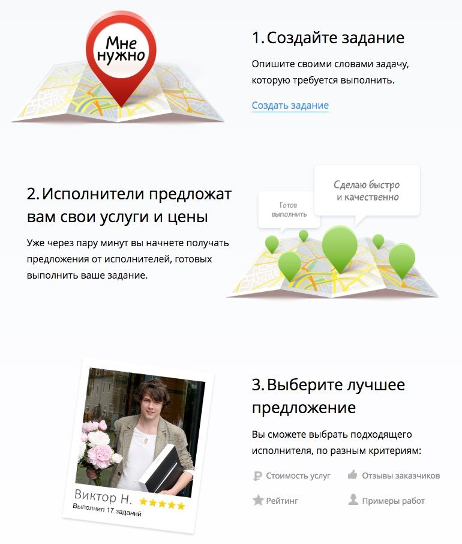
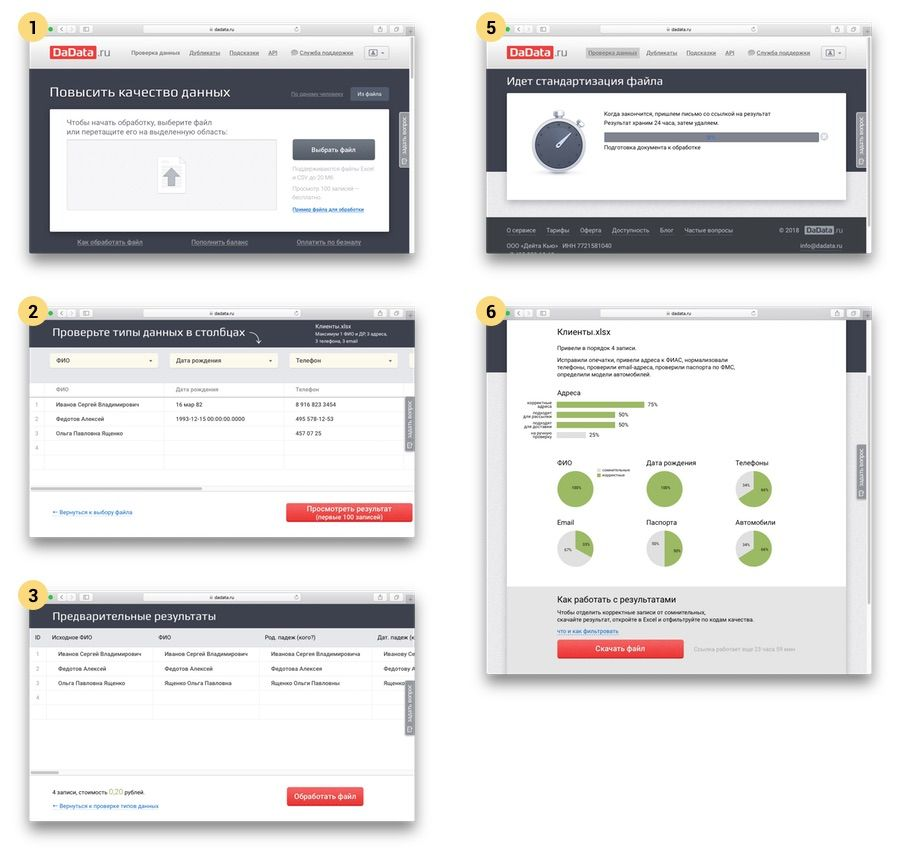
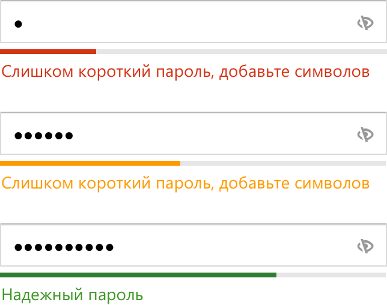

+++
date = 2020-05-12T08:46:38Z
description = "Как залезть человеку в голову и не обмануть его ожиданий."
image = "/simple-ui/cover.png"
slug = "simple-ui"
tags = ["interface"]
title = "Что делает интерфейс простым"
+++

*Это вторая часть цикла статей о проектировании интерфейсов для не-дизайнеров. Предыдущая: [Законы робототехники в интерфейсе](/laws/)*

Дизайнеры, программисты, маркетологи — все, кто причастен к разработке продукта — считают, что пользователь работает с программой сосредоточенно, вдумчиво и аккуратно. Досадное заблуждение.

На самом деле, за внимание человека конкурирует целая куча отвлекалок:

- Окружение: коллеги на работе, дети дома, машины и пешеходы на улице.
- Насущные дела: отчёт должен быть готов через 10 минут, от сковороды уже воняет гарью, мерзко пиликает напоминалка о встрече.
- Программы-конкуренты: пуш-оповещения от мессенджеров и других приложений.

Хорошо, если в этом аду человек уделит 30% внимания вашей программе. Но не надолго — всё равно будет постоянно отвлекаться.

Даже в таких неприятных условиях программа может оставаться удобной. Для этого она должна:

- быть простой,
- не нагружать мозг,
- прощать ошибки.

Про «не нагружать мозг» и «прощать ошибки» поговорим в другой раз, а пока остановимся на «быть простой».

## Модель программы

Ещё до того, как пользователь в первый раз запустил программу, у него в голове уже сложилось представление, как она работает.

> Так, это заказ такси. Значит, я выбираю откуда-куда и тариф, приезжает машина, везёт по адресу, деньги списывает с карты.

> Так, это CRM. Значит, там я веду сделки и историю общения по каждому клиенту, а она мне строит воронку продаж и всякие разные отчёты.

> Так, это интернет-магазин. Сейчас я найду хорошие беспроводные наушники, закажу, а завтра-послезавтра их привезёт курьер.

Это представление о том, как всё устроено — модель программы в голове человека. Сначала человек берёт её из предыдущего опыта общения с аналогичными программами, затем, по мере взаимодействия с вашим софтом — уточняет и дополняет.

Пользовательская модель программы — это то, как человек воспринимает её логику и устройство. Она может не совпадать (и наверняка не совпадает) с тем, как программу воспринимают:

- продакт-менеджер,
- дизайнер,
- программист,
- тестировщик.

У этих ребят модели намного более полные, целостные и логичные. Но их невозможно вложить человеку в голову. Поэтому самая главная — пользовательская модель.

<figure>
  
  <figcaption>Пользовательская модель проще, но фокусируется на главном</figcaption>
</figure>

Это плохая новость. Хорошая новость — пользовательскую модель тоже можно спроектировать. Для этого достаточно представить, как ваш софт будет воспринимать обычный человек, не питающий к программе особо тёплых чувств, зато обременённый нехваткой внимания и времени.

Ключевое свойство хорошей пользовательской модели — простота. Если модель у вас с кучей шагов, нюансов, возможностей, с навороченной логикой взаимодействия, с необходимыми пояснениями — это плохая модель. Если вы рассказали о программе трём посторонним людям, спросили «как это по-твоему работает?» и ни один не угадал — это плохая модель. Если для описания модели приходится рисовать блок-схему — это очень, очень плохая модель.

## Здоровая модель и модель курильщика

Вот модель, которая осталась у меня от работы с довольно известным сервисом:

<strong>♞ Сервис № 1 по вызову мастера для мелкого бытового ремонта</strong>

Я оформляю заявку: пишу, что сломалось, указываю стоимость, адрес и телефон.

Выбираю, буду ли подбирать мастера самостоятельно или с помощью администратора.

Если я выбрал «самостоятельно», сервис подбирает мастеров, которые потенциально подходят для этой работы. Не знаю, почему это называется «самостоятельно», если подбирает сервис, а не я.

Если я выбрал «с помощью администратора», то мастеров подбирает администратор. Но это не точно, я не проверял.

Даже при «самостоятельном» варианте некоторых мастеров всё равно почему-то подбирает администратор. Автоматически и вручную подобранные мастера показываются по-разному, потому что чёрт его знает почему.

...

Если мастер онлайн, он откликается и присылает мне встречную заявку (такое ощущение, что я государственная корпорация и провожу тендер на много миллионов рублей). Я принимаю заявку и назначаю мастера на заказ.

Если у мастера есть вопросы, он задаёт их в чате. Чат с каждым мастером отдельный, и «чужие» чаты мастерам не видны. Если вопросы повторяются, я копирую ответы из чата в чат.

Ещё иногда мастер может быть оффлайн, но это ничего. Я всё равно могу отправить ему приглашение. Мастер получит его по СМС и откликнется. Но это не точно, я не проверял.

… (пропустим остаток для краткости)

Если бы меня заранее спросили «как работает сервис вызова мастера по ремонту», я бы *никогда* не предложил такую модель. Я бы ответил примерно так:

<strong>♞ Сервис № 2 по вызову мастера для мелкого бытового ремонта</strong>

Я оформляю заявку: пишу, что сломалось, указываю стоимость, адрес и телефон.

Мастера видят мою заявку и откликаются на неё.

Я вижу отклики. Выбираю подходящего мастера по цене, рейтингу, фотографии и общей адекватности (за адекватностью загляну в профиль).

Если мастер задаёт уточняющие вопросы, я отвечаю. Ответы видят все, чтобы мне не повторяться.

Где во второй модели шаги вроде «выбрать самому или с помощью администратора», «мастер отправляет встречную заявку на мою заявку» и разделение между «онлайн» и «офлайн» мастерами? Их нет. Наверняка, для разработчиков они выглядят логично и обоснованно — но не для нормального человека. Я не буду больше пользоваться сервисом № 1 — он сделал мою жизнь сложнее, а не проще.

<figure>
  
  <figcaption>Хорошо, когда дизайнер описывает продукт в терминах пользователя</figcaption>
</figure>

## Внутренняя сложность

Простота ментальной модели не означает, что логика программы должна быть примитивной.

- Если бы сервис № 1 спрятал все свои нюансы, показал подходящим мастерам мою заявку, а мне — только тех, кто на неё откликнулся — было бы вполне ОК.
- Если бы внутри у него работала сложнейшая система искусственного интеллекта, которая с вероятностью 99,999% нашла лучшего в мире мастера под мой заказ, а я увидел бы только конечный результат — ОК.
- Если бы то же самое делал не искусственный интеллект, а 20 тысяч сотрудников по всей стране — ОК, какая мне разница.

Софт может быть сколь угодно навороченным, пока его сложность не видна человеку.

## Слон кусочками

Даже если модель получилась сложная, дизайнер может подать её как простую. В этом помогает принцип дозирования информации: разбить задачу на независимые шаги и подавать пользователю отдельными кусочками.

Например, «Дадата» обрабатывает файл с адресами и телефонами, исправляя ошибки и восстанавливая недостающую информацию. Идеальная модель выглядела бы так:

> бросил на страницу файл → получил готовый с исправленными данными

К сожалению, из-за скучных технических нюансов прямо так сделать не получилось. Поэтому мы разбили задачу «обработать файл» на шаги:

1. Загрузить файл.
2. Убедиться, что «Дадата» правильно угадала, в каких столбцах какие данные лежат.
3. На 100 записях убедиться, что результат устраивает.
4. Оплатить, если не хватает денег на обработку.
5. Дождаться результата (с этого шага уже можно уйти).
6. Скачать результат.

<figure>
  
  <figcaption>Шаги скрывают сложность процесса</figcaption>
</figure>

Если вывалить на пользователя шаги 1–4 одним махом, вышло бы что-то монструозное. А так в каждый момент времени человек сосредоточен на конкретном шаге. Шаги по отдельности несложные, но все вместе решают непростую задачу.

## Ментальная переподготовка

Человек подходит к новой программе с готовой ментальной моделью. Обычно, пытаться его переобучить — плохая идея. Проще подстроиться, а не бороться с устоявшимися шаблонами поведения.

Но бывает, что пользователь привык к плохому, а вы придумали что-то такое, что прямо ах:

- Раньше привычка жать Ctrl+S была у каждого опытного пользователя. Потом Гугл-документы многих отучили.
- Раньше уважающий себя бухгалтер регулярно ездил в налоговую с дискеткой. Теперь пользуется «Контуром», жмёт на кнопку и в ус не дует.
- Раньше интернет-магазины требовали адрес из шести полей, и обязательно почтовый индекс. Теперь многие сообразили, что можно не напрягать человека, а мучить «Дадату» (ей всё равно, она железная).

Ради стоящего дела можно и переподготовкой пользователей заняться. Но если вы чаще сталкиваетесь с реакцией «ох, что вы тут напридумывали», чем «ого! а так можно было?!» — лучше не надо.

## Соответствие ожиданиям

Если программа ведёт себя так, как ожидает человек, то он воспринимает интерфейс как удобный и «интуитивный».

Ожидания человека формируются из:

- платформы,
- среды и навыков,
- целей.

### Платформа

Базовое ожидание пользователя — программа выглядит и ведёт себя, как принято на «родной» платформе: Windows, macOS, iOS, Android или веб. Правила платформы лучше соблюдать — это делает интерфейс привычным для пользователя и не заставляет его напрягать голову без необходимости.

Для десктопных и мобильных ОС написаны гайдлайны[^1]. С вебом сложнее — общих руководств нет. Лично мне нравятся «Контур.Гайды[^2]». Если вам они не по душе, можно найти другие или подсмотреть интерфейсные приёмы у известных веб-сервисов.

<figure>
  
  <figcaption>Хорошие гайдлайны описывают внешний вид и логику поведения интерфейса</figcaption>
</figure>

### Среда и навыки

Помимо платформы, ожидания зависят от среды и навыков. Среда — это внешние условия, в которых находится человек: идёт по улице с телефоном, сидит в кабинете за столом, работает в шумном цеху. Навыки — это общая «компьютерная грамотность», понимание предметной области, опыт общения с аналогичным софтом.

Среду и навыки проще всего понять, наблюдая за пользователями. Это отдельная большая тема, которую мы рассматривать не будем.

### Цели

На уровне конкретного сценария ожидания зависят от целей пользователя:

<blockquote>

Приложение: «тренер по физподготовке» 
Цель: похудеть к лету без особых усилий 
Сценарий: ежедневная серия физических упражнений

Ожидания:

<ul>
    <li>никакой теоретической подготовки,</li>
    <li>никаких настроек,</li>
    <li>очень просто в использовании, «одна кнопка»,</li>
    <li>видно, как с каждым разом я всё ближе к цели.</li>
</ul>
</blockquote>

Цели и сценарии лучше прописать до начала проектирования интерфейса. Как это сделать — отдельная тема. Алан Купер посвятил ей целую книгу[^3].

⌘&nbsp;⌘&nbsp;⌘

## Запомнить

У человека в голове есть представление о том, как устроена ваша программа — ментальная модель.

«Стихийная» модель не получится хорошей, поэтому лучше спроектируйте её.

Хорошая модель — простая. В создании простых моделей помогают приёмы «сложность под капот» и «слон кусочками».

Переобучайте пользователя, только если он будет в восторге, когда освоит новый способ.

Человек воспринимает интерфейс как простой и понятный, если он соответствует ожиданиям. Чтобы не нарушить ожидания, как минимум соблюдайте правила платформы, на которой работает программа.

Пропишите цели и сценарии работы пользователя с программой — это поможет выявить остальные ожидания.

Следующая статья цикла:

<a href="/user-actions/">Как человек решает задачи в интерфейсе</a>

*Спасибо [Ольге Коноваловой](http://cat-in-cap.ru) за помощь в подготовке статьи.*

<em>Специально для <i class="far fa-star color-sin"></i> «<a href="tg://resolve?domain=dangry">Интерфейсов без шелухи</a>»</em>

⌘&nbsp;⌘&nbsp;⌘

Ссылки по тексту:

[^1]: Гайдлайны для разных платформ: [Apple](https://developer.apple.com/design/human-interface-guidelines/), [Google](https://material.io/design), [Microsoft](https://www.microsoft.com/design/fluent/)
[^2]: [Контур.Гайды](https://guides.kontur.ru/)
[^3]: «[Психбольница в руках пациентов](/asylum-2/)»

