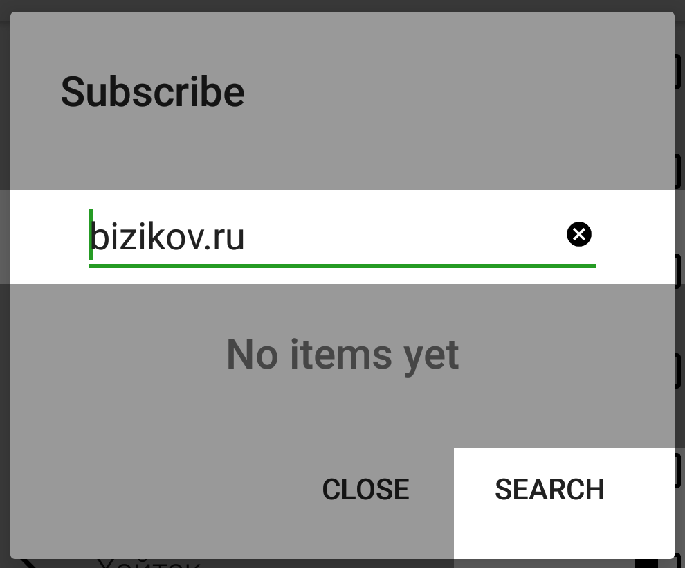
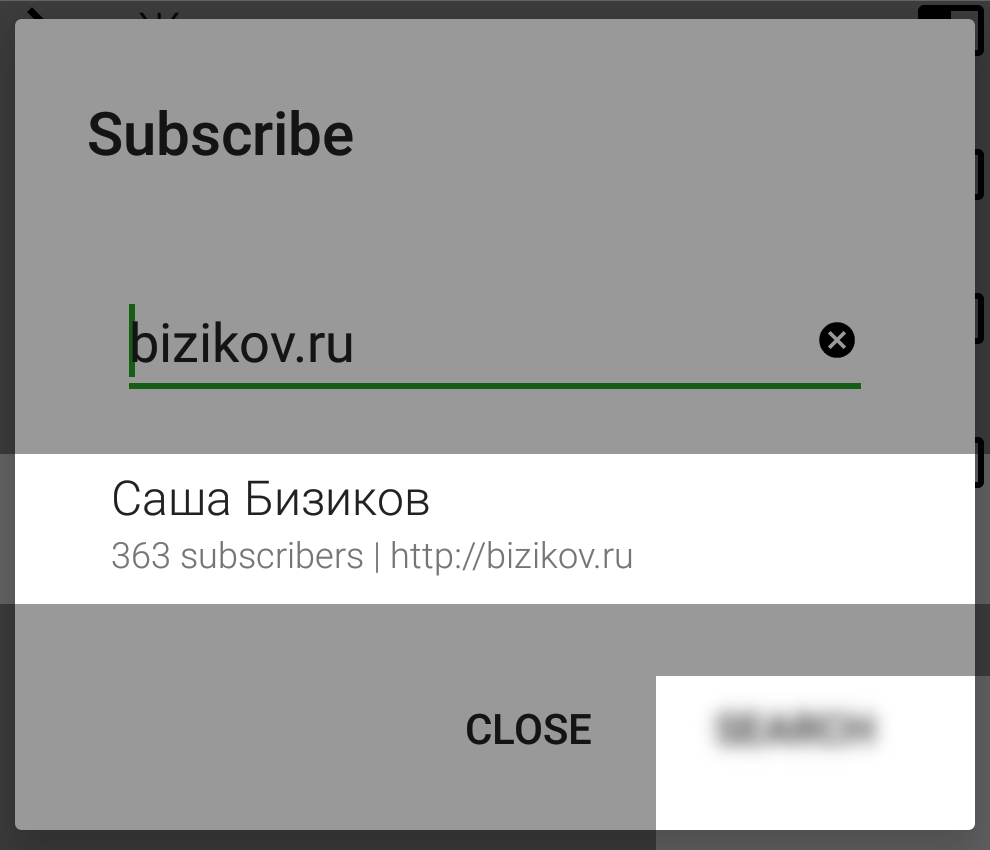
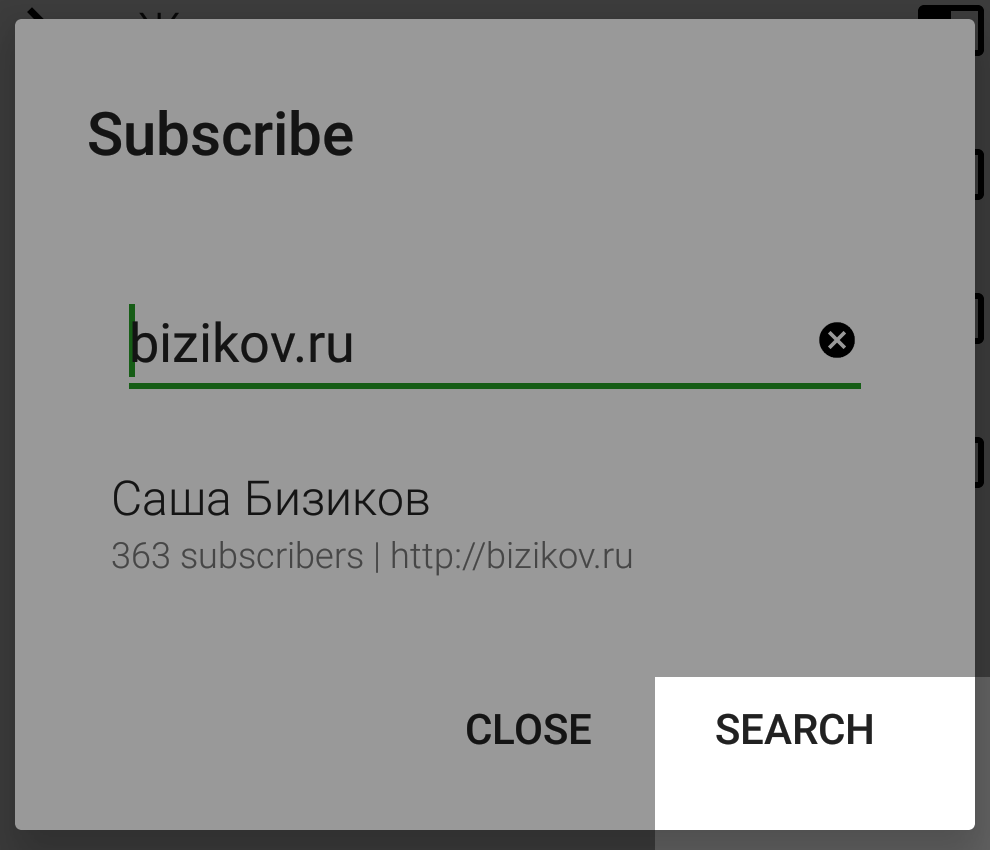
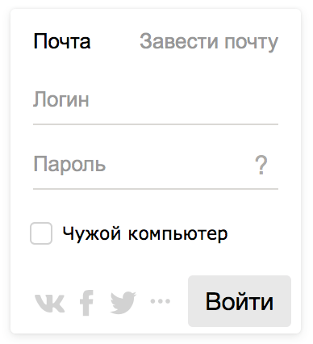
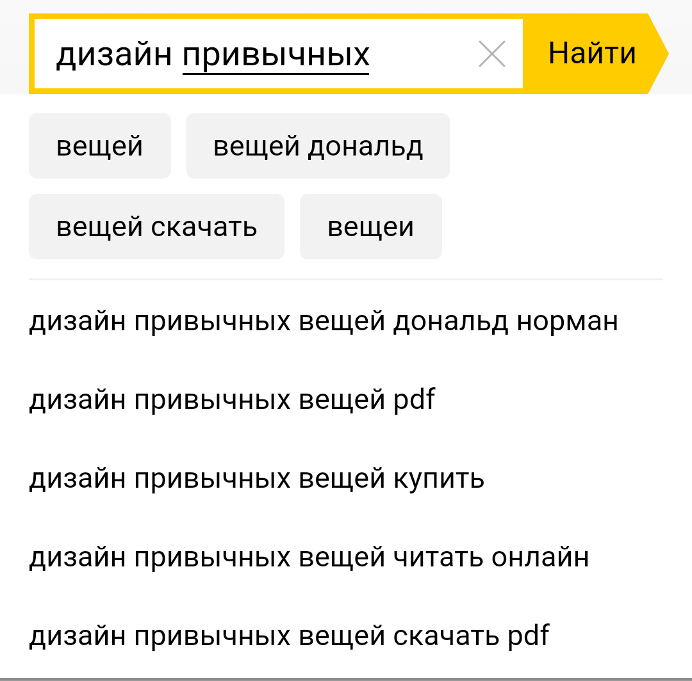
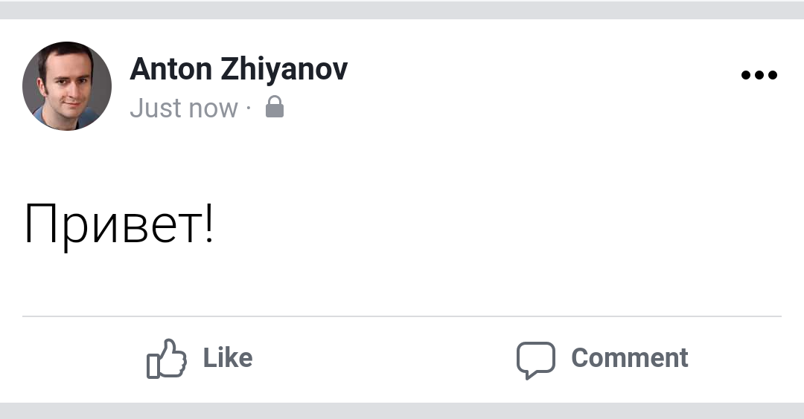
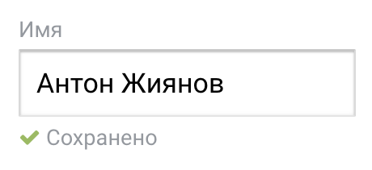
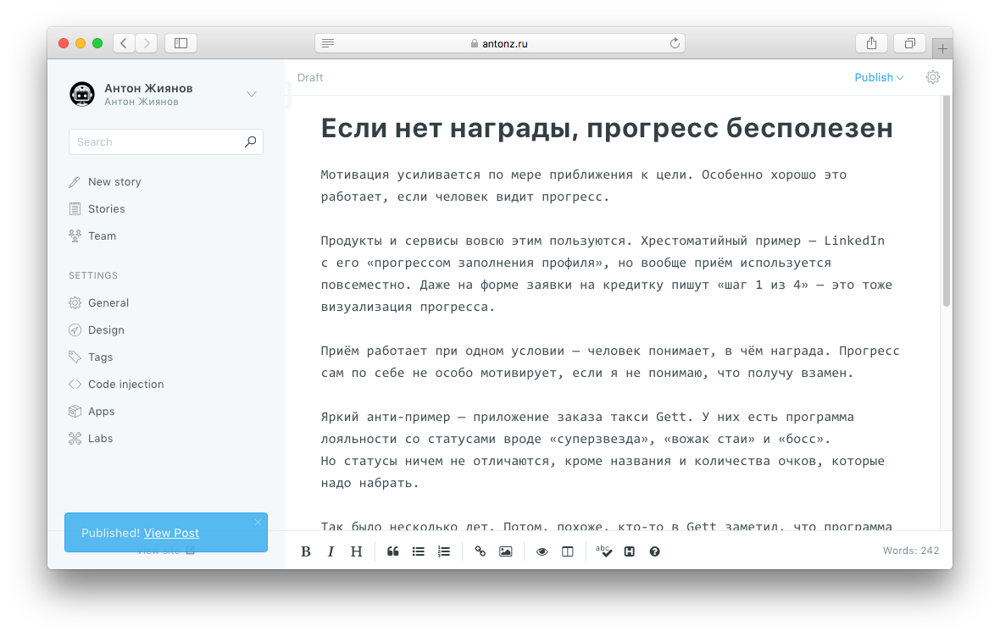

+++
date = 2020-05-19T08:10:30Z
description = "Психология действий пользователя: три шага, три проблемы."
image = "/user-actions/cover.png"
slug = "user-actions"
tags = ["interface"]
title = "Как человек решает задачи в интерфейсе"
+++

*Это третья часть цикла статей о проектировании интерфейсов для не-дизайнеров. Предыдущая: [Что делает интерфейс простым](/simple-ui/)*

Человек взаимодействует с интерфейсом, чтобы решить конкретную задачу. Происходит это в три шага:

1. _Сформулировать задачу_. Я подписан на один канал в Телеграме. Он хороший, но надоел оповещениями. Хочу их отключить.
2. _Выполнить действие_. Полагаю, это делается где-то в самом канале. Захожу в ленту, тыкаю на канал. Вижу внизу большую кнопку *Mute*. Ага, это наверняка она. Нажимаю.
3. _Оценить результат_. Кнопка изменилась: *Mute* → *Unmute*. Рядом с названием канала появилась иконка с перечёркнутым динамиком. Полагаю, оповещения выключены.

На каждом шаге интерфейс может помогать, а может вставлять палки в колёса. Посмотрим, как это бывает.

## 1. Сформулировать задачу

Обычно при работе с продуктом человек знает, что хочет сделать:

-   Купить новый айфон на сайте Эпла.
-   Подписаться на интересный подкаст о технологиях в приложении Pocket Casts.
-   Перевести деньги с карты на карту в интернет-банке.

Исключение — когда пользователь слабо знаком с продуктом или фичей и не может «приземлить» высокоуровневую цель на конкретную задачу.

> Менеджеру продукта ставят цель — добавить на сайт компании чат службы поддержки. Менеджер знает, что сайт использует специальный «облачный» сервис для базы знаний. По слухам, в нём есть и чат, но менеджер понятия не имеет, что конкретно входит в эту фичу и насколько она подходит под требования компании.
>
> Поэтому он не пытается понять, как включить чат в настройках, а идёт в документацию разбираться с возможностями, ценой и ограничениями.

## 2. Выполнить действие

Человек формулирует последовательность действий (_нажать на Mute, чтобы отключить оповещения_) и выполняет их в интерфейсе (_жму на Mute_).

Главная проблема этого шага: из интерфейса непонятно, какие действия выполнить, чтобы решить задачу. Чаще всего — человек не видит подходящих элементов управления.

⌘&nbsp;⌘&nbsp;⌘

Я пользуюсь специальной программой (RSS-ридером), чтобы получать обновления с интересных сайтов. Решил подписаться на нового автора:

<figure>
  
  <figcaption>1. Вбил адрес сайта и нажал «найти».</figcaption>
</figure>

    

<figure>
  
  <figcaption>2. Жму на кнопку «подписаться» в правом нижнем углу.</figcaption>
</figure>

<figure>
  
  <figcaption>3. Эээ. Ничего не изменилось.</figcaption>
</figure>

Приглядываюсь и понимаю, что кнопки «подписаться»-то и нет. В правом нижнем углу всё та же кнопка «найти». А как тогда подписаться? Задача провалена.

⌘&nbsp;⌘&nbsp;⌘

Бывает, что подходящий элемент управления вроде есть, но какой-то странный:

Что такое «чужой компьютер»? Обычно на этом месте пишут «запомнить» (или вовсе ничего не пишут и автоматически запоминают логин-пароль), а тут что-то странное.

Бывает, что подходящих элементов управления несколько (хрестоматийные кнопки «Отменить» и «Отмена» в модальном окне Андроида). Или один, но недоступен (кнопка отправки заказа в интернет-магазине заблокирована по одному программисту ведомым причинам). Это тоже озадачивает.

Корневая причина одна — <em class="text-highlight">пользователь не понимает, как решить задачу</em> с помощью интерфейса. Лучшая защита от таких проблем — тестирование.

Не обязательно устраивать полномасштабные юзабилити-тесты: достаточно изловить коллегу, попросить его выполнить типичную пользовательскую задачу, и обратить внимание на затруднения и вопросы. Главное — не подсказывать и не объяснять, что к чему: к каждому пользователю ведь не подсадишь консультанта. Просто наблюдать и записывать.

Такие тесты можно делать прямо на макетах или прототипах, не обязательно дожидаться реализации.

## 3. Оценить результат

Человек выполнил действие и пытается понять — решило оно задачу или нет. Хорошо, если интерфейс явно даёт понять — «получилось!». Проще всего показать результат действия:

<figure>
  
  <figcaption>Яндекс подсказывает, что я правильно запомнил название книги Нормана</figcaption>
</figure>

<figure>
  
  <figcaption>Фейсбук показывает только что опубликованный пост</figcaption>
</figure>

Если результат — изменение внутреннего состояния системы, об этом тоже лучше сообщить:

<figure>
  
  <figcaption>Дописал фамилию в личном кабинете и понял, что кнопку «Сохранить» искать не надо — сохраняется автоматически.</figcaption>
</figure>

А вот типичные интерфейсные проблемы, которые мешают оценить результат:

## Проблема: результата вовсе нет

Пользователь не понимает, восприняла программа его действия или нет.

<small><strong>Плохо</strong></small> 
Нажал на кнопку «Вызвать такси», появился индикатор загрузки. Крутится, крутится. Что происходит? Такси приедет?

<small><strong>Как исправить</strong></small> 
Добавить явный статус: «отправляю заказ», «ищу такси», «все машины заняты», «нет интернета».

Бывает, что формально результат есть, но человек его не видит:

<figure>
  
  <figcaption>Интерфейс публикации статей в блоге. Кнопка «Опубликовать» — в верхнем правом углу, а сообщение «опубликовано» — в левом нижнем.</figcaption>
</figure>

Если человек сосредоточен на задаче, поле зрения сужается до узкой области интерфейса. Поэтому, чтобы результат был заметен, лучше показывать его по месту действия, а не чёрти где на экране.

## Проблема: непонятный результат

Результат определённо есть, но пользователь не понимает, удалось решить задачу или нет.

<small><strong>Плохо</strong></small> 
Сотрудник поддержки заметил ошибку в уже закрытом тикете. Исправил, нажал на «Сохранить», получил ответ: «Переход из состояния Разрешен в состояние Разрешен не разрешен»

<small><strong>Как исправить</strong></small> 
Сказать по-человечески:

«Закрытые заявки редактировать нельзя. <u>Открыть заявку</u>?»

## Проблема: непонятно, что дальше

Понятно, что задача решена. Но нет «мостика» для перехода к следующей задаче или непонятно, как результат вписывается в общий контекст.

<small><strong>Плохо</strong></small> 
Создал в онлайн-календаре встречу, добавил участников, нажал «Сохранить», получаю: «Событие успешно создано».

Результат есть, но чего ожидать дальше? Участники получат приглашения автоматически? Я должен что-то сделать, чтобы разослать их вручную? Приглашения в принципе нельзя отправить?

<small><strong>Как исправить</strong></small> 
Рассматривать сценарий в целом, а не частную задачу:

«Встреча назначена, приглашения отправлены участникам»

## Запомнить

Человек взаимодействует с интерфейсом, чтобы решить конкретную задачу. Происходит это в три шага: сформулировать задачу, выполнить действие, оценить результат. Если все три шага проходят гладко — интерфейс своё дело сделал.

Основная проблема на шаге «выполнить действие»: пользователь не понимает, как решить задачу с помощью интерфейса. Лучшая защита от таких проблем — коридорное тестирование.

Основные проблемы на шаге «оценить результат»:

- Нет результата или он не виден. Защита: явно писать статус, показывать результат по месту действия.
- Результат непонятен. Защита: сказать по-человечески.
- Непонятно, что дальше. Защита: показать место задачи в пользовательском сценарии.

*Спасибо [Ольге Коноваловой](http://cat-in-cap.ru) за помощь в подготовке статьи.*

<em>Специально для <i class="far fa-star color-sin"></i> «<a href="tg://resolve?domain=dangry">Интерфейсов без шелухи</a>»</em>

