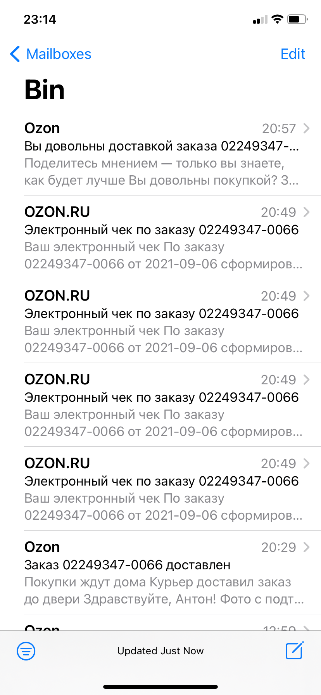
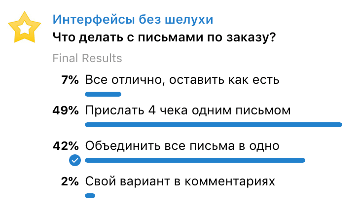

+++
date = 2021-09-09T10:32:08Z
description = "Продукты работают хуже, потому что команда не признает проблемы."
image = "/acknowledge/cover.png"
slug = "acknowledge"
tags = ["interface", "productology"]
title = "Признать проблему"
+++

Иногда продукты работают хуже, чем могли бы, потому что команда отказывается признавать проблемы. Давайте посмотрим, как это бывает.

## Письма о заказе

Представьте ситуацию. Вы работаете в крупном маркетплейсе. Люди делают на маркетплейсе заказы, он доставляет. А по факту доставки *одного* заказа присылает *шесть* писем:

<figure>
  
</figure>

<ul>
  <li>Заказ доставлен</li>
  <li>Электронный чек по 1-й части заказа</li>
  <li>Электронный чек по 2-й части заказа</li>
  <li>Электронный чек по 3-й части заказа</li>
  <li>Электронный чек по 4-й части заказа</li>
  <li>Вы довольны доставкой?</li>
</ul>

При этом маркетплейс сам разбивает заказ на части, покупатель никак этим не управляет. В примере выше все части доставлены в один день, в одно время, одним курьером.

Некоторые покупатели почему-то недовольны таким количеством писем и жалуются в саппорт.

Ваши коллеги разводят руками — в заказе было 4 части, значит должно быть четыре чека. Потом, надо же уведомить о доставке, а то вдруг человек не в курсе. И уточнить, всем ли покупатель доволен (мы же клиентоориентированная компания). Вот и получается шесть писем. Ничего не поделаешь.

## Решение

Я предложил эту задачку подписчикам «[Интерфейсов без шелухи](https://t.me/dangry)». Вот что они ответили:

<figure>
  
  <figcaption>Нерешаемая инженерная проблема</figcaption>
</figure>

Конечно, нормальное решение — присылать по факту доставки *одно* письмо, включив в него и чеки, и опрос, и все что еще важно. Никаким законам это не противоречит и технически реализуемо.

Маркетплейс не присылает четырех разных курьеров, чтобы доставить несчастный заказ — он понимает, что заказ один, и отправляет одного курьера. Аналогично можно объединить четыре письма с чеками в одно, а попотев еще немного — и оставшиеся два письма тоже свести в одно общее.

Но я хочу обратить внимание вот на что.

## Признать проблему

Самое плохое, что может сделать инженер (продакт, дизайнер, разработчик), столкнувшись с проблемой — отказаться ее признавать. Начать доказывать себе и другим, что все работает правильно и ничего менять нельзя.

Отказываясь признавать проблему, вы бесите потребителей, ослабляете продукт и становитесь хуже как специалист.

Всегда стоит руководствоваться здравым смыслом. Нет, это не нормально — присылать шесть писем об одном чертовом заказе! Это проблема. И важно это признать, хотя бы перед самим собой.

Признав проблему, можно оценить ее влияние, варианты решения и их стоимость. И потом уже думать — будете исправлять или нет.

*Признав проблему, вы не обязаны ее решать*. Кажется, не все это понимают. Возможно, затраты на решение не окупят выгоды. Возможно, есть более критичные проблемы, на которых стоит сосредоточиться. Возможно, вы выберете дешевый обходной путь. Возможно, вообще не найдете решение. Всё это бывает, и в каждом продукте найдутся десятки проблем, которые сознательно не будут исправлены.

Но важно честно сказать себе, что да, это действительно проблема. А не закрывать глаза и убеждать всех вокруг, что ее не существует.

<em>Заметка из телеграм-канала <i class="far fa-star color-sin"></i> «<a href="https://t.me/dangry">Интерфейсы без шелухи</a>»</em>

