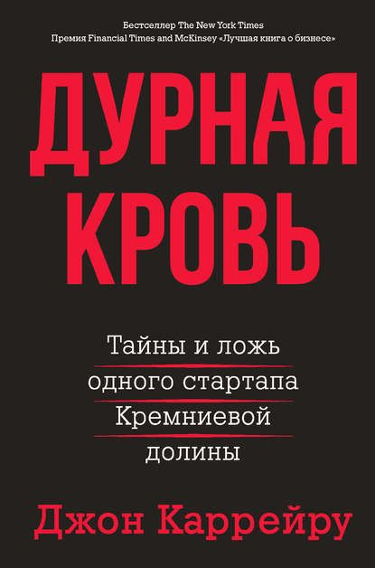

+++
date = 2021-07-08T15:06:18Z
description = "Захватывающая история бесконечной лжи."
image = "/bad-blood/cover.jpg"
slug = "bad-blood"
tags = ["book"]
title = "Дурная кровь"
+++

Прочитал бестселлер о компании Theranos, которая обещала делать сотни анализов по одной капле крови из пальца, а на деле построила масштабнейшую мистификацию, равную которой современная экономика высоких технологий еще не видела.

До этого я читал немало увлекательных биографий людей и компаний, но «Дурная кровь» — нечто особенное. Это натуральный блокбастер, невозможно оторваться. И там чистый голливуд, как будто нарочно придумали захватывающую историю — вот только все это было на самом деле.

<figure>
  
  <figcaption><a href="https://www.litres.ru/dzhon-karreyru/durnaya-krov/">Книга на Литресе</a></figcaption>
</figure>

В 2013–2014 году, когда Theranos и основательница компании Элизабет Холмс стали известны на всю страну как спасители миллионов американцев, страдающих от забора крови из вены — компания уже напрочь погрязла во лжи. Theranos и Элизабет последовательно много лет врали сначала инвесторам, затем партнерам, затем регулятору — и наконец реальным живым пациентам.

Все, что Theranos подавала как факт, было ложью. Буквально все. За годы компания смогла сделать два прибора, один из которых тупо не работал, а второй давал погрешность 146% (не шучу, реальная цифра). Скрывая неудачи, компания взломала приборы Siemens, бодяжила кровь физраствором, и использовала эту нелегальную конструкцию с ужасным по качеству результатом.

Сотрудникам затыкали рот соглашением о неразглашении, а непокорные получали судебное разбирательство с перспективой банкротства в процессе — у Theranos были неограниченные финансы и одна из самых злых адвокатских контор в числе крупных акционеров.

У Холмс были отличные связи с высокопоставленными чиновниками, включая администрацию действующего президента. Акционерами компании выступали уважаемые и влиятельные люди.

Когда читаешь это все, постепенно понимаешь, что дело должно закончиться трагедией с сотнями, если не тысячами жертв тераносовских «анализов». По счастливой случайности, один въедливый журналист раскопал историю раньше, чем Theranos развернулись совсем уж широко.

Рекомендую.

