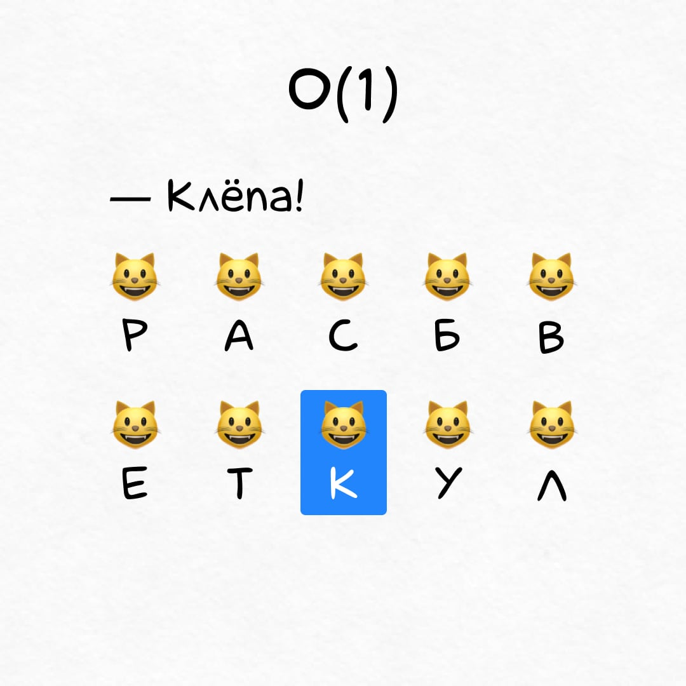
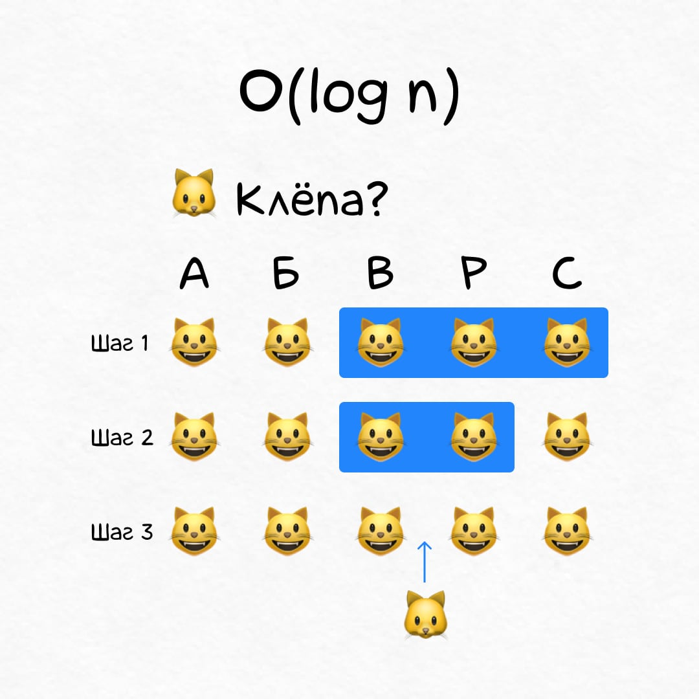
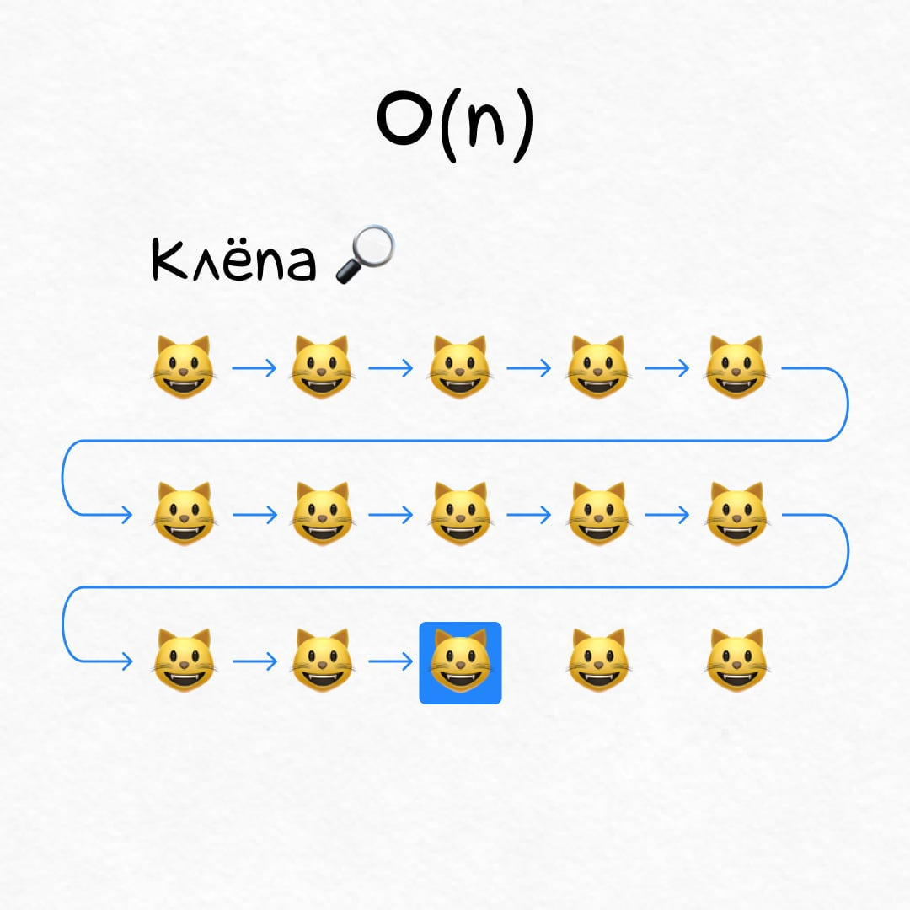
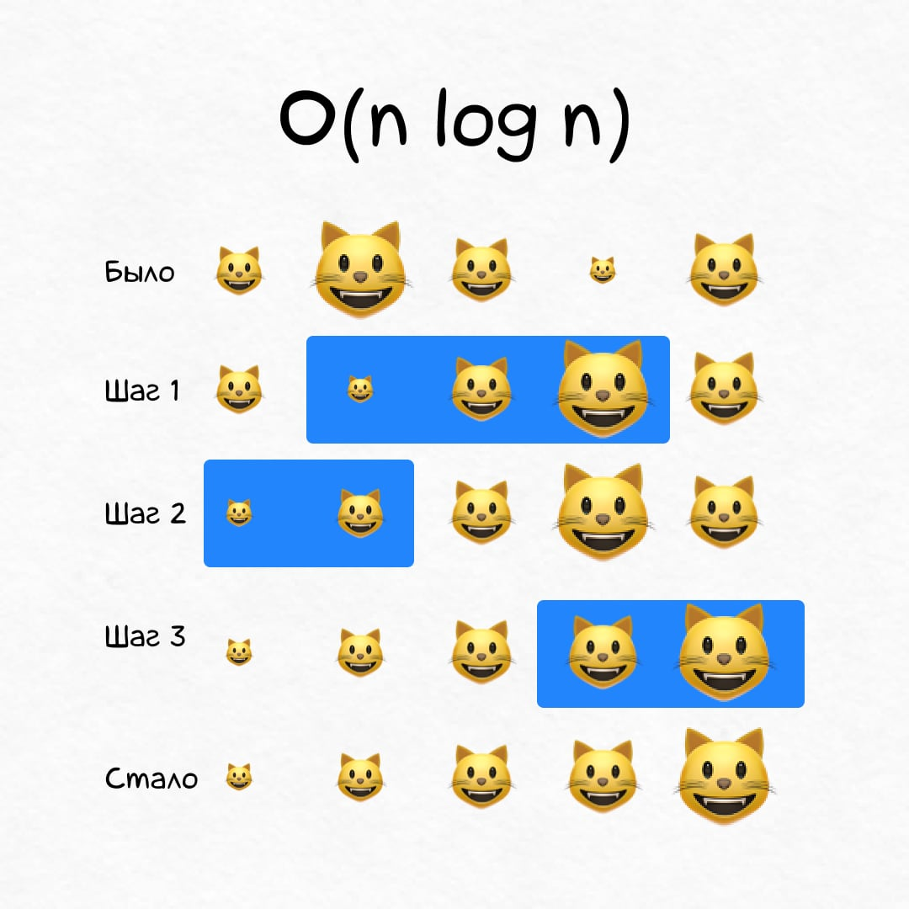
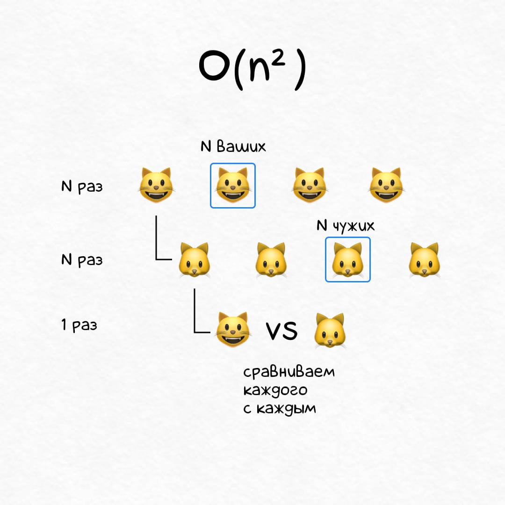
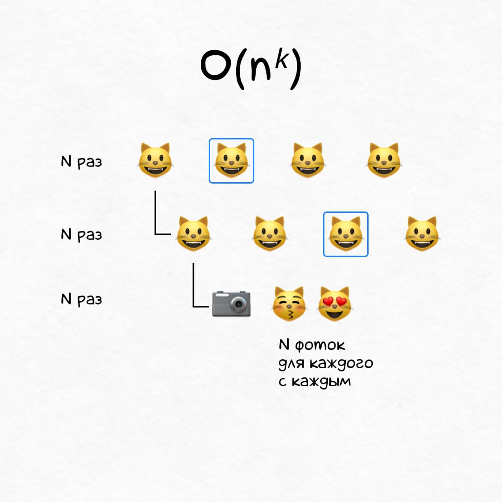
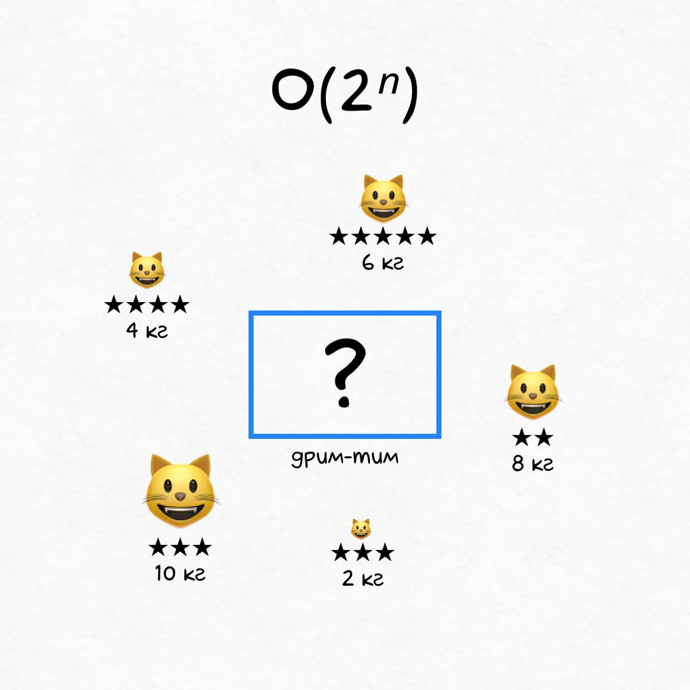
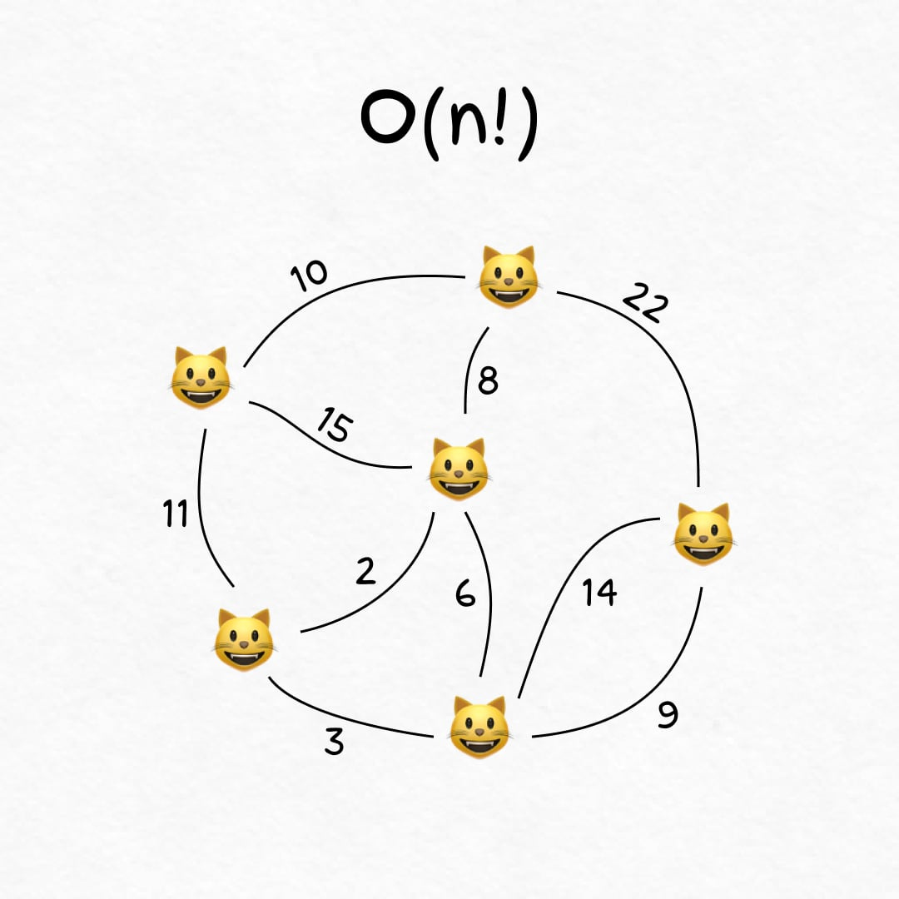

+++
date = 2021-11-25T16:30:00Z
title = "Скорость алгоритмов и котики"
description = "Разбираем быстрые и медленные алгоритмы на шерстяных жопках."
image = "/big-o/cover.jpg"
slug = "big-o"
tags = ["development"]
featured = true
+++

Давайте посмотрим, как программисты оценивают быстрые и медленные алгоритмы. Поскольку тема максимально занудная, разбираться будем на дурацких примерах с котиками.

## Константное время, O(1)

Самый лучший вариант, скорость алгоритма не зависит от количества котиков.

    
<strong>🐾 Пример</strong>

    
Вы — счастливый обладатель <code>N</code> котиков. Каждый котик знает, как его зовут. Если позвать «Клёпа!», то прибежит только он, а остальным <code>N-1</code> жопкам пофиг.

<figure>
  
</figure>

## Логарифмическое время, O(log n)

На `N` котиках алгоритм отрабатывает за `log(N)` шагов. Это быстро! 1 000 000 котиков → всего 20 операций.

    
<strong>🐾 Пример</strong>

    
Мисочки у котиков расставлены по алфавиту. Когда у вас появляется новый котик, место для его мисочки находится за <code>log(N)</code> шагов.

<figure>
  
</figure>

## Линейное время, O(n)

На `N` котиках алгоритм отрабатывает за `N` шагов. Это значит, каждый раз приходится перебирать всех кошачьих. Ну такое.

    
<strong>🐾 Пример</strong>

    
Котики взбунтовались и перестали отзываться на клички. Теперь приходится обходить <code>N</code> шубок, чтобы найти нужного.

<figure>
  
</figure>

## Линейно-логарифмическое время, O(n log n)

На `N` котиках алгоритм отрабатывает за `N` × `log(N)` шагов. Это дольше, чем за линейное время, но ненамного (логарифм `N` сильно меньше `N`, помните?).

    
<strong>🐾 Пример</strong>

    
К приходу гостей вы решили рассадить котиков по размеру. Алгоритм quick sort справится с этим за <code>N</code> × <code>log(N)</code> шагов.

<figure>
  
</figure>

На очереди у нас неторопливые полиномиальные котики и совсем улиточки — суперполиномиальные.

## Квадратичное время O(n²)

На `N` котиках алгоритм отрабатывает за `N²` шагов. Ме-е-едленно.

    
<strong>🐾 Пример</strong>

    
Конкурент утверждает, что его <code>N</code> котиков более гладкие и довольные, чем ваши. Специальная комиссия попарно сравнит хвостатых и вынесет справедливый вердикт. Понадобится ~ <code>N²</code> сравнений.

<figure>
  
</figure>

## Полиномиальное время, O(nᵏ)

На `N` котиках алгоритм отрабатывает за `N³` шагов, `N⁴` шагов, `N⁵` шагов, или ещё дольше. Фу таким быть.

    
<strong>🐾 Пример</strong>

    
Фотосессия! Каждого из <code>N</code> котиков надо попарно отфоткать с другими, причем фотограф делает <code>N</code> снимков на каждую пару. <code>N</code> × <code>N</code> × <code>N</code> ≃ <code>N³</code> шагов.

<figure>
  
</figure>

Хоть полиномиальные алгоритмы и не славятся быстротой, по сравнению с суперполиномиальными они стремительны как Флеш. Из «суперского» у суперполиномиальных только название, увы. Сейчас покажу.

## Экспоненциальное время, O(2ⁿ)

На `N` котиках алгоритм отрабатывает за `2ⁿ` шагов. Это долго, вы вряд ли дождетесь.

    
<strong>🐾 Пример</strong>

    
Котики отправляются на выставку. Каждого взвесили и оценили в звездах. Но перевозка рассчитана максимум на X килограмм. Как выбрать самый звездный состав? Ответ потребует <code>2ⁿ</code> шагов.

<figure>
  
</figure>

## Факториальное время, O(n!)

На `N` котиках алгоритм отработает за `N` × `(N-1)` × `(N-2)` ×… × `1` шагов. Это жесть! Всего 20 котиков уже дадут нам пару квинтиллионов операций.

    
<strong>🐾 Пример</strong>

    
Котики расселись по квартире. Вам хочется пожамкать каждого, но ходить лень. Какой кратчайший маршрут, чтобы обойти всех шерстяных жопок? Это ~ <code>N!</code> сравнений.

<figure>
  
</figure>

## Резюме

Вот какие алгоритмы мы рассмотрели:

-   Константные `O(1)`
-   Логарифмические `O(log n)`
-   Линейные `O(n)`
-   Линейно-логарифмические `O(n log n)`
-   Квадратичные `O(n²)`
-   Полиномиальные `O(nᵏ)`
-   Экспоненциальные `O(2ⁿ)`
-   Факториальные `O(n!)`

Константный алгоритм — всегда лучший вариант, а логарифмический — почти всегда. С линейными и полиномиальными сложнее — тут все зависит от задачи. Где-то стыдно выбирать `O(n)`, а где-то и `O(n²)` будет большим успехом.

`O(2ⁿ)` и `O(n!)` безумно медленные, поэтому на практике вместо них обычно используют неоптимальные, но быстрые алгоритмы.

_Всем котиков! И подписывайтесь на [Oh My Py](https://t.me/ohmypy), чтобы не пропустить новые заметки 🚀_
