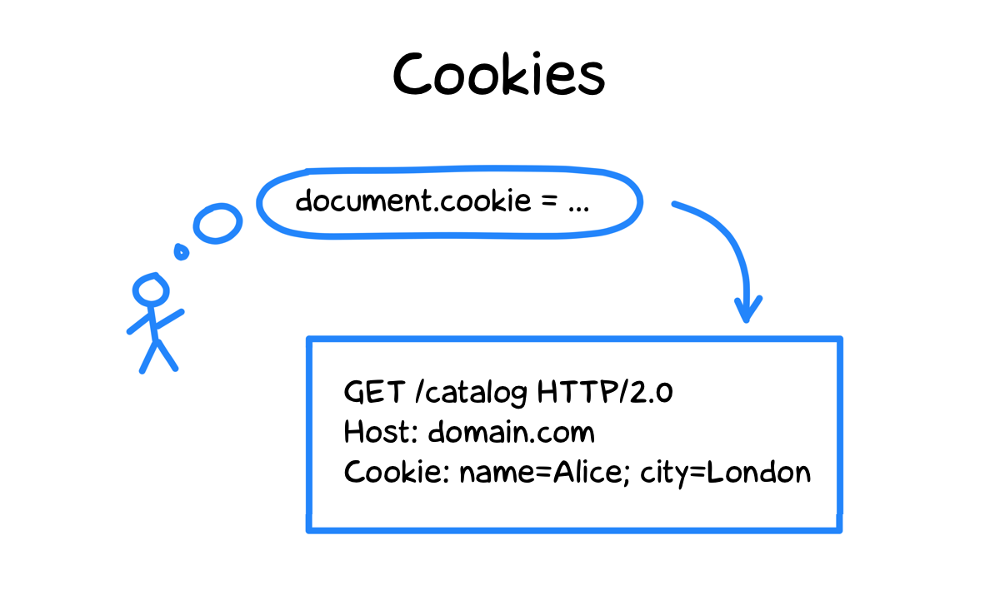
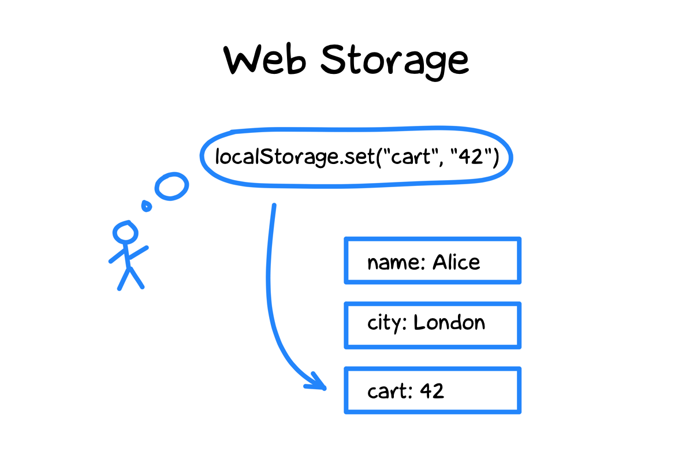
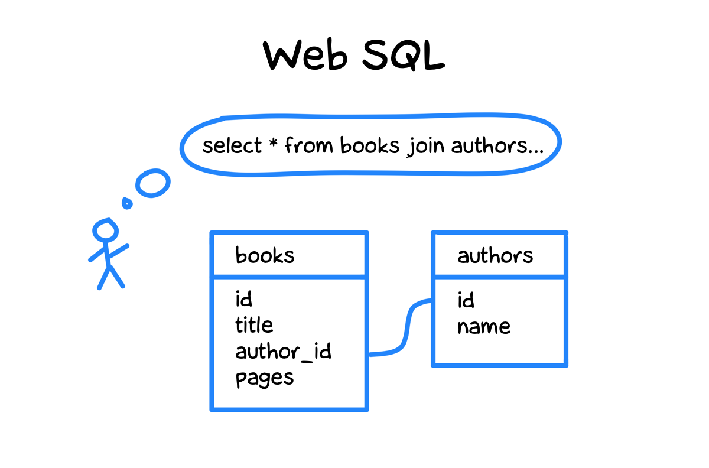
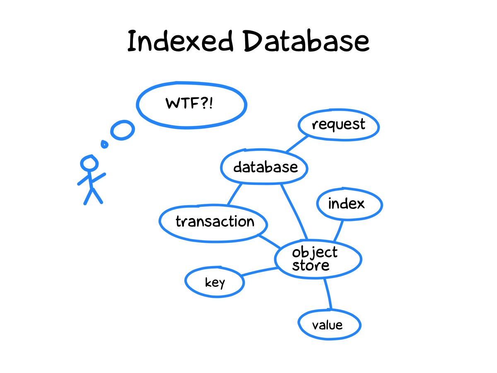
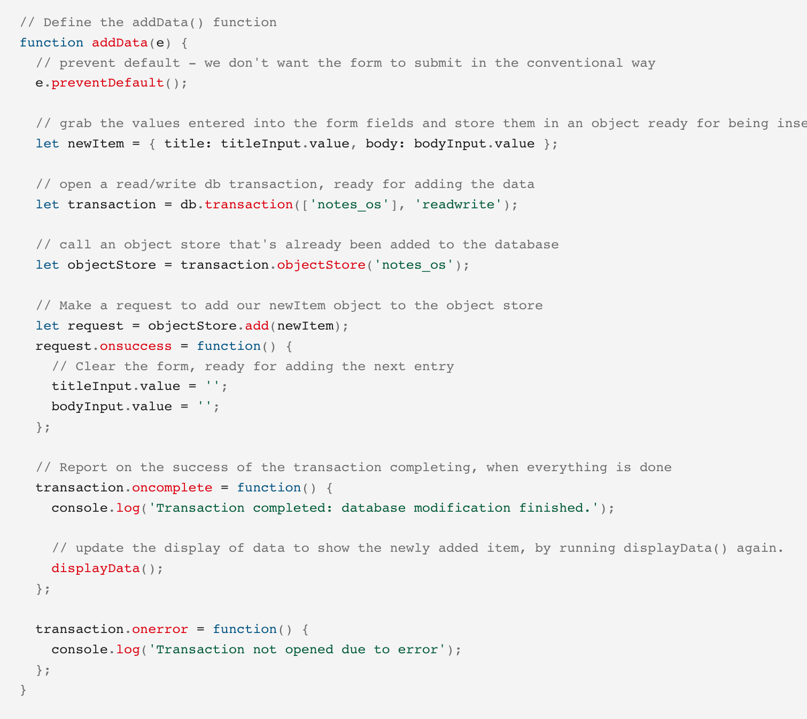

+++
date = 2021-09-26T09:36:07Z
description = "От мохнатой древности до нашего времени."
featured = true
image = "/browser-storage/cover.png"
slug = "browser-storage"
tags = ["data", "development"]
title = "Как хранят данные в браузере"
+++

Поговорим о том, как люди хранили данные в браузере, от мохнатой древности до нашего времени.

## 1. Куки

Первые инженеры, едва переодевшись из шкур в неопрятные свитера, попытались использовать родной и привычный HTTP-протокол. Проблема в том, что он не хранит состояние (stateless) — пять запросов от Алисы выглядят точно так же, как пять запросов от пяти разных людей.

Что же делать? В любой непонятной ситуации придумывай костыль! Так появились *куки* (cookie). Это пары строк (ключ — значение), которые браузер гоняет на сервер с каждым запросом. Таким образом stateless протокол внезапно становится немножко stateful.

<figure>
  
</figure>

Куки хороши тем, что доступны и на клиенте, и на сервере. Когда вы ходите по страницам интернет-магазина и складываете товары в корзину, браузер с каждым запросом передает в куках идентификатор сессии. По нему сервер магазина понимает, что товары относятся именно к вашей корзине.

Куку может установить не только тот сайт, на котором вы находитесь, но и вообще любой (так называемые third-party cookies). Этим немедленно воспользовались хитрозадые рекламодатели. Если на сайте магазина подключен фейсбук, а вы купили ботинки — теперь до конца жизни будете видеть рекламу ботинок на всех сайтах, подключенных к фейсбуку.

Third-party cookies можно отключить в настройках браузера, а в Сафари они даже отключены по умолчанию. Рекомендую это сделать. Правда, некоторые особенно кривые сайты при этом перестанут работать — но оно и к лучшему, как по мне.

Работа с куками в JS реализована традиционно для веба — максимально неудобно. `document.cookie` — это все куки, склеенные в одну строку через точку с запятой. Наслаждайтесь парсингом.

Вообще, о куках можно еще много плохого рассказать. Делать этого я, конечно, не буду.

[Куки на MDN](https://developer.mozilla.org/en-US/docs/Web/HTTP/Cookies)

## 2. Web Storage

Постепенно разработчики поняли, что надо оставить HTTP в покое и сделать нормальное API хранения данных в браузере. Так появились *localStorage* и *sessionStorage* с очень простым интерфейсом:

- получить значение по ключу,
- записать значение по ключу,
- удалить значение по ключу.

localStorage хранит данные вечно, а sessionStorage — только пока открыта вкладка браузера. local свой у каждого домена, чужие данные посмотреть не получится. А session отдельный у каждой вкладки. Максимальный размер базы — несколько мегабайт.

<figure>
  
</figure>

И ключи, и значения — только строки, так что числа, массивы и объекты приходится превращать в строку перед сохранением. И парсить из строки при выборке. Обычно не заморачиваются и используют `JSON.stringify` / `JSON.parse`.

sessionStorage редко используют, а вот localStorage весьма популярен. Простой, удобный, быстрый — что еще надо:

```javascript
let obj = { a: 42 };
let objStr = JSON.stringify(obj);
localStorage.setItem("q", objStr);

let objStr = localStorage.getItem("q");
JSON.parse(objStr);
// {a: 42}
```

Ребята из команды Chrome рекомендуют вместо Web Storage использовать более новый механизм — IndexedDB. Это, мягко говоря, странный совет — но о своеобразном подходе разработчиков браузеров мы еще поговорим.

[Web Storage на MDN](https://developer.mozilla.org/en-US/docs/Web/API/Web_Storage_API)

## 3. Web SQL

Постепенно разработчики дозрели до полноценной базы данных в браузере. Надо сказать, что абсолютно во всех браузерах — что мобильных, что десктопных — уже встроена отличная СУБД, которая реализует стандарт SQL-92 (и большой кусок более поздних стандартов) — <a href="https://sqlite.org/">SQLite</a>.

<figure>
  
</figure>

Казалось бы, придумай удобный интерфейс поверх SQLite, согласуй со всеми и вперед — что может быть логичнее? Собственно, в конце нулевых так и сделали — новый стандарт *Web SQL* поддержали Apple (Safari), Google (Chrome) и Opera (еще популярная тогда). А Mozilla (Firefox) — нет.

Замечательные люди из Мозиллы заявили, что:

1. Использовать SQL в вебе некрасиво, у веба свой путь.
2. Где это видано, всем использовать SQLite, вместо того, чтобы каждый браузер напилил свой велосипед.

Классные аргументы, да? Очень характерно для веба.

В результате Web SQL убили, использовать его сейчас нельзя. А элегантное решение, которое гении из Мозиллы породили ему на замену (IndexedDB), я вам скоро покажу.

<div class="boxed">
<p><strong>🤔 SQL в браузере</strong></p>
<p>Если интересно, как может работать настоящий SQL в браузере — попробуйте онлайн-песочницу <strong><a href="https://sqlime.org/">sqlime</a></strong>. Там можно подключить любую SQLite-базу или создать новую с нуля и делать к ней запросы прямо из браузера.</p>
</div>

[Документация по Web SQL](https://docs.tizen.org/application/web/guides/w3c/storage/websql/) (для полноты картины)

## 4. Indexed Database

Ну уж тут-то разработчики браузеров развернулись. *IndexedDB* — это настоящая NoSQL-база данных у вас в браузере. Можно сделать полноценное приложение, которое шустро ворочает сотнями мегабайт данных, не обращаясь к серверу. Прямо на вашем айфоне, мухаха.

Начнем с хорошего в IndexedDB:

- есть коллекции (аналог таблиц в реляционных БД), индексы и транзакции;
- без проблем хранит массивы и объекты;
- поддерживает версионирование схемы данных;
- (условно) неограниченный размер базы;
- работает асинхронно.

<figure>
  
</figure>

А теперь о плохом:

<blockquote class="big"><p>всё очень сложно</p></blockquote>

Никаких вам get / set, будьте любезны освоить многочисленные концепции, приемы и особенности работы, чтобы записать свой несчастный объект в базу и получить его обратно. Уверен, вы просто мечтали освоить еще одну СУБД. Ваши мечты сбылись.

<figure>
  
  <figcaption>Картинка из туториала по IndexedDB, для вдохновения. Пришлось уменьшить масштаб, а то на экран не влезала.</figcaption>
</figure>

Ах, и еще. В вебе есть стандарт асинхронной работы — механизм промисов (promise) и async / await. Так вот, IndexedDB его не поддерживает. Потому что fuck you, that's why. Используйте костылики (<a href="https://github.com/jakearchibald/idb">idb</a>) — это ведь так элегантно.

[IndexedDB на MDN](https://developer.mozilla.org/en-US/docs/Web/API/IndexedDB_API)

## 5. Cache API

Допустим, у вас веб-приложение для заметок. Было бы здорово, чтобы оно работало даже когда нет сети, верно?

Сами заметки можно хранить в localStorage или IndexedDB. Но что делать, если человек обновит страницу, а сети нет? Тут и пригодится *Cache API*.

Cache API создан, чтобы хранить не данные приложения, а сетевые запросы и ответы. Обычно это файлы приложения — все ваши `*.html`, `*.css` и `*.js`

Если сохранить файлы в кеш, то в офлайн-режиме можно перехватить запросы и вернуть их из кеша, когда человек обновит страницу. За перехват отвечает другой механизм — service worker, о нем не будем.

Cache API простой и асинхронный, одно удовольствие:

```javascript
const cache = await caches.open("app");
await cache.add("/app.js");
const resp = await cache.match("/app.js");
```

`.add()` сам запросит указанный файл и сложит ответ в кеш, такой заботливый.

Возможно, вы ожидаете, что Cache API умеет очищать старые или редко используемые записи (на то он и кеш). Но нет! Это веб, так что решите вопрос как-нибудь самостоятельно.

На самом деле, никто не мешает использовать кеш и для данных приложения. Но так обычно не делают:

```javascript
const data = { a: 42 };
let resp = new Response(JSON.stringify(data));
await cache.put("data.json", resp);

resp = await cache.match("data.json");
await resp.json();
// { a: 42 }
```

[Cache API на MDN](https://developer.mozilla.org/en-US/docs/Web/API/Cache)

## 6. Storage API

*Storage API* на самом деле ничего не хранит (обожаю веб). Вместо этого оно сообщает, сколько места занято вашим барахлом и сколько всего доступно.

```javascript
const {usage, quota} = await navigator.storage.estimate();
```

`usage` и `quota` считаются суммарно по всем видам хранилищ — Web Storage, IndexedDB и CacheAPI.

А ещё можно сообщить браузеру, что ваши данные ну очень ценные, и молча удалять их никак нельзя, только с разрешения человека:

```javascript
navigator.storage.persist()
```

Storage API пока не работает в Safari. Увы.

[Storage API на MDN](https://developer.mozilla.org/en-US/docs/Web/API/Storage_API)

## 7. File (whatever) API

Пара замечательных API с интуитивно понятными названиями: *File System Access API* и *File and Directory Entries API*.

Когда-нибудь они позволят вам писать файлы прямо на устройство пользователя. Но пока совсем сырые, так что не будем на них останавливаться.

## Очень краткие выводы

- Web Storage для мелочевки
- IndexedDB для серьезных данных
- Cache API для файлов и запросов

Куки оставьте Цукербергу, Web SQL погиб молодым, File * API ещё не родились, а Storage API считает место.

*И подписывайтесь на [Oh My Py](https://t.me/ohmypy), чтобы не пропустить новые заметки* 🚀


