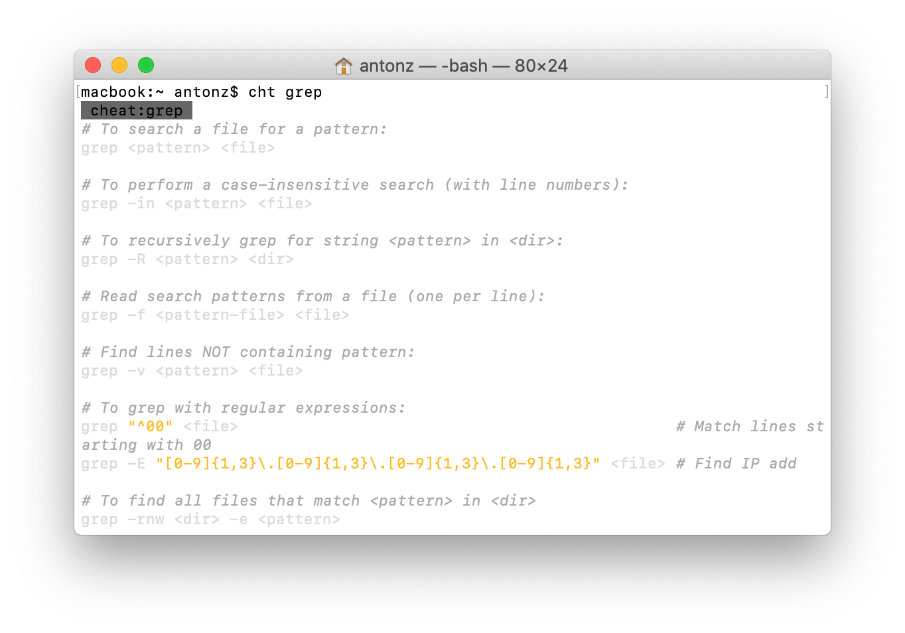

+++
date = 2021-04-23T10:46:01Z
description = "Конкретные примеры вызова линуксовых утилит вместо портянки с документацией."
image = "/cheat-sh/cover.png"
slug = "cheat-sh"
tags = ["development", "60-sec"]
title = "​Шпаргалки как альтернатива man"
+++

Я вечно забываю синтаксис линуксовых утилит вроде `grep`, `sed` и `find`. Есть команда `man`, которая показывает документацию по утилите, но для меня она совершенно бесполезна — никогда не получается найти то, что нужно (возможно, это только я такой тупой).

Поэтому был бесконечно счастлив, когда на днях нашел приятную альтернативу от Игоря Чубина — «шпаргалки» с конкретными примерами. Чтобы их включить, достаточно добавить такую функцию в `.bashrc`:

```
function cht() { curl "cht.sh/$1"; }
```

И вызвать шпаргалку по конкретной команде:

```
$ cht grep
$ cht sed
$ cht tr
```



Есть консольный клиент и много всяких наворотов, подробности [в репозитории автора](https://github.com/chubin/cheat.sh).

_Подписывайтесь на [Oh My Py](https://t.me/ohmypy), чтобы не пропустить новые заметки 🚀_


