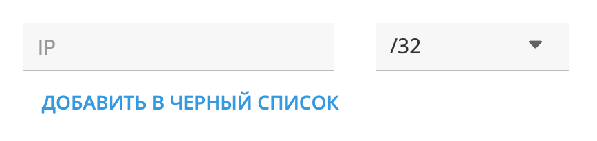

+++
date = 2021-01-18T11:30:06Z
description = "Комментарий — это хаос, но с ним система устойчивее."
image = "/comments/cover.png"
slug = "comments"
tags = ["interface"]
title = "Сила комментария"
subscribe = "dangry"
+++

Комментарий в интерфейсе — это необязательное текстовое поле. В комментарии человек указывает любую дополнительную информацию, которая кажется ему важной:

- На карточке клиента: за что предоставили скидку 20%
- На форме заказа: что в дверь звонить не надо
- В тикете техподдержки: ссылка на обсуждение в багтрекинге

Комментарии в интерфейсах недооценены. Аналитики, дизайнеры, программисты — все мы любим и умеем систематизировать информацию. Поэтому любой объект в интерфейсе представляем как набор полей с конкретным назначением: наименование, почтовый индекс, стоимость.

Но жизнь всегда богаче моделек. И когда люди используют софт, часто получается, что важная информация есть, а записать ее некуда. Тут и приходит на помощь комментарий.

Например, на «Дадате» мы используем систему защиты от сетевых атак. У нее есть интерфейс, где можно заблокировать конкретный IP-адрес. Указываешь IP, жмешь «добавить в черный список», злодей получает бан. Что может быть проще?

Проблема в том, что непонятно, кто заблокировал IP и почему. В большинстве случаев это и неважно, но иногда пригодилось бы для разбора. Решить проблему элементарно — добавить поле «комментарий».

Но постойте, можно же сделать нормальные поля «сотрудник» и «причина блокировки»? Да, можно, но непонятно:

- точно ли нужны именно эти поля?
- действительно ли они нужны?

Добавлять поля просто «чтобы были» — так себе идея. А выяснить реальные сценарии как раз и поможет поле «комментарий». Потом, если что, можно заменить его на поля с конкретным назначением.

Комментарий — элемент хаоса. Но с ним система устойчивее.
