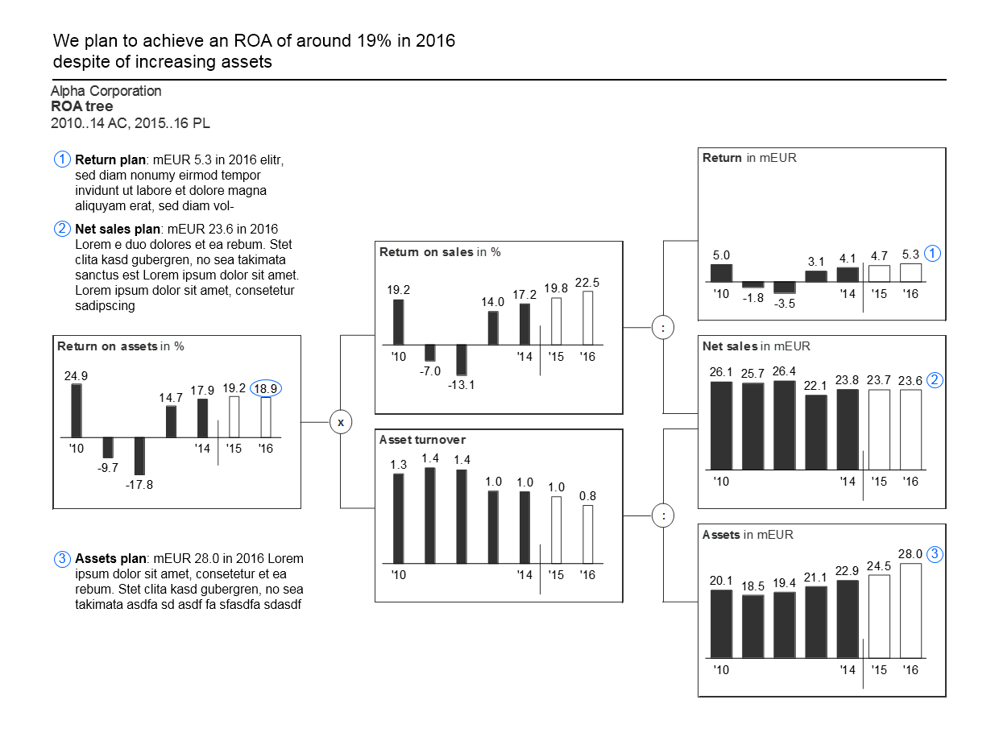

+++
date = 2021-04-11T08:37:39Z
description = "Для презентаций, отчетов и дашбордов."
featured = true
image = "/dataviz-guide/cover.png"
slug = "dataviz-guide"
tags = ["interface", "data"]
title = "Книга по визуализации данных"
+++

На днях я наткнулся на идеальное руководство по инфографике и визуализации данных:

- основано на работах Эдварда Тафти и Стивена Фью;
- подробное, но не слишком многословное (150 страниц);
- практичное и с кучей примеров (197 иллюстраций).

Книга рассказывает, как строить понятные отчеты и дашборды, на основе которых люди смогут принимать решения:

1. Как сформулировать и донести сообщение.
2. Как выбрать подходящую диаграмму.
3. Как должен выглядеть каждый элемент диаграммы.
4. Как избежать визуального мусора и повысить информационную плотность.
5. Как не ввести никого в заблуждение и облегчить восприятие информации.

Хотя само руководство отличное, его авторы — IBCS Association — приняли несколько странных решений:

1. Назвали книгу максимально непонятно и далеко от настоящей темы — «International Business Communication Standards».
2. Разместили [на сайте](https://www.ibcs.com/standards/) в таком виде, что нормально читать невозможно.

К счастью, IBCS опубликовали руководство под открытой лицензий Creative Commons. Так что с помощью пригоршни питона и такой-то матери я подготовил нормальную [веб-версию](https://github.com/nalgeon/dataviz), [EPUB](https://github.com/nalgeon/dataviz/releases/download/1.1/data-visualization-guide.epub) and [PDF](https://github.com/nalgeon/dataviz/releases/download/1.1/data-visualization-guide.pdf).

Авторы вложили в руководство много труда, а результат мне очень понравился. Так что предлагаю вам тоже оценить!

<em>Заметка из телеграм-канала <i class="far fa-star color-sin"></i> «<a href="https://t.me/dangry">Интерфейсы без шелухи</a>»</em>

