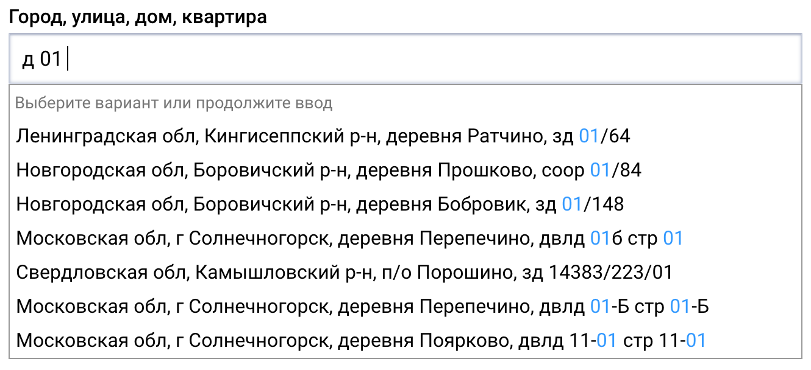

+++
date = 2021-10-24T17:02:08Z
description = "Который ведет налоговая."
image = "/fias/cover.png"
slug = "fias"
tags = ["data"]
title = "Справочник адресов России"
subscribe = "dangry"
+++

Не все знают, что в России есть Великий Справочник Адресов, в который свято веруют все чиновники (да и не только они). Расскажу о нём немного. Без официальной нуднятины, только задорные факты из жизни.

Справочник адресов называется «ФИАС» (федеральная информационная адресная система) или «ГАР» (государственный адресный реестр) — это одно и то же. Раньше назывался «КЛАДР» (классификатор адресов). Технически поддерживает его налоговая, а данные о домах и улицах вносят местные чиновники по всей стране. У справочника даже есть сайт (не читайте его): [fias.nalog.ru](https://fias.nalog.ru)

Вот как видит нашу родину налоговая служба:

- 86 регионов
- 3 тыс. городов
- 300 тыс. населённых пунктов
- 1 млн улиц
- 31 млн домов
- 52 млн квартир

У каждого адреса есть тип и название. Скажем, тип = «город», название = «Самара». Или тип = «республика», название = «Бурятия». Но если вам повезло жить в республике Чувашия, то тип = «Чувашия», название = «Чувашская республика». Потому что пошёл ты нахер, вот почему.

ФИАС — истина в последней инстанции для всех гос. органов. Если вы живёте в Кабардино-Балкарии на Моздокской улице, а у налоговой она значится как «МосдоГская» (в честь знаменитых кабардино-балкарских догов, видимо), то ни одному чиновнику вы свою правоту не докажете.

<figure>
  
  <figcaption>Дурная фантазия чиновников безгранична</figcaption>
</figure>

Или ещё был случай. В 2018 году питерским чиновникам стало скучно, и они домам приделали «литеру А». Был «Невский проспект, дом 41», а стал «дом 41 литер А». И так со всеми домами в городе. На табличках нормально написано, а в голове у чиновников — с литерами. Deal with it.

Справочник полон милых идиотизмов. Однажды перестали помещаться гаражи и садовые товарищества, и налоговая додумалась добавить новый «уровень» адреса для них. Загадочно назвали его «планировочная структура». Но забыли рассказать местным чиновникам, что это такое и зачем. Поэтому теперь в «планировочных структурах» лежит всё от жилых кварталов до районов городов и международных трасс. Бадум-тсс!

Ах да. Если вы думаете, что живёте в городе, то разочарую. На самом деле это не «город», а «городской округ». Это называется «муниципальное деление»: городские округа вместо городов, сельские поселения вместо сёл, и так далее. Ну, чтобы никто не догадался.

Налоговая любит внезапно менять справочник. То все дома в городе потеряет, то битых улиц насыпет, то просто два месяца не обновляет. Объяснений и анонсов, конечно же, никто не делает. Сами разберётесь, не маленькие.

Но. Хоть я и ворчу, ФИАС — большое благо! Это структурированный, регулярно обновляемый справочник адресов, доступный всем желающим. У большинства стран такого нет, так что пусть завидуют 👌
