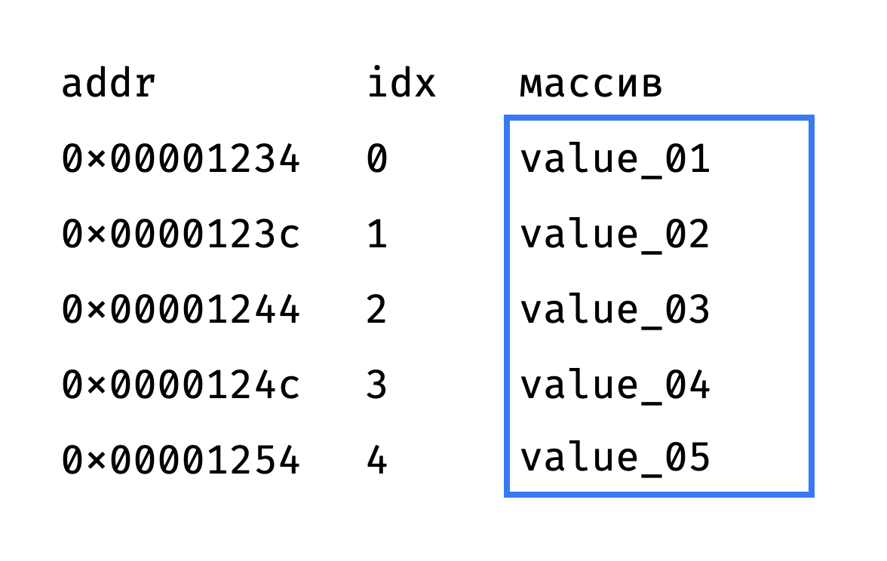
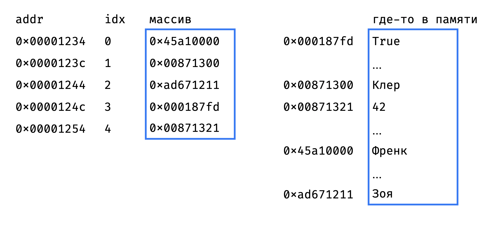
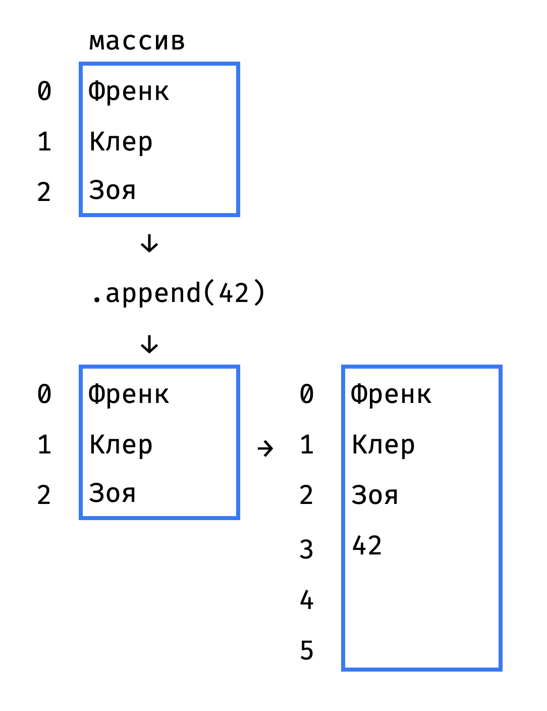

+++
date = 2021-11-11T16:18:00Z
title = "Как на самом деле устроен список в Python"
description = "И где у него константное время, а где линейное."
image = "/list-internals/cover.png"
slug = "list-internals"
tags = ["ohmypy", "development"]
+++

_Эта заметка посвящена структуре данных номер один в мире — массивам. Если вы еще не гуру алгоритмов и структур данных — гарантирую, что лучше поймете списки в питоне, их преимущества и ограничения. А если и так все знаете — освежите ключевые моменты._

Все знают, как работать со списком в питоне:

```py
>>> guests = ["Френк", "Клер", "Зоя"]
>>> guests[1]
'Клер'
```

Наверняка вы знаете, что выборка элемента по индексу — `guests[idx]` — отработает очень быстро даже на списке из миллиона элементов. Более точно, выборка по индексу работает за константное время O(1) — то есть не зависит от количества элементов в списке.

А знаете, за счет чего так быстро работает? Если да — вы в меньшинстве:

<div class="row">
<div class="col-xs-12 col-sm-6">
<figure>
  
</figure>
</div>
</div>

Давайте разбираться.

## Список = массив?

В основе списка лежит массив. Массив — это набор элементов ① одинакового размера и ② расположенных в памяти подряд друг за другом, без пропусков.

Раз элементы одинаковые и идут подряд, получить элемент массива по индексу несложно — достаточно знать адрес самого первого элемента («головы» массива).

Допустим, голова находится по адресу `0×00001234`, а каждый элемент занимает 8 байт. Тогда элемент с индексом `idx` находится по адресу `0×00001234 + idx*8`:

<div class="row">
<div class="col-xs-12 col-sm-6">
<figure>
  
</figure>
</div>
</div>

Поскольку операция «получить значение по адресу» выполняется за константное время, то и выборка из массива по индексу выполняется за O(1).

Грубо говоря, список в питоне именно так и устроен. Он хранит указатель на голову массива и количество элементов в массиве. Количество хранится отдельно, чтобы функция `len()` тоже отрабатывала за O(1), а не считала каждый раз фактическое количество элементов списка.

Все хорошо, но есть пара проблем:

- все элементы массива одного размера, а список умеет хранить разные (true/false, числа, строки разной длины);
- массив имеет фиксированную длину, а в список можно добавить сколько угодно элементов.

Чуть позже посмотрим, как их решить.

## Ну очень примитивный список

Лучший способ освоить структуру данных — реализовать ее с нуля. К сожалению, питон плохо подходит для таких низкоуровненых структур как массив, потому что не дает явно работать с указателями (адресами в памяти).

Но кое-что можно сделать:

```py
class OhMyList:
    def __init__(self):
        self.length = 0
        self.capacity = 8
        self.array = (self.capacity * ctypes.py_object)()

    def append(self, item):
        self.array[self.length] = item
        self.length += 1

    def __len__(self):
        return self.length

    def __getitem__(self, idx):
        return self.array[idx]
```

Наш самописный список имеет фиксированную вместимость (`capacity` = 8 элементов) и хранит элементы в массиве `array`.

Модуль `ctypes` дает доступ к сишным структурам, на которых построена стандартная библиотека. В даннам случае мы используем его, чтобы создать массив размером в `capacity` элементов.

## Список = массив указателей

Список моментально выбирает элемент по индексу, потому что внутри у него массив. А массив такой быстрый, потому что все элементы у него одинакового размера.

Но при этом в списке элементы могут быть очень разные:

```py
guests = ["Френк", "Клер", "Зоя", True, 42]
```

Чтобы решить эту задачку, придумали хранить в массиве не сами значения, а указатели на них. Элемент массива — адрес в памяти, а если обратиться по адресу — получишь настоящее значение:

<div class="row">
<div class="col-xs-12 col-sm-10">
<figure>
  
  <figcaption>Элементы массива расположены подряд, а сами значения, на которые они ссылаются, могут быть вперемешку где угодно в памяти.</figcaption>
</figure>
</div>
</div>

Поскольку указатели фиксированного размера (8 байт на современных 64-битных процессорах), то все прекрасно работает. Да, получается, что вместо одной операции (получить значение из элемента массива) мы делаем две:

1. Получить адрес из элемента массива.
2. Получить значение по адресу.

Но это все еще константное время O(1).

## Список = динамический массив

Если в массиве под списком остались свободные места, то метод `.append(item)` выполнится за константное время — достаточно записать новое значение в свободную ячейку и увеличить счетчик элементов на 1:

```py
def append(self, item):
    self.array[self.length] = item
    self.length += 1
```

Но что делать, если массив уже заполнен?

Приходится выделять память под новый массив, побольше, и копировать все элементы старого массива в новый:

<div class="row">
<div class="col-xs-12 col-sm-6">
<figure>
  
  <figcaption>Когда место в старом массиве заканчивается, приходится создавать новый.</figcaption>
</figure>
</div>
</div>

Примерно так:

```py
def append(self, item):
    if self.length == self.capacity:
        self._resize(self.capacity*2)
    self.array[self.length] = item
    self.length += 1

def _resize(self, new_cap):
    new_arr = (new_cap * ctypes.py_object)()
    for idx in range(self.length):
        new_arr[idx] = self.array[idx]
    self.array = new_arr
    self.capacity = new_cap
```

`._resize()` — затратная операция, так что новый массив создают с запасом. В примере выше новый массив в два раза больше старого, а в питоне используют более скромный коэффициент — примерно 1.12.

Если удалить из списка больше половины элементов через `.pop()`, то питон его скукожит — выделит новый массив поменьше и перенесет элементы в него.

Таким образом, список все время жонглирует массивами, чтобы это не приходилось делать нам ツ

## Добавление элемента в конец списка

Выборка из списка по индексу работает за O(1) — с этим разобрались. Метод `.append(item)` тоже отрабатывает за O(1), пока не приходится расширять массив под списком. Но любое расширение массива — это операция O(n). Так за сколько же в итоге отрабатывает `.append()`?

Оценивать отдельную операцию вставки было бы неправильно — как мы выяснили, она иногда выполняется за O(1), а иногда и за O(n). Поэтому используют амортизационный анализ — оценивают общее время, которое займет последовательность из K операций, затем делят его на K и получают амортизированное время одной операции.

Так вот. Не вдаваясь в подробности скажу, что амортизированное время для `.append(item)` получается константным — O(1). Так что вставка в конец списка работает очень быстро.

<div class="boxed">
<h3>Почему амортизированное время — O(1)</h3>
<p>Допустим, список пуст и мы хотим добавить в него <code>n</code> элементов. Для простоты будем использовать фактор расширения 2. Посчитаем количество атомарных операций:</p>
<ul>
  <li>первый элемент: 1 (копирование) + 1 (вставка)</li>
  <li>ещё 2: 2 (копирование) + 2 (вставка)</li>
  <li>ещё 4: 4 (копирование) + 4 (вставка)</li>
  <li>ещё 8: 8 (копирование) + 8 (вставка)</li>
  <li>...</li>
</ul>
<p>Итого на <code>n</code> элементов будет <code>n</code> операций вставки.</p>
<p>А при копировании будет</p>
<pre><code>1 + 2 + 4 + ... log(n) = 
= 2**log(n) * 2 - 1 =
= 2n - 1</code></pre>
<p>операций.</p>
<p>Итого на <code>n</code> элементов получилось <code>3n - 1</code> атомарных операций.</p>
<pre><code>O((3n - 1) / n) = O(1)</code></pre>
</div>

Получается, у списка есть такие гарантированно быстрые операции:

```py
# O(1)
lst[idx]

# O(1)
len(lst)

# амортизированное O(1)
lst.append(item)
lst.pop()
```

## Итоги

Как мы выяснили, у списка работают за O(1):

- выборка по индексу `lst[idx]`
- запрос длины `len(lst)`
- добавление элемента в конец списка `.append(item)`
- удаление элемента из конца списка `.pop()`

Остальные операции — «медленные»:

- Вставка и удаление из произвольной позиции — `.insert(idx, item)` и `.pop(idx)` — работают за линейное время O(n), потому что сдвигают все элементы после целевого.
- Поиск и удаление элемента по значению — `item in lst`, `.index(item)` и `.remove(item)` — работают за линейное время O(n), потому что перебирают все элементы.
- Выборка среза из `k` элементов — `lst[from:to]` — работает за O(k).

Значит ли это, что «медленные» операции нельзя использовать? Конечно, нет. Если у вас список из 1000 элементов, разница между O(1) и O(n) для единичной операции незаметна.

С другой стороны, если вы миллион раз выполняете «медленную» операцию на списке из 1000 элементов — это уже заметно. Или если список из миллиона элементов — тоже.

Поэтому полезно знать, что у списка работает за константное время, а что за линейное — чтобы осознанно принимать решение в конкретной ситуации.

<div class="row">
<div class="col-xs-12 col-sm-10 col-md-8"><p><em>Заметка из телеграм-канала <span class="nowrap"><i class="fas fa-kiwi-bird"></i> «<a href="https://t.me/ohmypy">Oh My Py</a>»</span></em></p></div>
</div>