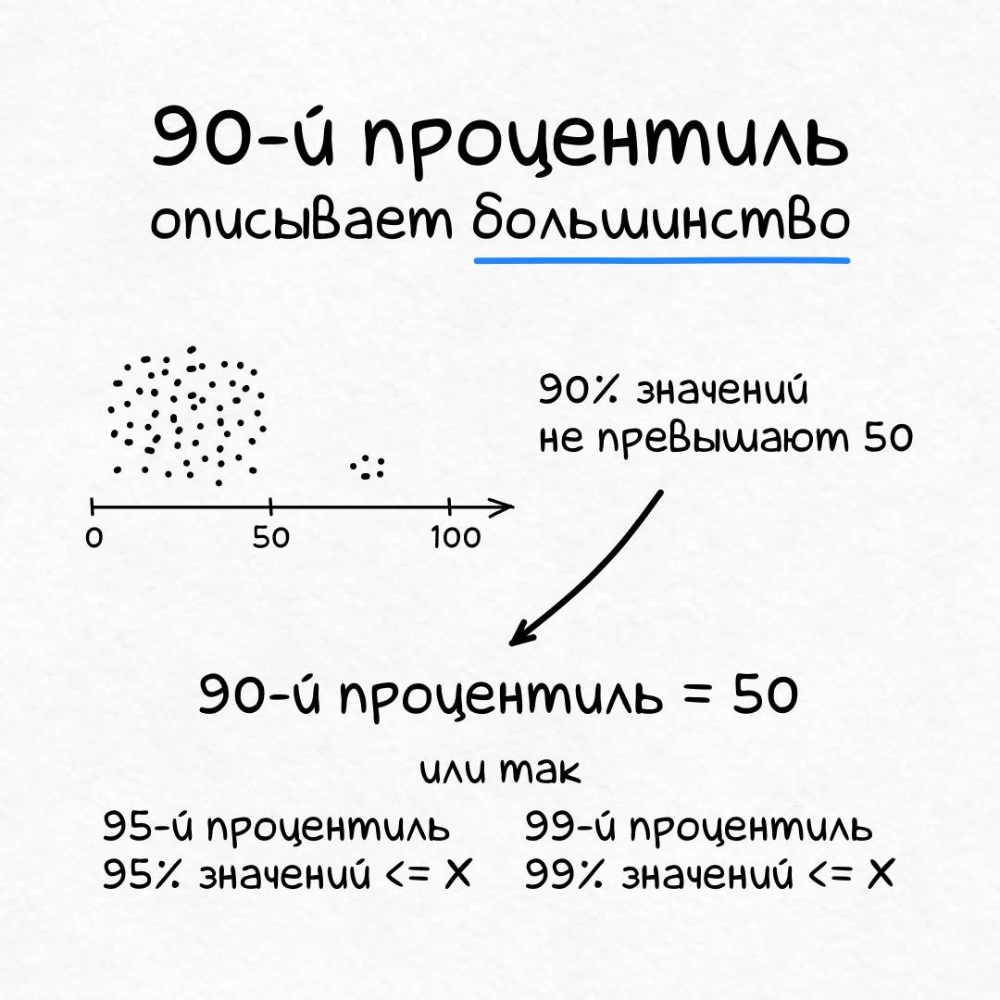

+++
date = 2021-02-08T17:26:26Z
description = "Медиана — бро, среднее — не бро. Четыре картинки на тему."
featured = true
image = "/median/cover.png"
slug = "median"
tags = ["data", "60-sec"]
title = "Медиана вместо среднего"
+++

Данные часто описывают с помощью среднего значения:

- средний рост человка,
- средняя оценка фильма,
- среднегодовой курс $.

И часто вместо среднего лучше подходит медиана и процентили. Только никто их не любит.

Сделал в честь этих ребят картинки:

Если хотите узнать больше о медиане, процентилях и 1% матстатистики, которого достаточно в 90% случаев — записывайтесь на курс:

<a href="/sqlite-course/">SQLite для аналитики</a>

Курс расскажет, как использовать SQLite для прикладного анализа данных. Без воды, куча примеров, применяйте в работе с первого дня.

<em>И подписывайтесь на канал <i class="fas fa-database"></i> «<a href="https://t.me/sqliter">SQLite на практике</a>»</em>

