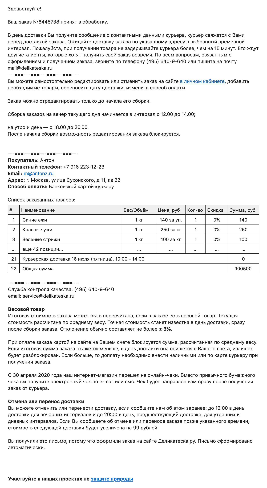
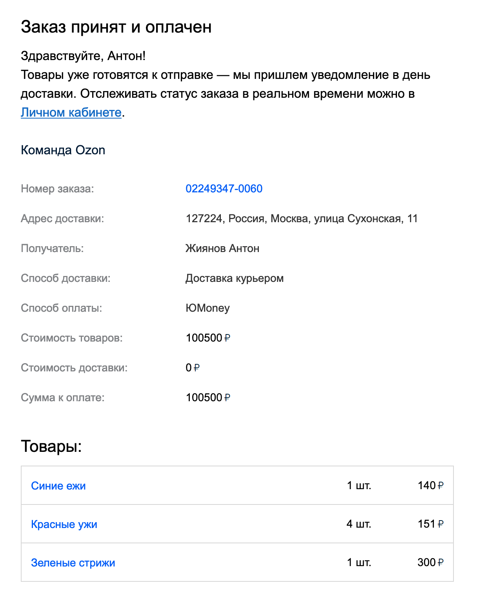
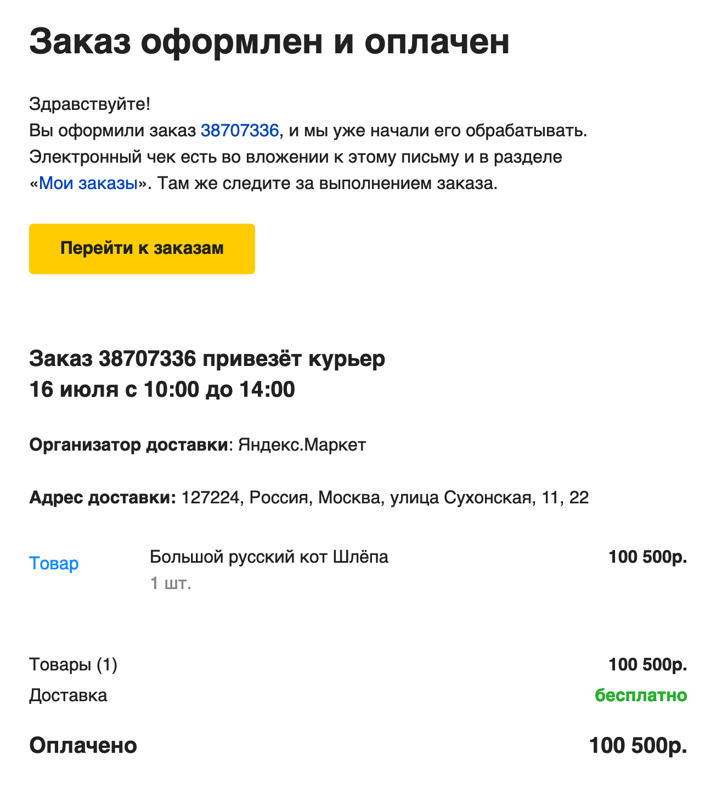

+++
date = 2021-07-15T15:57:34Z
description = "Номер, стоимость, время доставки."
image = "/order-confirmation/cover.png"
slug = "order-confirmation"
tags = ["interface", "writing"]
title = "Что должно быть в письме о заказе"
+++

Если продаете товары с доставкой курьером — наверняка отправляете клиентам емейл или смс после того, как заказ оформлен. Все так делают.

Но не у всех это письмо полезно клиенту.

## Плохо

Например, «Деликатеска» присылает такую простыню:

<figure>
  
  <figcaption>Здравствуйте, вам нужно больше читать, поэтому вот</figcaption>
</figure>

Тут и правила всего на свете, и мое имя и телефон (спасибо, а то вечно забываю), и бесконечный список заказанных товаров (на скриншоте я его обрезал), и даже призыв защитить природу в финале. Все, кроме самого главного — когда я получу заказ. Формально дата и время в письме есть, но так затейливо спрятаны, что заметить их малореально.

Или вот «Озон»:

<figure>
  
  <figcaption>Все скажу, дату-время доставки не скажу</figcaption>
</figure>

Тут получше — хотя бы нет правил поведения при пожаре. Но главный вопрос остается — когда я получу заказ?

А вот «Яндекс-маркет». Почти хорошо, не считая вступления с кнопкой:

<figure>
  
  <figcaption>Нам платят, когда вы жмакаете на кнопку «перейти к заказам», поэтому она превыше всего</figcaption>
</figure>

## Лучше
    
Если письмо бестолковое — человеку все равно придется идти в личный кабинет и искать информацию там. Не делайте так. Если хотите, чтобы письмо пригодилось, напишите вот что:

> Приняли заказ №12345, стоимость 5623 ₽, доставим в пятницу 16 июля с 10 до 14.

Если ваши айти-системы в состоянии идентифицировать заказ без номера (по телефону, например) — можно номер не писать, станет еще лучше. Правда, может возникнуть путаница, если у клиента несколько заказов одним днем.

> Приняли заказ на 5623 ₽, доставим в пятницу 16 июля с 10 до 14.

Добавьте телефон, чтобы человек не искал, как с вами связаться:

> Приняли заказ на 5623 ₽, доставим в пятницу 16 июля с 10 до 14. <u>8 800 223-23-23</u>

Если есть ограничения по оплате, тоже напишите:

> Оплата только наличными, у курьера нет сдачи.

> Заказ оплачен, вот <u>чек</u>.

Такой формат одинаково подходит для емейла и смс. В смс достаточно этим и ограничиться. В емейле можно дать больше подробностей:

- список товаров;
- как изменить время или отменить заказ;
- особенности (курьер звонит за час, доставка до двери и тому подобное).

Адрес доставки имеет смысл указывать, если у клиента их несколько. ФИО, телефон, адрес эл. почты — если заказ для другого человека.

## Итого

Укажите в сообщении о заказе:

- номер (если без него никак);
- стоимость,
- дату и время доставки,
- контактный телефон,
- важные ограничения.

> Приняли заказ № 12345, стоимость 5623 ₽, доставим в пятницу 16 июля с 10 до 14. Оплата только наличными. <u>8 800 223-23-23</u>

Такое сообщение действительно пригодится.

<em>Заметка из телеграм-канала <i class="far fa-star color-sin"></i> «<a href="https://t.me/dangry">Интерфейсы без шелухи</a>»</em>

