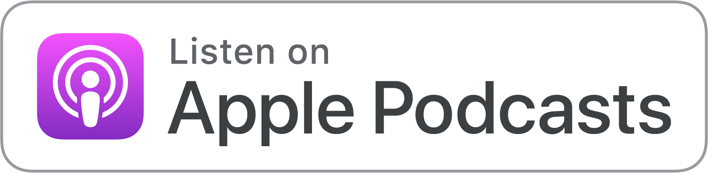
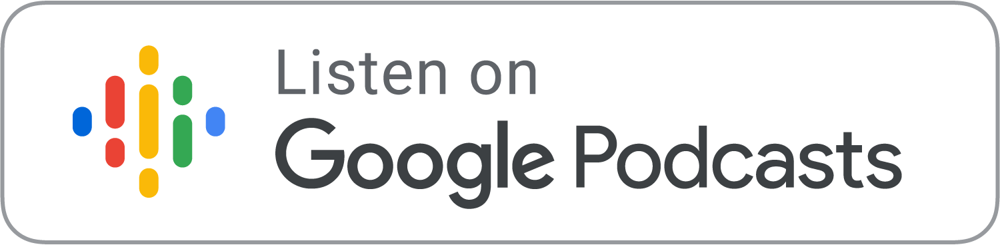

+++
date = 2021-02-28T07:02:00Z
description = "Компактный практический подкаст о программировании и продуктах."
featured = true
image = "/assets/projects/til.png"
slug = "podcast"
tags = ["project", "podcast"]
title = "Сегодня я узнал"
+++

Запустил подкаст о программировании и продуктах. Главные принципы:

- Никакой пустой болтовни. Никаких рассуждений об очередном айфоне, цене биткойна или что там Маск написал в твитере.
- Только практические штуки. В каждом выпуске — одна тема, которую можно взять и сразу применять на работе или в жизни.
- Очень короткие эпизоды — пять минут или около того. Не хочу долго занимать эфир, да и вообще длинных подкастов уже достаточно.

Выходит раз в неделю или чаще. Подписывайтесь!

    

    

<!--

    

-->

    
<a class="podcast-button" href="/tag/podcast/">все эпизоды</a>

