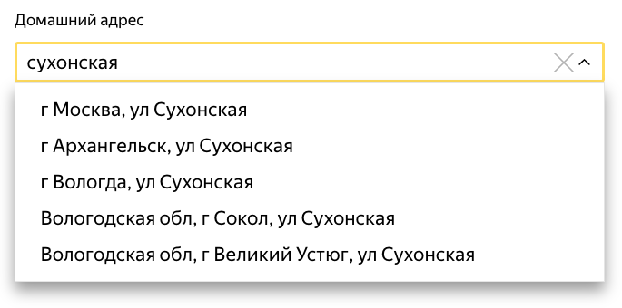
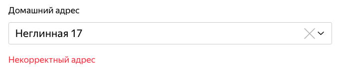
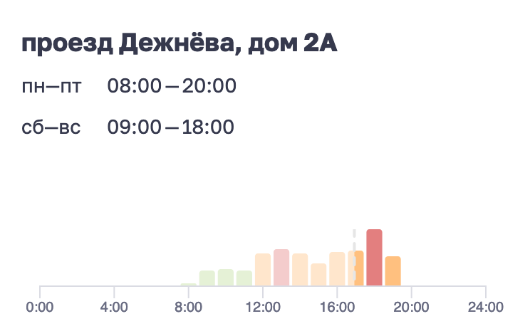
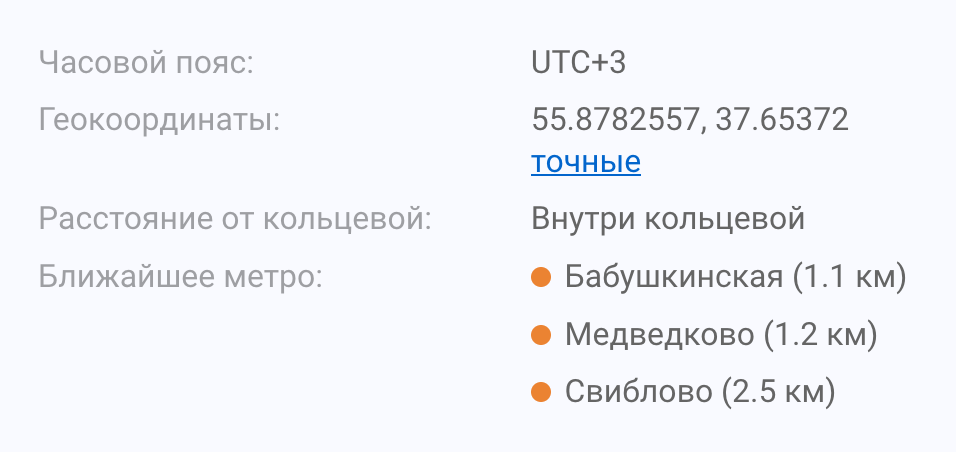

+++
date = 2021-09-06T14:32:41Z
description = "6 правил для работы с адресами."
image = "/postal-address/cover.png"
slug = "postal-address"
tags = ["interface", "dadata"]
title = "Почтовые адреса в интерфейсе"
+++

Моя вынужденно-любимая тема! Поговорим о том, как работать с почтовыми адресами в интерфейсах. Вот что я об этом думаю (1–3 обязательно, 4–6 по необходимости и возможности):

## 1. Спрашивать адрес одним полем

Не мучайте людей, заставляя их вводить «регион», «город», «населенный пункт» и «улицу». Достаточно одного поля с автодополнением от Дадаты, Яндекса или хотя бы Гугла.

<figure></figure>

## 2. Автоматически определять индекс

У нас не США, люди часто не помнят свой почтовый индекс. Сделайте доброе дело и подставьте его самостоятельно.

## 3. Разрешать вводить адрес вручную

Какой бы адресный справочник вы ни использовали, точно известно одно — жизнь все равно богаче. Запрещаете вводить неизвестные адреса → теряете часть заказов. Не делайте так.

<figure></figure>

## 4. Автоматически определять город

Если человек работает из мобильного приложения, вы знаете его координаты. Если из браузера — знаете айпи-адрес. В обоих случаях несложно определить город. Только оставьте возможность его изменить, конечно.

## 5. Показывать почтовое отделение

Если человек будет получать товар на почте, сделайте доброе дело и напишите, где находится отделение и какие у него часы работы.

<figure></figure>

## 6. Определять ближайшее метро

Если товар доставит курьер, помогите ему и автоматически определите ближайшее к адресу метро.

<figure></figure>

<a href="https://dadata.ru/blog/basics/best-practises-address/">Подробности — в блоге «Дадаты»</a>

<em>Заметка из телеграм-канала <i class="far fa-star color-sin"></i> «<a href="https://t.me/dangry">Интерфейсы без шелухи</a>»</em>

