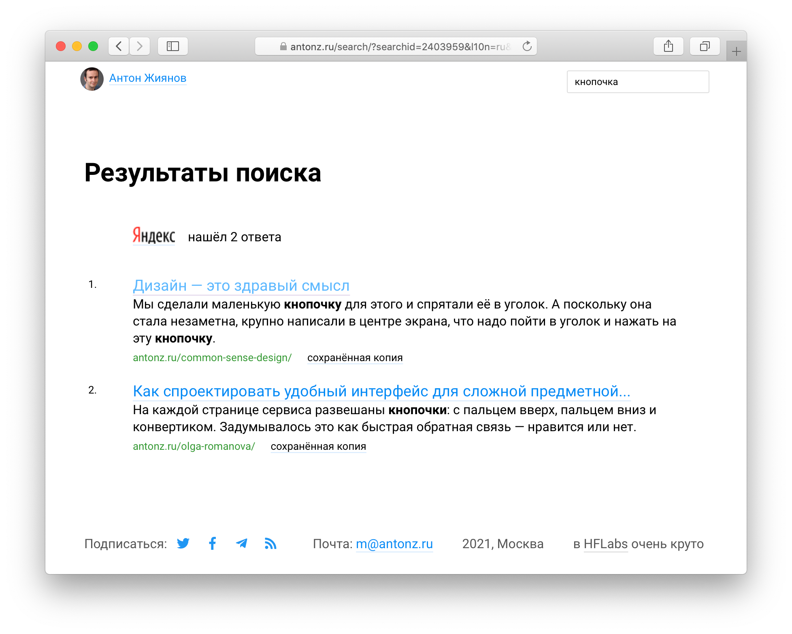

+++
date = 2021-01-29T09:26:42Z
description = "Включить FTS в БД или воткнуть Эластик — недостаточно."
image = "/search-as-a-service/cover.png"
slug = "search-as-a-service"
tags = ["productology"]
title = "Как сделать нормальный поиск"
+++

У магазинов, госсайтов, СМИ и даже жирных блогов часто есть поиск. Качество его обычно варьируется от «ужасно» (когда напилили сами) до «на троечку» (когда используют встроенный в CMS).

Проблема в том, что поиск — это сложно. Не, включить механизм полнотекстового поиска в БД или прикрутить Elasticsearch — как раз легко. А вот сделать нормальный релевантный поиск — непросто. Релевантный — это когда на первых местах в выдаче именно то, что имел в виду человек, а не фигня какая-то.

Как обычно бывает со сложными штуками, есть ребята, которые специализируются исключительно на поиске. Вот их и стоит использовать.

Если нет ни времени, ни бюджета, я бы взял [Поиск для сайта](https://site.yandex.ru/) от Яндекса. Встраивается за полчаса, ищет неплохо, выглядит нормально:

<figure>
  
  <figcaption class="align-center">Именно через «Яндекс» сделан поиск на моем сайте</figcaption>
</figure>

Если есть деньги и желание сделать классно — [Multisearch](https://multisearch.io/) (или [Algolia](https://www.algolia.com/) для англоязычного контента).

В качестве опенсорсной алтернативы Алголии рекомендуют [Typesense](https://github.com/typesense/typesense). Я с ним не работал, но по описанию выглядит интересно.

А пилить свой поиск — почти всегда плохая идея.

<em>Заметка из телеграм-канала <i class="far fa-star color-sin"></i> «<a href="https://t.me/dangry">Интерфейсы без шелухи</a>»</em>

