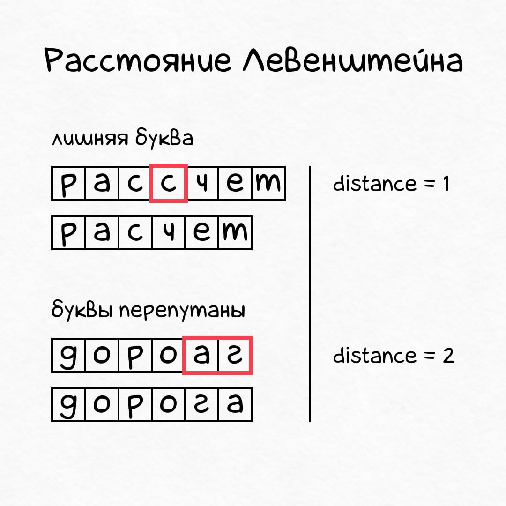
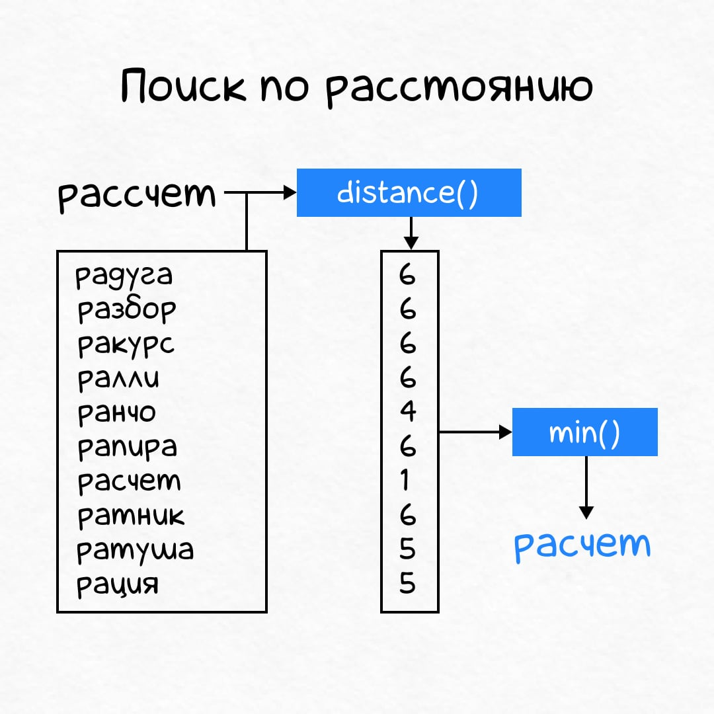
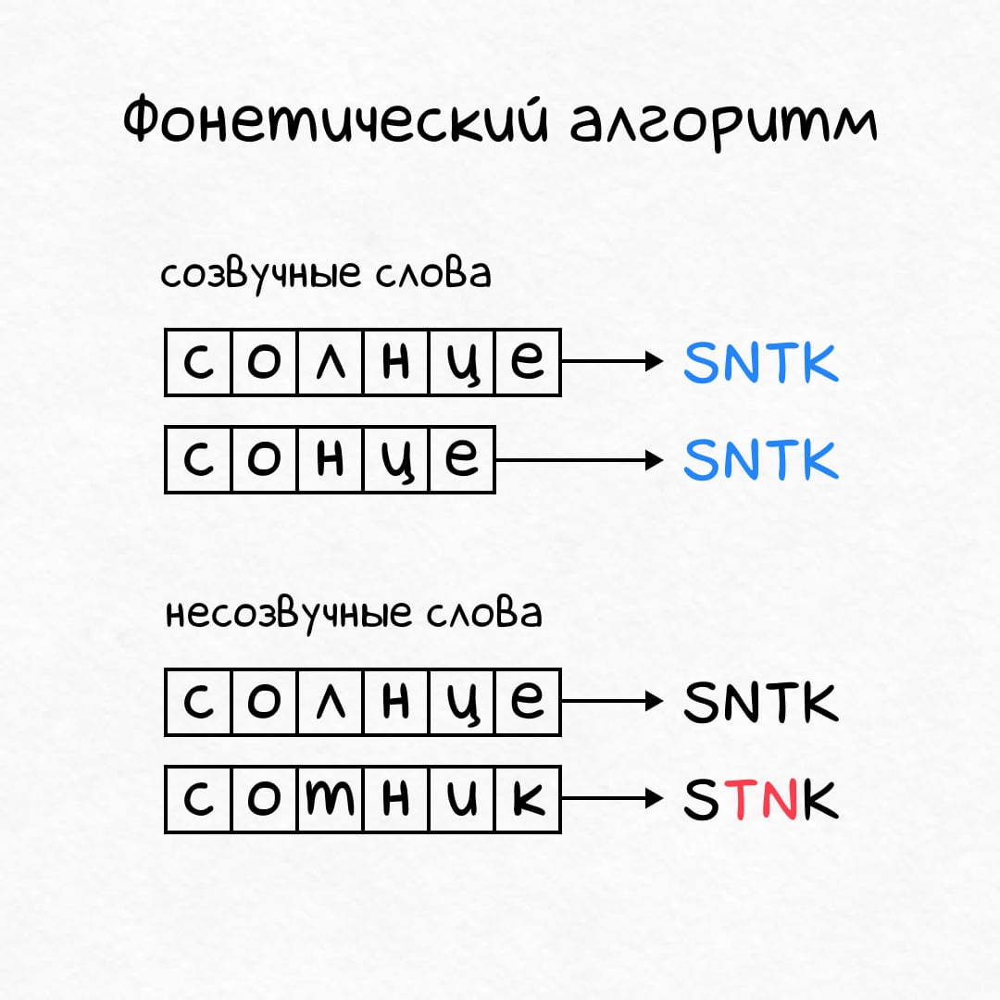
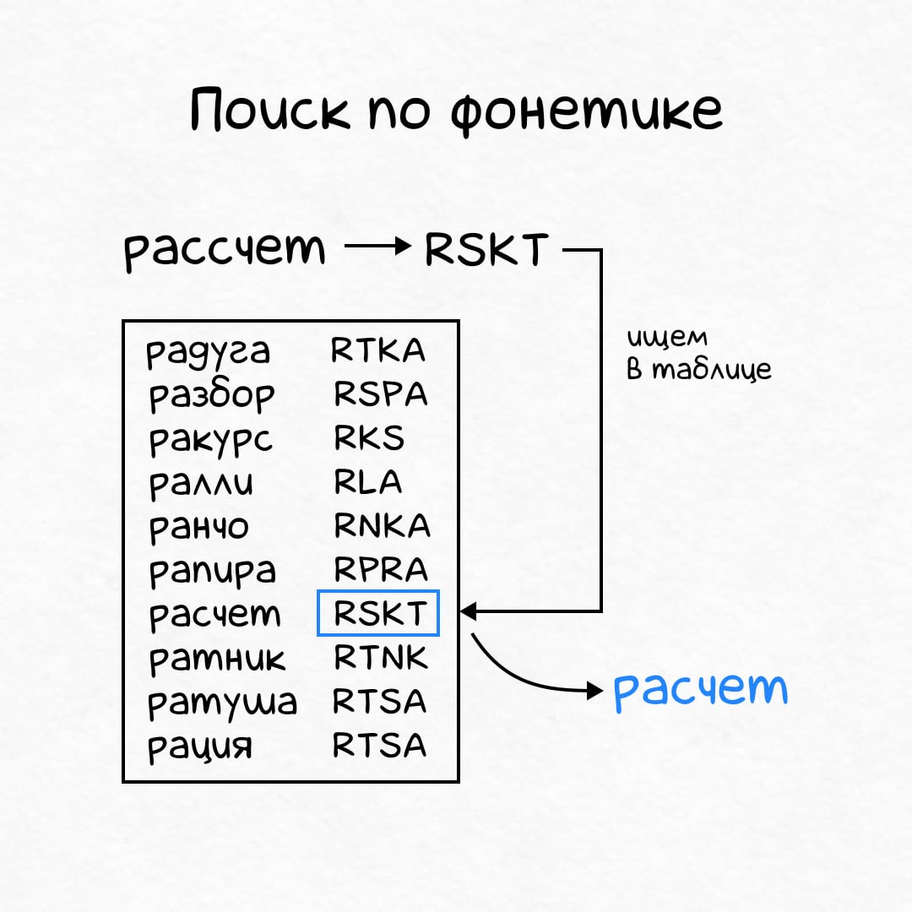
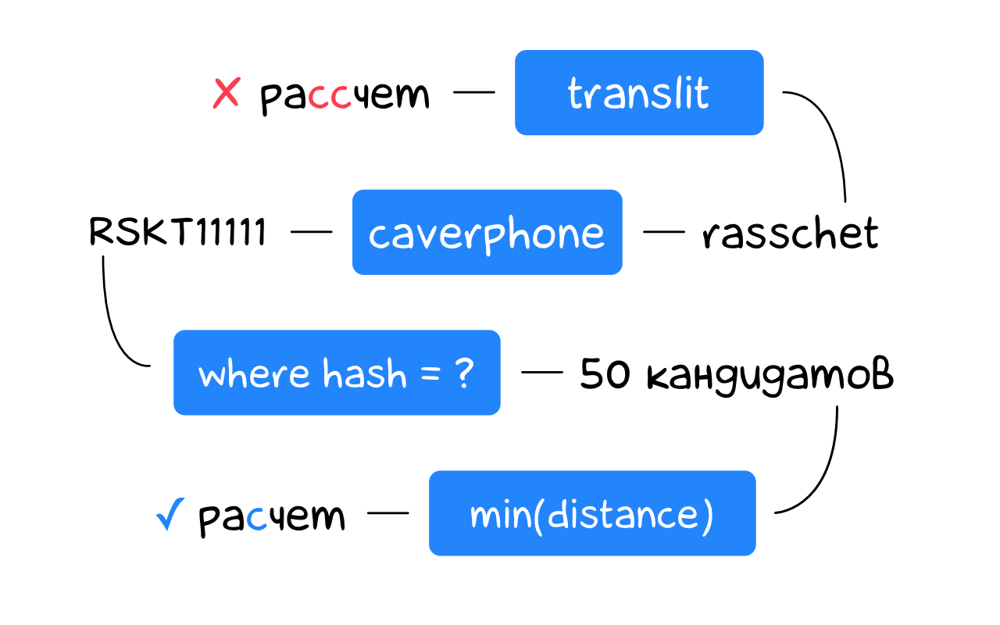

+++
date = 2021-12-02T13:30:00Z
title = "Быстрый поиск похожих слов на SQL"
description = "Фонетика, расстояния и никакого LIKE."
image = "/similar-words/cover.png"
slug = "similar-words"
tags = ["sqlite", "development", "data"]
featured = true
+++

_В этой статье разберемся, как быстро найти похожее слово в огромном словаре. Сначала рассмотрим наивное решение, потом сконструируем быстрое, а в конце посмотрим на готовое._

Предположим, мы хотим исправлять опечатки в поисковых запросах или сообщениях чата. Человек вводит «а<span class="color-red">б</span>р<span class="color-red">и</span>виатура», мы исправляем на «аббревиатура», «ра<span class="color-red">сс</span>чет» → «расчет», «доро<span class="color-red">аг</span>» → «дорога». Посмотрим, как решить такую задачу на SQL.

Я буду использовать SQLite. Но аналогичный подход сработает с любой СУБД или языком программирования (если интересно — дайте знать, сделаю примеры на Python).

## 1. Собираем словарь {#dictinary}

Воспользуемся списком русских слов во всех морфологических формах из репозитория [russian-words](https://github.com/danakt/russian-words). Скачаем и сконвертируем в UTF-8:

```bash
$ wget https://github.com/danakt/russian-words/raw/master/russian.txt
$ iconv -f cp1251 russian.txt > russian.utf.csv
```

Загрузим в таблицу `words`:

```
$ sqlite3 dictionary.db
sqlite> create table words(word text);
sqlite> .mode csv
sqlite> .import russian.utf.csv words
sqlite> create unique index words_idx on words(word);
sqlite> select count(*) from words;
1532629
```

Словарь из 1.5 млн слов готов.

Когда человек ввел какое-то слово («абривиатура») — несложно проверить, есть ли оно в словаре:

```sql
select 1 from words where word = 'абривиатура';
-- <пусто>
```

Раз варианта в словаре нет — в слове наверняка опечатка. Чтобы предложить исправление, придется найти максимальное похожее слово в `words`.

## 2. Определяем похожесть слов {#distance}

Человеку интуитивно понятно, что такое «похожее» или «непохожее» слово, но машине нужен формальный критерий.

Идеально, если бы мы умели измерять _расстояние_ между словами. Функция расстояния принимает на входе два слова и возвращает некоторое число `D`, которое характеризует похожесть:

```
distance(w1, w1) = x
```

Чем меньше `D`, тем более похожи слова.

Приятно, что специалисты по компьютерным наукам уже придумали великое множество таких функций. Наиболее известная из них — _расстояние Левенштейна_. Она измеряет, сколько букв надо удалить, добавить или заменить, чтобы перейти от слова `w1` к слову `w2`:

<div class="row">
<div class="col-xs-12 col-sm-6">
<figure>
  
</figure>
</div>
<div class="col-xs-12 col-sm-6">
<p class="figcaption">Расстояние Левенштейна считает количество элементарных замен, которыми можно превратить одно слово в другое.</p>
</div>
</div>

```python
# одна операция: удалить лишнюю С
levenshtein("рассчет", "расчет") = 1

# одна операция: добавить недостающую лишнюю Л
levenshtein("сонце", "солнце") = 1

# две операции: заменить А→Г, заменить Г→А
levenshtein("дороаг", "дорога") = 2
```

Пример с «дороаг» → «дорога» может показаться странным: очевидно же, что достаточно переставить буквы местами. Перестановка — одна операция, и расстояние должно быть 1, а не 2. Алгоритм Левенштейна не учитывает такие случаи, поэтому создали улучшенную и дополненную версию — *расстояние Дамерау-Левенштейна*:

```python
dlevenshtein("дороаг", "дорога") = 1
```

Его и будем использовать.

<div class="boxed">
<h3>Считаем расстояние в SQLite</h3>
<p>В стандартную поставку SQLite расстояния не входят. Поэтому будем использовать расширение <a href="https://github.com/nalgeon/sqlean/blob/main/docs/fuzzy.md">fuzzy</a>, в котором есть все необходимое:</p>
<pre><code>-- в консоли sqlite
.load ./fuzzy<br>
-- или через select
select load_extension('./fuzzy');
</code></pre>

<p>Расширение умеет работать только с ASCII-строками (латиницей), так что русские слова придется предварительно транслитерировать (перевести в латиницу) функцией <code>translit</code>:</p>
<pre><code>select translit('дорога');
-- doroga<br>
select translit('дороаг');
-- doroag<br>
select dlevenshtein(
  translit('дорога'),
  translit('дороаг')
);
-- 1</code></pre>

</div>

## 3. Ищем похожее слово в словаре {#search-distance}

Чтобы исправить опечатку в слове, достаточно посчитать расстояние от него до каждого слова в словаре и выбрать слово с минимальным расстоянием.

<div class="row">
<div class="col-xs-12 col-sm-6">
<figure>
  
</figure>
</div>
<div class="col-xs-12 col-sm-6">
<p class="figcaption">Считаем расстояния между словом с опечаткой и остальными словами → получаем набор расстояний. Выбираем минимальное → получаем слово с исправленной опечаткой.</p>
<p class="figcaption">Отличный был бы алгоритм, если бы не сортировал каждый раз полтора миллиона слов.</p>
</div>
</div>

На SQL:

```sql
select
  word,
  dlevenshtein(
    translit('абривиатура'),
    translit(word)
  ) as distance
from words
order by distance
limit 1;
```

```
┌──────────────┬──────────┐
│     word     │ distance │
├──────────────┼──────────┤
│ аббревиатура │ 2        │
└──────────────┴──────────┘
Run Time: real 8.145 user 8.055009 sys 0.051747
```

Отлично работает! Одна проблема: расчет занимает 8 секунд. Для исправления опечаток в онлайне не подходит. Нам желательно уложиться в 50–200 мс, чтобы для человека выглядело мгновенным. Исправим это.

## 4. Фонетическое кодирование {#phonetics}

Проблема с расстоянием в том, что его нельзя посчитать заранее — мы же не знаем, какое слово введет человек. Здесь поможет _фонетическое кодирование_:

<div class="row">
<div class="col-xs-12 col-sm-6">
<figure>
  
</figure>
</div>
<div class="col-xs-12 col-sm-6">
<p class="figcaption">Фонетический алгоритм превращает произвольное слово (<code>солнце</code>) в <em>фонетический код</em> (<code>SNTK</code>). При этом созвучные слова получают одинаковые коды, а несозвучные — разные.</p>
</div>
</div>

Теперь мы можем обойтись без расстояния вообще:

1. Заранее посчитать код для каждого слова в словаре.
2. Посчитать код для слова с опечаткой, которое ввел человек.
3. Найти слово в словаре по этому коду — это и будет правильный вариант.

<div class="row">
<div class="col-xs-12 col-sm-6">
<figure>
  
</figure>
</div>
<div class="col-xs-12 col-sm-6">
<p class="figcaption">Работать должно моментально, потому что по столбцу с кодами можно построить индекс, и искать по нему.</p>
</div>
</div>

Попробуем использовать фонетическое кодирование для исправления опечаток.

## 5. Ищем по фонетике {#search-phonetics}

Фонетические алгоритмы придумывали для английского языка, и на русском они не работают. Нам придется прибегнуть к трюку с транслитерацией.

У транслитерированных слов фонетика сильно отличается от «родной» английской, поэтому многие фонетические алгоритмы плохо работает с транслитом. Мы возьмем функцию `caverphone` — она на удивление недурна, несмотря на австралийское происхождение:

```python
caverphone(translit("рассчет")) = "RSKT111111"
caverphone(translit("расчет"))  = "RSKT111111"

caverphone(translit("сонце"))  = "SNTK111111"
caverphone(translit("солнце")) = "SNTK111111"

caverphone(translit("абривиатура"))  = "APRFTRA111"
caverphone(translit("аббревиатура")) = "APRFTRA111"
```

Рассчитаем коды для слов из словаря и построим индекс:

```sql
alter table words add column hash text;
update words set hash = caverphone(translit(word));
create index words_hash_idx on words(hash);
```

Исправим опечатку в слове `абривиатура`:

```sql
select word
from words
where hash = caverphone(translit('абривиатура'))
limit 3;
```

```
┌───────────────┐
│     word      │
├───────────────┤
│ аббревиатура  │
│ аббревиатурой │
│ аббревиатурою │
└───────────────┘
Run Time: real 0.002 user 0.000130 sys 0.000391
```

Замечательно! Запрос выполнился мгновенно и вернул подходящие слова из словаря.

## 6. Ищем по фонетике и расстоянию {#search-combined}

Как удачно все получилось с «аббревиатурой». Проверим на «расчете»:

```sql
select word
from words
where hash = caverphone(translit('рассчет'))
limit 3;
```

```
┌────────────┐
│    word    │
├────────────┤
│ разжигает  │
│ разжигаете │
│ разжигайте │
└────────────┘
```

Эээ. Совсем не то, чего мы ожидали. Проблема в том, что у «расчета» фонетически похожих слов довольно много:

```sql
select count(*)
from words
where hash = caverphone(translit('рассчет'));
-- 50
```

Нам бы как-то найти среди этих пятидесяти самое похожее. Хорошо, что мы уже знаем как это сделать — с помощью расстояния Дамерау-Левенштейна! Будем выбирать слова-кандидаты по фонетическому коду, а наиболее подходящего из кандидатов — по расстоянию:

<figure>
  
  <figcaption>Транслитерируем слово, считаем фонетический код, затем ищем по нему кандидатов и выбираем ближайшего по расстоянияю.</figcaption>
</figure>

```sql
-- кандидаты по фонетическому коду
with candidates as (
  select word
  from words
  where hash = caverphone(translit('рассчет'))
)

-- выбираем кандидата с минимальным расстоянием
select
  word,
  dlevenshtein(
    translit('рассчет'),
    translit(word)
  ) as distance
from candidates
order by
  distance,
  abs(length(word) - length('рассчет')),
  length(word)
limit 3;
```

```
┌──────────┬──────────┐
│   word   │ distance │
├──────────┼──────────┤
│ расчет   │ 1        │
│ расчёт   │ 1        │
│ рассечет │ 1        │
└──────────┴──────────┘
Run Time: real 0.014 user 0.000729 sys 0.003712
```

То что надо! Поиск остался моментальным (благодаря выборке кандидатов по индексу), но стал точным (благодаря честному сравнению расстояния между кандидатами).

## 7. Учитываем нефонетические опечатки {#other-typos}

Все здорово в нашем походе. Кроме одного: не все опечатки фонетические. Если перепутать порядок букв в слове `дорога`, звучать слова будут совершенно по-разному:

```
дорога
дороаг
```

Фонетический алгоритм посчитает такие слова разными (и будет прав):

```python
caverphone("doroga") = "TRKA111111"
caverphone("doroga") = "TRK1111111"
```

В результате на нефонетических опечатках наш алгоритм будет работать плохо. Для `дороаг` вернет:

```
┌────────┬──────────┐
│  word  │ distance │
├────────┼──────────┤
│ дорог  │ 1        │
│ дороге │ 2        │
│ драг   │ 2        │
└────────┴──────────┘
```

Часть нефонетических опечаток можно исправить. Например, выбирать не по строгому равенству фонетических кодов, а по префиксу (первые 3 символа в данном случае):

```sql
-- диапазон допустимых фонетических кодов
with bounds as (
  select
    substr(caverphone(translit('дороаг')), 1, 3) || '1' as left,
    substr(caverphone(translit('дороаг')), 1, 3) || 'Z' as right
),

-- кандидаты по фонетическому коду
-- из числа допустимых
candidates as (
  select word
  from words, bounds
  where hash between bounds.left and bounds.right
)

-- выбираем кандидата с минимальным расстоянием
select
  word,
  dlevenshtein(translit('дороаг'), translit(word)) as distance
from candidates
order by distance, abs(length(word) - length('дороаг')), length(word)
limit 3;
```

```
┌────────┬──────────┐
│  word  │ distance │
├────────┼──────────┤
│ дорога │ 1        │
│ дорог  │ 1        │
│ дороге │ 2        │
└────────┴──────────┘
Run Time: real 0.032 user 0.030312 sys 0.000339
```

Такой запрос находит на порядки больше кандидатов (6633 вместо 81 для «дороги»). Из-за этого он намного медленнее работает (хотя 32 мс — все еще очень быстро с точки зрения человека).

Префиксный подход не сработает, если опечатка в самом начале слова. Запрос по `одрога` не найдет слово `дорога`:

```
┌────────┬──────────┐
│  word  │ distance │
├────────┼──────────┤
│ отрога │ 1        │
│ отроге │ 2        │
│ отроги │ 2        │
└────────┴──────────┘
```

Хоть мой айфон такую опечатку тоже не исправляет, так что может и ничего.

## 8. Готовое решение для SQLite {#spellfix}

Теперь вы знаете, как быстро искать похожие слова в стиле «сделай сам». Описанный алгоритм можно реализовать в любой СУБД, где есть фонетические функции и функции расстояний. Но даже если в вашей базе их нет — то же самое можно сделать на Python, JS или C#, для которых уж точно найдутся подходящие библиотеки.

Если же работаете в SQLite — можно сэкономить время и воспользоваться готовым расширением [spellfix](https://github.com/nalgeon/sqlean/blob/main/docs/spellfix.md). Под капотом у него фонетика + расстояния, как мы обсуждали, но внешний интерфейс сильно проще:

```sql
.load ./spellfix

create virtual table dictionary using spellfix1;

insert into dictionary(word)
select word from words;

select word from dictionary
where word match 'абривиатура'
limit 1;
```

```
┌──────────────┐
│     word     │
├──────────────┤
│ аббревиатура │
└──────────────┘
Run Time: real 0.182 user 0.112689 sys 0.014142
```

Работает медленнее и местами хуже, чем наше DIY-решение, зато гибче настраивается. Можно добавлять синонимы слов и тюнить расстояние — см. разделы «Dealing With Unusual And Difficult Spellings» и «Configurable Edit Distance» [в документации](https://sqlite.org/spellfix1.html).

## 9. Итоги

Теперь вы умеете:

-   Считать расстояние между словами, чтобы понять, насколько они отличаются.
-   Использовать фонетические алгоритмы, чтобы искать созвучные слова.
-   Сочетать фонетику и расстояние, чтобы моментально находить похожие слова в миллионном словаре.

Конечно, есть и альтернативные подходы к исправлению опечаток. Например:

-   Для каждого слова из словаря заранее сгенерить возможные варианты опечаток и сохранить их в отдельной таблице. Словарь увеличится в десятки, если не сотни раз — зато не нужны фонетика и расстояния.
-   Обучить нейросеть предсказывать правильное слово по тому, что ввел человек. Заодно получится предиктивно предлагать варианты еще до того, как пользователь дописал слово — так работает ввод в айоси и андроиде.

Но это уже совсем другая история ツ А фонетика и расстояния могут вам пригодиться.

<div class="row">
<div class="col-xs-12 col-sm-10 col-md-8"><p><em>И подписывайтесь на канал <span class="nowrap"><i class="fas fa-database"></i> «<a href="https://t.me/sqliter">SQLite на практике</a>»</span></em></p></div>
</div>
