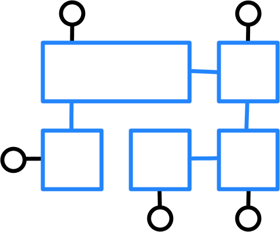

+++
date = 2021-02-26T12:55:15Z
description = "Стремление к простым программам  — самый важный, наверное, принцип разработки"
image = "/simple-made-easy/cover.png"
slug = "simple-made-easy"
tags = ["development", "ohmypy"]
title = "Простое против легкого"
subscribe = "ohmypy"
+++

9 лет назад в докладе «[Simple Made Easy](https://www.infoq.com/presentations/Simple-Made-Easy/)» Рич Хикки рассказал о разнице между простым (*simple*) и легким (*easy*) в разработке софта. Стремление к простым программам (в противоположность легким) — самый важный, наверное, принцип разработки. И при этом совершенно непопулярный.

- *Simple* — это о внутреннем устройстве программы, ее архитектуре. У простых программ мало внутренних зависимостей, движущихся частей, настроек. Антипод простой программы — сложная. Простая программа или сложная — это объективная характеристика.
- *Easy* — это о том, насколько человеку легко работать с программой. Это субъективная характеристика: что мне легко, другому сложно, и наоборот. Антипод легкой программы — тяжелая.

Например, SQLite — легкая, но не простая. Внутри там ад, особенно в системе типов и взаимовлиянии многочисленных параметров. А Redis — простой. Но для многих не такой легкий, как SQLite, потому что непривычный. Docker — «легкий», но сложный. Kubernetes — тяжелый и адово сложный.

<figure>
  
  <figcaption>Простое — про внутреннее устройство</figcaption>
</figure>

<figure>
  
  <figcaption>Легкое — про восприятие</figcaption>
</figure>

«Си» начинался как простой язык, но из-за стремления бесконечно сохранять обратную совместимость превратился в сложный. C++ сразу начинался как сложный, а из-за фичеризма авторов превратился в ночной кошмар.

JavaScript — легкий, но очень сложно устроен. Python — тоже легкий и непростой, хотя и попроще джаваскрипта. Go — простой.

Модули стандартной библиотеки Python [`bisect`](https://github.com/python/cpython/blob/3.9/Lib/bisect.py) и [`heapq`](https://github.com/python/cpython/blob/3.9/Lib/heapq.py) — простые. Но не легкие, если вы не знаете алгоритмов, которые они реализуют. [`dataclasses`](https://github.com/python/cpython/blob/3.9/Lib/dataclasses.py) и [`namedtuple`](https://github.com/python/cpython/blob/3.9/Lib/collections/__init__.py#L336) созданы, чтобы быть легкими, но при этом очень сложны.

Простые программы в долгой перспективе лучше легких. В простой программе оказывается легче разобраться, легче использовать на реальных сценариях, легче менять и дорабатывать. Легкую (но при этом сложно устроенную) программу можно быстро начать использовать, но дальше ждет стена.

Разработчики предпочитают писать «легкие» программы, а не простые — потому что простые делать тяжело. Придется продумывать архитектуру, работать с ограничениями, много раз переписывать. Намного легче слепить из палочек и веточек, а сверху приделать «легкий» интерфейс.

Очень хочу, чтобы в мире софта появлялось больше простых, а не «легких» программ и библиотек.
