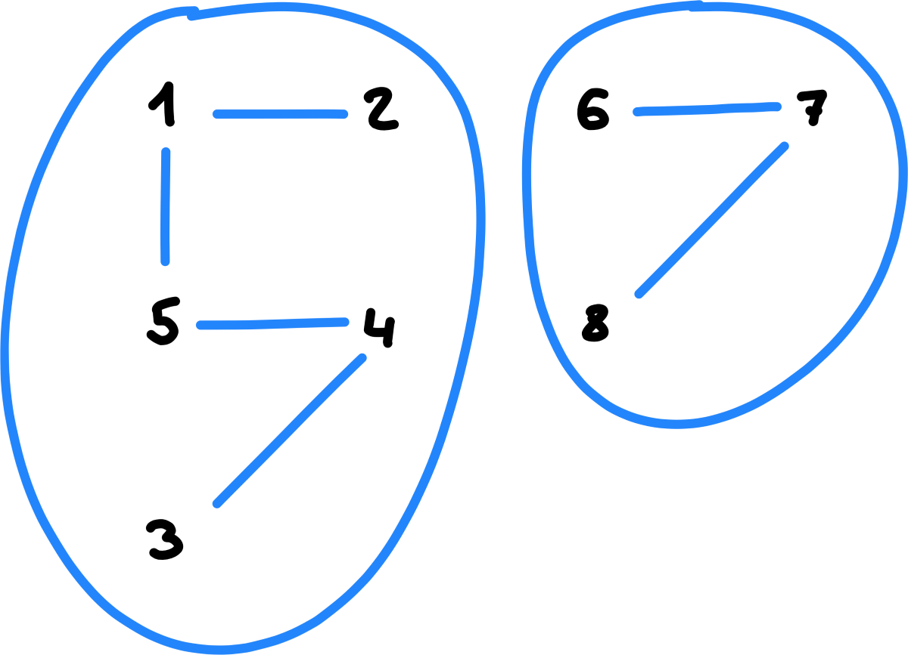
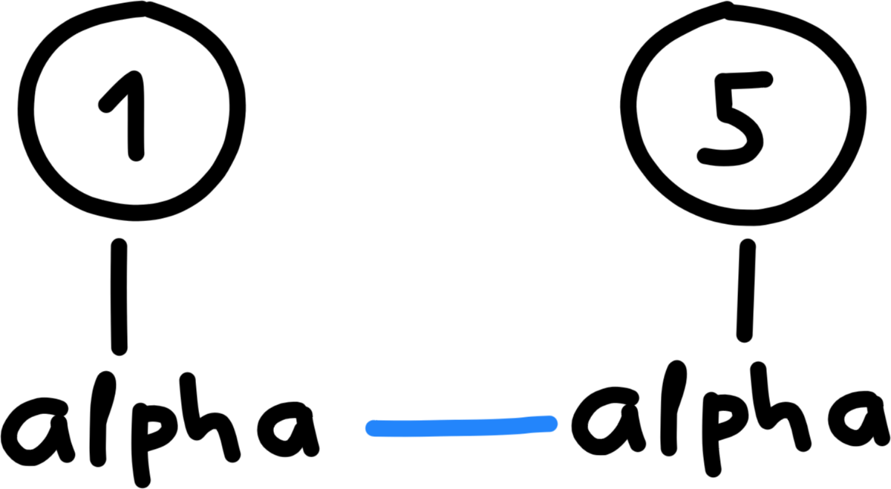
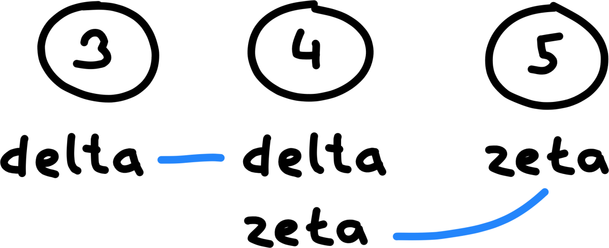
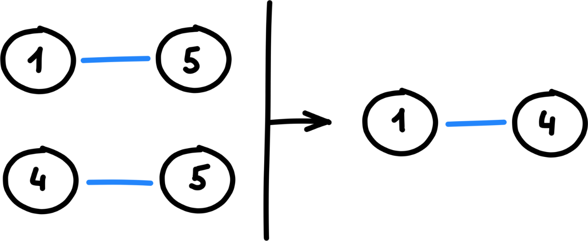

+++
date = 2021-06-06T14:47:53Z
description = "Ищем похожих людей, товары и все что угодно."
image = "/sql-groups/cover.png"
slug = "sql-groups"
tags = ["data", "sqlite", "puzzle"]
title = "Найти группы похожих объектов с помощью SQL"
subscribe = "sqliter"
+++

Бывает, есть множество объектов с разными свойствами, и хочется идентифицировать группы похожих:

- объединить людей с одинаковым ФИО и адресами-телефонами в клиентской базе;
- сегментировать покупателей магазина по товарам, которые они приобрели;
- определить персоны в зависимости от сценариев, по которым люди взаимодействуют с сервисом.

<div class="row">
<div class="col-xs-12 col-sm-6">
<figure>
  
</figure>
</div>
</div>

Давайте посмотрим, как решить эту задачу на «голом» SQL.

## Постановка задачи

Рассмотрим на конкретном примере. Есть таблица `attributes` с атрибутами пользователей:

```
┌─────────┬─────────┐
│ user_id │  attr   │
├─────────┼─────────┤
│ 1       │ alpha   │
│ 1       │ beta    │
│ 2       │ beta    │
│ 2       │ gamma   │
│ 3       │ delta   │
│ 3       │ epsilon │
│ 4       │ delta   │
│ 4       │ zeta    │
│ 5       │ alpha   │
│ 5       │ zeta    │
│ 6       │ iota    │
│ 7       │ iota    │
│ 7       │ kappa   │
│ 8       │ kappa   │
│ 8       │ lambda  │
└─────────┴─────────┘
``` 

Хотим объединить пользователей в группы. При этом действуют правила:

- Если пользователи A и B обладают общим свойством → они входят в одну группу.
- Если A и B обладают общим свойством P1, B и C обладают общим свойством P2 → A, B, C входят в одну группу.
- Идентификатором группы считается минимальный идентификатор из входящих в нее пользователей.

Для каждой группы хотим еще определить список атрибутов ее пользователей.

В итоге должно получиться две группы:

```
┌──────────┬─────────┬─────────────────────────────────────┐
│ group_id │ user_id │                attrs                │
├──────────┼─────────┼─────────────────────────────────────┤
│ 1        │ 1       │ alpha,beta,gamma,delta,epsilon,zeta │
│ 1        │ 2       │ alpha,beta,gamma,delta,epsilon,zeta │
│ 1        │ 3       │ alpha,beta,gamma,delta,epsilon,zeta │
│ 1        │ 4       │ alpha,beta,gamma,delta,epsilon,zeta │
│ 1        │ 5       │ alpha,beta,gamma,delta,epsilon,zeta │
│ 6        │ 6       │ iota,kappa,lambda                   │
│ 6        │ 7       │ iota,kappa,lambda                   │
│ 6        │ 8       │ iota,kappa,lambda                   │
└──────────┴─────────┴─────────────────────────────────────┘
```

Как решить задачу на чистом SQL? Использовать процедурные расширения вроде pl/sql и pl/pgSQL — нельзя.

## 0. Какие бывают группы

Сначала договоримся о терминах.

Пользователи `A` и `B` *напрямую* похожи, если у них есть общее свойство `P`. В нашем примере пользователи 1 и 5 похожи напрямую:

<div class="row">
<div class="col-xs-12 col-sm-4">
<figure>
  
</figure>
</div>
</div>

```
┌─────────┬─────────┐
│ user_id │  attr   │
├─────────┼─────────┤
│ 1       │ alpha   │
│ 5       │ alpha   │
└─────────┴─────────┘
```

Пользователи `A` и `C` *транзитивно* похожи, если у них нет общих свойств, но существует пользователь `B` такой, что у `A` и `B` есть общее свойство `P1`, а у `B` и `C` — общее свойство `P2`. В нашем примере пользователи 3 и 5 похожи транзитивно, через пользователя 4:

<div class="row">
<div class="col-xs-12 col-sm-6">
<figure>
  
</figure>
</div>
</div>

```
┌─────────┬─────────┐
│ user_id │  attr   │
├─────────┼─────────┤
│ 3       │ delta   │
│ 4       │ delta   │
│ 4       │ zeta    │
│ 5       │ zeta    │
└─────────┴─────────┘
```

Вообще, когда слышишь задачу «найти группы» — первая мысль должна быть «сортировка». Например, найти группы напрямую похожих пользователей очень просто — достаточно отсортировать или сгруппировать по значению атрибута:

```sql
select * from attributes order by attr;
```

```
┌─────────┬─────────┐
│ user_id │  attr   │
├─────────┼─────────┤
│ 1       │ alpha   │
│ 5       │ alpha   │
│ 1       │ beta    │
│ 2       │ beta    │
│ 3       │ delta   │
│ 4       │ delta   │
│ 3       │ epsilon │
│ 2       │ gamma   │
│ 6       │ iota    │
│ 7       │ iota    │
│ 7       │ kappa   │
│ 8       │ kappa   │
│ 8       │ lambda  │
│ 4       │ zeta    │
│ 5       │ zeta    │
└─────────┴─────────┘
```

```sql
select
  attr,
  group_concat(user_id) as users
from attributes
group by attr
order by attr;
```

> Здесь я использую функцию `group_concat()`, чтобы объединить значения в строку. Так она называется в MySQL и SQLite, но в других СУБД тоже есть аналогичные. Например, `string_agg()` в PostgreSQL и `listagg()` в Oracle.

```
┌─────────┬───────┐
│  attr   │ users │
├─────────┼───────┤
│ alpha   │ 1,5   │
│ beta    │ 1,2   │
│ delta   │ 3,4   │
│ epsilon │ 3     │
│ gamma   │ 2     │
│ iota    │ 6,7   │
│ kappa   │ 7,8   │
│ lambda  │ 8     │
│ zeta    │ 4,5   │
└─────────┴───────┘
```

Проблема в том, что по условиям задачи мы должны учитывать и транзитивную похожесть. Обычной сортировкой уже не обойдешься.

## 1. Находим прямые пары

Если подход с сортировкой не работает, следующая мысль должна быть «пары». Если мы найдем все пары похожих пользователей — сможем построить по ним и группы.

Для начала найдем пары с прямой похожестью:

```sql
create view pairs as 
select
  min(a1.user_id, a2.user_id) as uid1,
  max(a1.user_id, a2.user_id) as uid2
from attributes as a1
  join attributes as a2
    on a1.attr = a2.attr and a1.user_id <> a2.user_id
;
```

```
┌──────┬──────┐
│ uid1 │ uid2 │
├──────┼──────┤
│ 1    │ 2    │
│ 1    │ 2    │
│ 1    │ 5    │
│ 1    │ 5    │
│ 3    │ 4    │
│ 3    │ 4    │
│ 4    │ 5    │
│ 4    │ 5    │
│ 6    │ 7    │
│ 6    │ 7    │
│ 7    │ 8    │
│ 7    │ 8    │
└──────┴──────┘
```

Здесь левый элемент пары — всегда меньший из двух идентификаторов, а правый — больший. Правило «левый меньший, правый больший» не обязательно, но поможет нам не плодить лишние пары на следующем шаге.

## 2. Находим транзитивные пары

Теперь добавим к прямым парам транзитивные. Это самый сложный шаг алгоритма: дело в том, что между транзитивно похожими пользователями X и Y может быть не одно промежуточное звено, а сколько угодно:

```
X → U1 → U2 → ... → Un → Y
```

Есть только один вид запроса, которой умеет размотать цепочку произвольной длины — `WITH RECURSIVE`. Подробно расскажу о нем в отдельной заметке, но общий принцип такой:

1. Однократно выполнить запрос `Q0`.
2. Снова и снова выполнять запрос `Qi`, пока он возвращает результаты.
3. Объединить результаты всех шагов и вернуть итоговый.

В нашем случае алгоритм такой:

1. Выбрать все прямые пары.
2. Для очередной пары пользователей `(x, y)`:
2.1. Найти пользователей `(u1, ... un)`, напрямую похожих на `y`.
2.2. Добавить к результатам пары `(x, u1), (x, u2), ... (x, un)`.
3. Выполнить шаг 2 для следующей пары.

<div class="row">
<div class="col-xs-12 col-sm-6">
<figure>
  
</figure>
</div>
</div>

На SQL:

```sql
create view allpairs as
with recursive cte(uid1, uid2) as (
  -- Пары пользователей (uid1, uid2) с одинаковыми свойствами
  select uid1, uid2
  from pairs
  
  union
  
  -- Пары, в которых uid2 фигурирует слева
  -- (они транзитивно похожи на uid1)
  select cte.uid1, p.uid2
  from pairs as p
    join cte on cte.uid2 = p.uid1
  
  union
  
  -- Пары, в которых uid2 фигурирует справа
  -- (тоже транзитивно похожи на uid1)
  select cte.uid1, p.uid1
  from pairs as p
    join cte on cte.uid2 = p.uid2
)
select * from cte;
```

```
┌──────┬──────┐
│ uid1 │ uid2 │
├──────┼──────┤
│ 1    │ 1    │
│ 1    │ 2    │
│ 1    │ 3    │
│ 1    │ 4    │
│ 1    │ 5    │
│ 3    │ 1    │
│ 3    │ 2    │
│ 3    │ 3    │
│ 3    │ 4    │
│ 3    │ 5    │
│ 4    │ 1    │
│ 4    │ 2    │
│ 4    │ 3    │
│ 4    │ 4    │
│ 4    │ 5    │
│ 6    │ 6    │
│ 6    │ 7    │
│ 6    │ 8    │
│ 7    │ 6    │
│ 7    │ 7    │
│ 7    │ 8    │
└──────┴──────┘
```

Теперь для каждого пользователя (столбец `uid1`) мы знаем всех похожих на него пользователей (столбец `uid2`) — как напрямую, так и транзитивно. Осталось из пар сформировать группы.

## 3. Объединяем пары в группы

Пары есть, можно объединить их в группы. Проблема только в том, что в `allpairs` группы дублируются:

```
┌──────┬──────┐
│ uid1 │ uid2 │
├──────┼──────┤
│ 1    │ 1    │
│ 1    │ 2    │
│ 1    │ 3    │
│ 1    │ 4    │
│ 1    │ 5    │
│ 3    │ 1    │
│ 3    │ 2    │
│ 3    │ 3    │
│ 3    │ 4    │
│ 3    │ 5    │
└──────┴──────┘
```

Формально здесь есть группа для `uid1 = 1` и группа для `uid1 = 3` — но по сути это одна и та же группа. Дубли нас не интересуют, так что выберем только уникальные группы:


```sql
create view groups as
select
  min(uid1) as group_id,
  uid2 as user_id
from allpairs
group by uid2;
```

Группировка по `uid2` гарантирует, что каждый пользователь входит только в одну группу. А выбор `min(uid1)` в качестве идентификатора группы — требование из постановки задачи.

```
┌──────────┬─────────┐
│ group_id │ user_id │
├──────────┼─────────┤
│ 1        │ 1       │
│ 1        │ 2       │
│ 1        │ 3       │
│ 1        │ 4       │
│ 1        │ 5       │
│ 6        │ 6       │
│ 6        │ 7       │
│ 6        │ 8       │
└──────────┴─────────┘
```

В целом, задача решена. Осталось только собрать список атрибутов для каждой группы.

## 4. Объединяем атрибуты групп

Тут все просто:

1. Для каждой группы выбираем ее пользователей.
2. Для каждого пользователя выбираем его атрибуты.
3. Объединяем атрибуты в одну строку, отсеивая дубли.

```sql
create view group_attributes as
select
  g.group_id,
  group_concat(distinct a.attr) as attrs
from groups as g
  join attributes as a on a.user_id = g.user_id
group by g.group_id;
```

```
┌──────────┬─────────────────────────────────────┐
│ group_id │                attrs                │
├──────────┼─────────────────────────────────────┤
│ 1        │ alpha,beta,gamma,delta,epsilon,zeta │
│ 6        │ iota,kappa,lambda                   │
└──────────┴─────────────────────────────────────┘
```

## 5. Собираем все вместе

Для каждого пользователя выбираем номер его группы и список атрибутов, которые в нее входят:

```sql
select
  g.group_id,
  g.user_id,
  ga.attrs
from groups as g
  join group_attributes as ga on ga.group_id = g.group_id
order by g.group_id, g.user_id;
```

```
┌──────────┬─────────┬─────────────────────────────────────┐
│ group_id │ user_id │                attrs                │
├──────────┼─────────┼─────────────────────────────────────┤
│ 1        │ 1       │ alpha,beta,gamma,delta,epsilon,zeta │
│ 1        │ 2       │ alpha,beta,gamma,delta,epsilon,zeta │
│ 1        │ 3       │ alpha,beta,gamma,delta,epsilon,zeta │
│ 1        │ 4       │ alpha,beta,gamma,delta,epsilon,zeta │
│ 1        │ 5       │ alpha,beta,gamma,delta,epsilon,zeta │
│ 6        │ 6       │ iota,kappa,lambda                   │
│ 6        │ 7       │ iota,kappa,lambda                   │
│ 6        │ 8       │ iota,kappa,lambda                   │
└──────────┴─────────┴─────────────────────────────────────┘
```

Тадам! Задача решена.

Если угодно, можно обойтись <a href="#show-sql" onclick="return showSql();">без промежуточных вьюх</a>.

<pre id="sql" style="display: none">
<code class="language-sql">with recursive

-- Уникальные пары пользователей с одинаковыми свойствами.
-- Если есть пара (1,2), то пары (2,1) уже не будет.
pairs as (
  select distinct
    -- Левый элемент пары - меньший из двух идентификаторов,
    min(a1.user_id, a2.user_id) as uid1,
    -- а правый - больший.
    -- Правило «левый меньший, правый больший» нужно,
    -- чтобы собрать транзитивные пары в allpairs ниже.
    max(a1.user_id, a2.user_id) as uid2
  from attributes as a1
    join attributes as a2
      on a1.attr = a2.attr and a1.user_id <> a2.user_id
),

-- Все пары похожих пользователей (в том числе транзитивно похожих).
-- Общий принцип: для каждой пары пользователей с одинаковыми свойствами
-- выбираем все пары, которые пересекаются с ними. Если выбрать все такие пары,
-- то для каждого пользователя получим полный набор пар, в которые он входит.
allpairs(uid1, uid2) as (
  -- Пары пользователей (uid1, uid2) с одинаковыми свойствами
  select uid1, uid2
  from pairs
  
  union
  
  -- Пары, в которых uid2 фигурирует слева
  -- (они транзитивно похожи на uid1)
  select ap.uid1, p.uid2
  from pairs as p
    join allpairs as ap on ap.uid2 = p.uid1
  
  union
  
  -- Пары, в которых uid2 фигурирует справа
  -- (тоже транзитивно похожи на uid1)
  select ap.uid1, p.uid1
  from pairs as p
    join allpairs as ap on ap.uid2 = p.uid2
),

-- Для каждого пользователя собираем группу похожих на него пользователей.
-- Каждый пользователь может входить только в одну группу:
-- если есть группа 1:[1,2,3], то группы 3:[1,2,3] уже не будет.
groups as (
  select
    -- id группы = минимальный user_id входящих в нее пользователей
    min(uid1) as group_id,
    -- пользователи, входящие в группу
    uid2 as user_id
  from allpairs
  -- группируем по пользователю, чтобы не было разных групп,
  -- в которые входит один и тот же пользователь
  group by uid2
),

-- Атрибуты пользователей для каждой группы (одной строкой)
group_attributes as (
  select
    g.group_id,
    group_concat(distinct a.attr) as attrs
  from groups as g
    join attributes as a on a.user_id = g.user_id
  group by g.group_id
)

-- Итог: для каждого пользователя номер его группы
-- и список атрибутов пользователей, входящих в группу
select
  g.group_id,
  g.user_id,
  ga.attrs
from groups as g
  join group_attributes as ga on ga.group_id = g.group_id
order by g.group_id, g.user_id;</code>
</pre>

## Итого

Вот общий алгоритм решения задач типа «объединить элементы в группы»:

1. Попытаться сформировать группы через обычную сортировку.
2. Если не получается — идентифицировать все пары элементов.
3. Объединить пары в группы.

Далеко не всегда такие задачи стоит решать на SQL. Часто процедурный код будет понятнее и эффективнее.

<script>
function showSql(e) {
  document.querySelector("#sql").style.display = "";
  return false;
}
</script>
