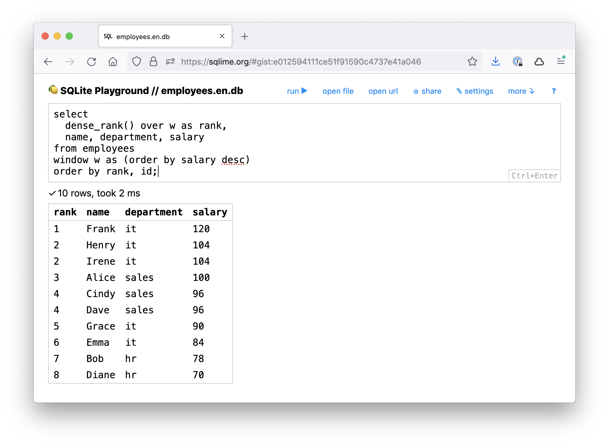

+++
date = 2021-09-28T21:13:03Z
description = "Для отладки и шаринга запросов."
image = "/sqlime/cover.png"
slug = "sqlime"
tags = ["sqlite", "project"]
title = "SQLite-песочница в браузере"
+++

Чего мне всегда не хватало, так это аналога JSFiddle для SQLite. Онлайн-песочницы, в которой можно быстро проверить SQL-запрос и поделиться с другими.

Вот чего хотелось:

-   Возможность загрузить готовую базу, а не писать SQL для создания таблиц.
-   Подключать как локальные базы, так и удаленные (по url).
-   Сохранять базу и запросы в облаке.
-   Бесплатно и без регистрации.
-   Свежайшая версия SQLite.
-   Минимализм.

В итоге сделал такую песочницу сам:

-   [демка](https://sqlime.org/) с пустой базой;
-   [пример](https://sqlime.org/#gist:e012594111ce51f91590c4737e41a046) заполненной базы;
-   [исходники](https://github.com/nalgeon/sqlime).

[подробности на Хабре](https://habr.com/ru/post/580240/)

