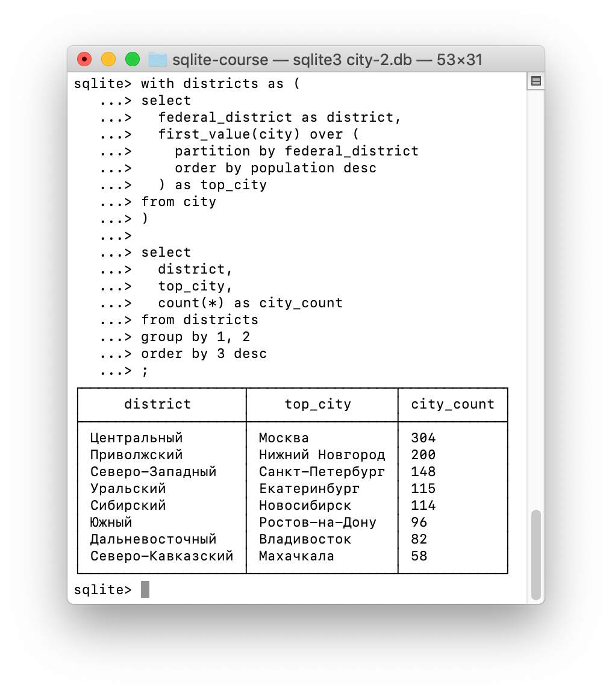
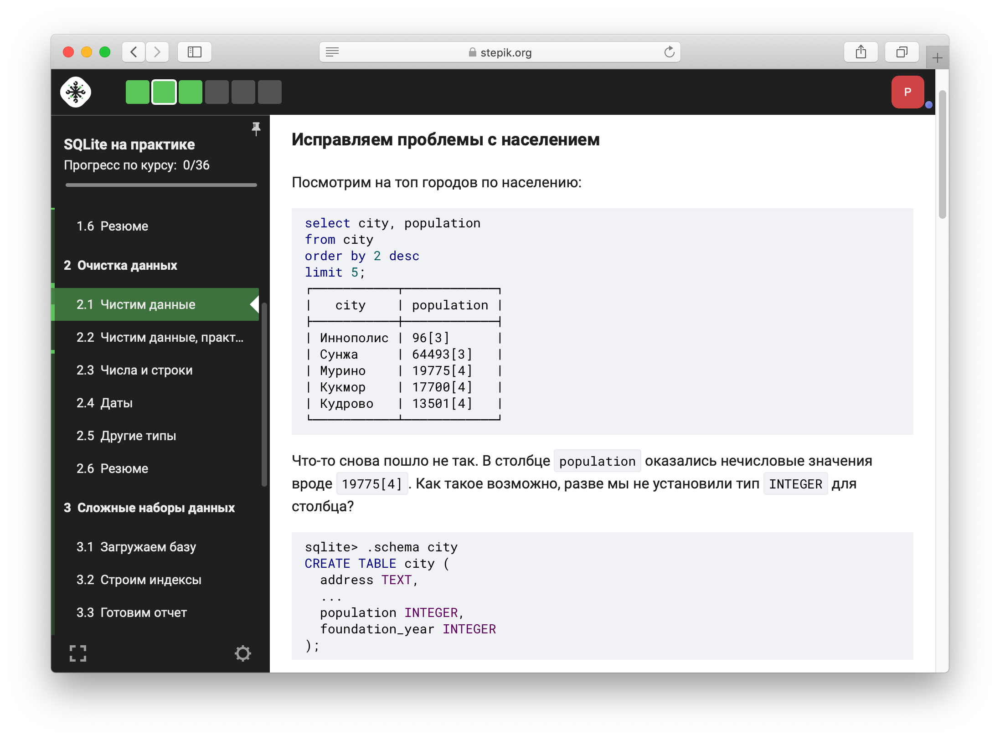
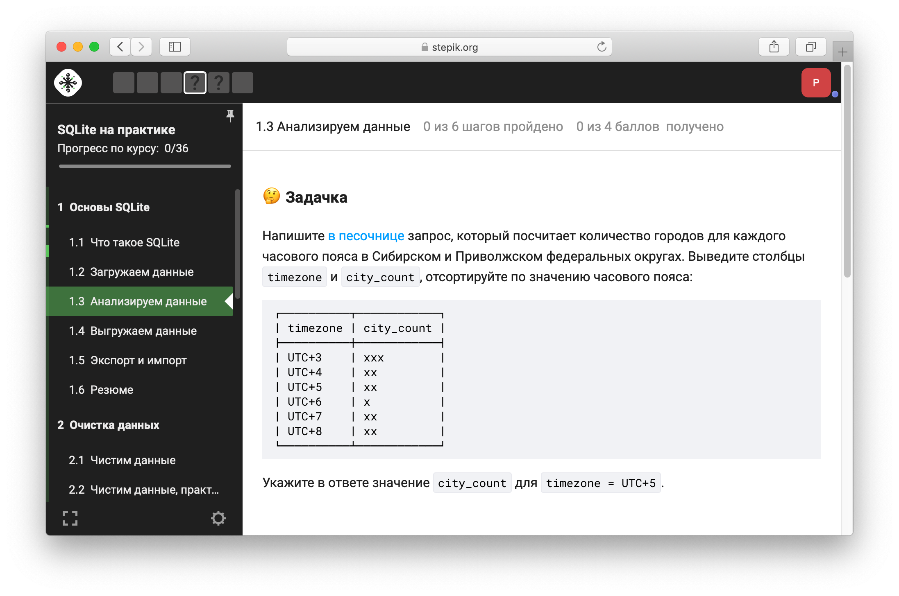
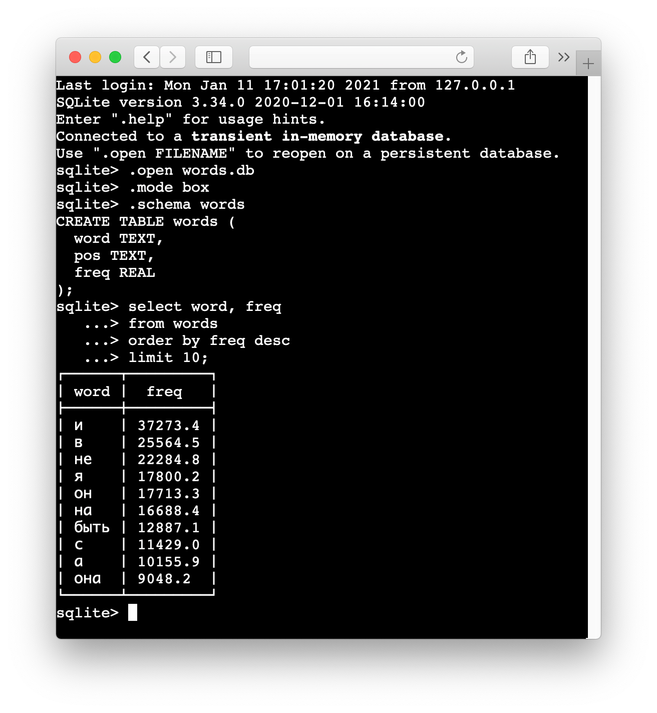
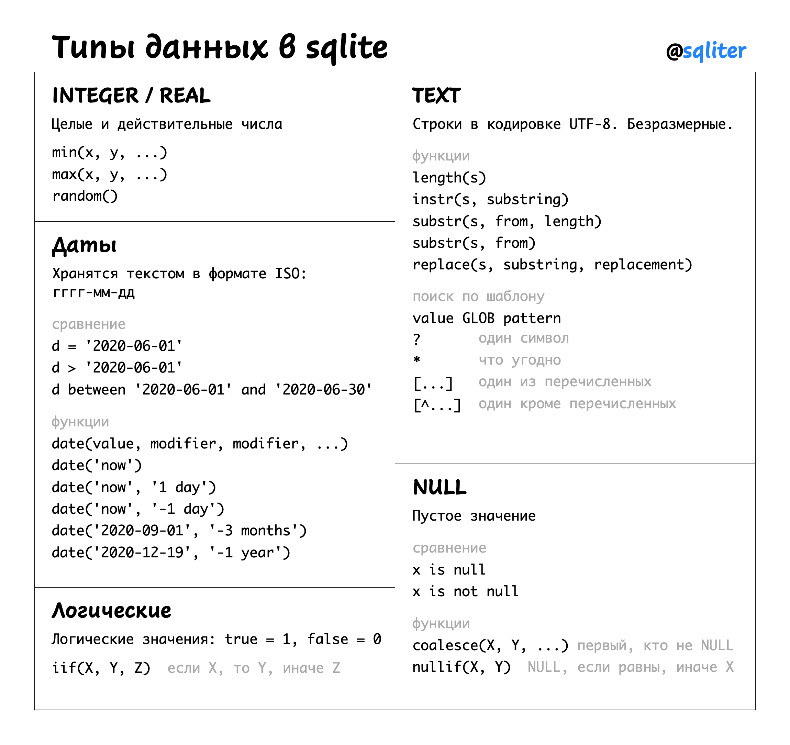
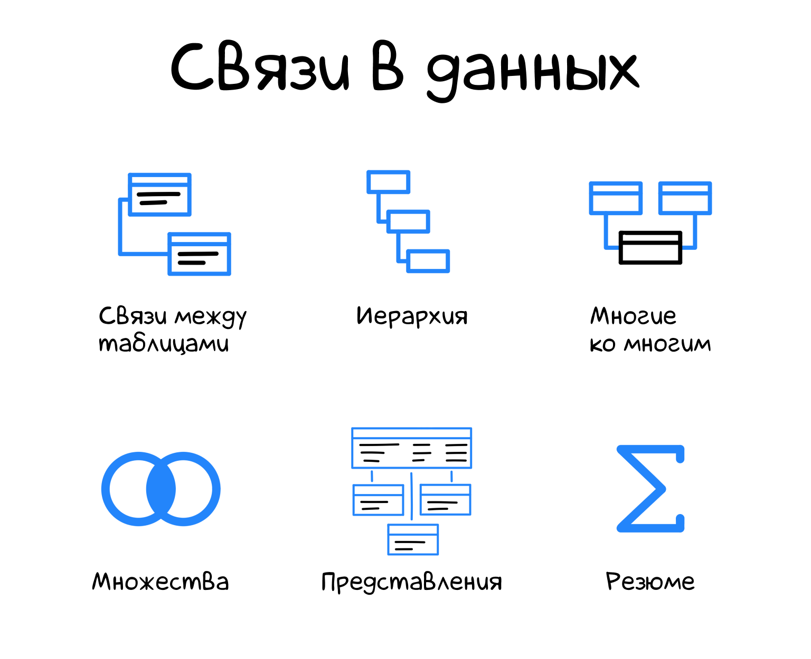
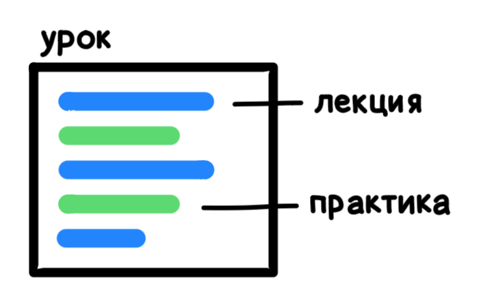

+++
date = 2021-01-12T11:45:44Z
description = "Как работать с данными без экселя и pandas."
featured = true
image = "/assets/projects/sqliter-2.png"
slug = "sqlite-course"
tags = ["sqlite", "project", "data"]
title = "SQLite для аналитики"
subscribe = "sqliter"
+++

*Я сделал интерактивный курс по прикладному анализу данных в SQLite. В этой заметке расскажу о нем и покажу, что внутри.*

Аналитики, разработчики и тестировщики часто работают с наборами данных. Посчитать статистику продаж в разных измерениях, преобразовать и «почистить» JSON неудобной структуры, найти проблемы в 500-мегабайтном логе nginx — похожие задачи приходится решать постоянно.

Чтобы проанализировать или преобразовать данные, часто используют Excel или библиотеки вроде pandas. Это неплохие инструменты: Excel удобен для самых простых задач, а pandas отлично подойдёт, как только вы посвятите ему первые 1000 часов.

Но есть ещё один инструмент. Намного мощнее Excel, проще и выразительнее pandas. Это SQLite — полноценная СУБД, которая не требует настройки и администрирования. SQLite использует SQL — язык, специально созданный для обработки данных — и добавляет к нему кучу приятных возможностей.

- [о чем курс](#about)
- [содержание](#syllabus)
- [что внутри](#inside)
- [как проходят занятия](#lessons)
- [стоимость](#pricing)

<h2 id="about">О чем и для кого</h2>

Курс расскажет, как использовать SQLite для повседневной работы с данными:

- Быстро проанализировать большой набор данных и найти неочевидные закономерности.
- Построить сводный отчет из нескольких источников, с группировками и аналитическими функциями.
- Загрузить, преобразовать и выгрузить данные в нужном формате.
- Удобно работать с JSON-документами.

<figure>
  
</figure>

Курс для вас, если:

- ✔️ Вы устали от возни с экселем или не хотите запоминать тысячу и одну команду pandas.
- ✔️ Уже знаете SQL и не хотите учить ещё один язык или библиотеку, чтобы решать повседневные задачи.
- ✔️ Хотите раз и навсегда освоить универсальный инструмент работы с данными.
- ✔️ Думаете, что SQLite — «игрушечная» СУБД, не пригодная для реальных задач.

Курс не подойдет, если:

- ❌ Вы совсем не знаете SQL.
- ❌ Не готовы работать с командной строкой.

Курс исключительно практический. Мы не будем разбирать пять вариантов конструкции FOREIGN KEY ON DELETE, уровни изоляции транзакций или разницу между нормальными формами. Вместо этого сфокусируемся на конкретных задачах — так вы сразу сможете применять знания в работе.

Вы сможете использовать SQLite на практике уже после первого модуля. А если пройдете курс до конца — SQLite превратится для вас в универсальный инструмент, которые подходит почти для любых задач.

Курс интерактивный. Упражнения можно выполнять прямо в браузере, не нужно ничего скачивать или устанавливать. Когда немного освоитесь — повторите их в консоли.

Навыки программирования не требуются.

<h2 id="syllabus">Содержание</h2>

1. **Основы SQLite**. Загружаем датасет, вспоминаем SQL, выгружаем в CSV.
2. **Очистка данных**. «Причесываем» проблемные данные и разбираемся с типами.
3. **Связи в данных**. Соединяем, объединяем и пересекаем таблицы в наборе данных.
4. **Данные → знания**. Считаем среднее, процентили, распределение и корреляцию. Анализируем текст.
5. **JSON**. Нативно работаем с JSON-документами и нереляционными структурами данных.
6. **Большие наборы**. Эффективно работаем с увесистыми таблицами.
7. **Оконные функции**. Осваиваем продвинутые аналитические функции для классных отчетов.

<h2 id="inside">Что внутри</h2>

Вот несколько инсайдов:

<figure>
  
  <figcaption class="align-center">Учимся приводить данные в порядок</figcaption>
</figure>

<figure>
  
  <figcaption class="align-center">Задачка на агрегацию данных</figcaption>
</figure>

<figure>
  
  <figcaption class="align-center">Интерактивная песочница в браузере</figcaption>
</figure>

    

<figure>
  
  <figcaption class="align-center">Шпаргалка по типам данных</figcaption>
</figure>

<figure>
  
  <figcaption class="align-center">Уроки одного из модулей</figcaption>
</figure>

<h2 id="lessons">Как проходят занятия</h2>

Курс проходит на «Степике» — это лучшая образовательная платформа в рунете. Собран из модулей, каждый модуль — отдельная большая тема: например, «JSON» или «оконные функции». Модуль состоит из 5–6 уроков. Урок состоит из лекции и нескольких практических заданий.

Практические задания участники выполняют в интерактивной песочнице. Ответы проверяются автоматически, ждать не придется. Если что-то не получается — участники задают вопросы в комментариях к заданию, я отвечаю.

Лекции письменные, видео нет. Я умею понятно объяснять сложные вещи, так что читать их приятно. Много примеров и картинок, нет сухой теории. В конце каждого модуля идет краткое резюме.

Прохождение модуля занимает 2–4 часа, зависит от вашей подготовки. Весь курс займет 15–30 часов.

<h2 id="reviews">Отзывы</h2>

Прямо сейчас курс проходят 130 человек, 20 уже закончили и получили сертификат. Вот некоторые отзывы:

> Искал для себя способ быстро освоить sqlite, чтобы научиться часть обработки данных переводить из Python на уровень СУБД. Курс идеально соответствует цели.

 

> Курс оправдал все ожидания и даже больше. Вся информация - с большим уважением к слушателю и огромной любовью к предмету изучения, разложена по полочкам. При этом, чтобы до них дотянуться, нужно все-таки поработать.

 

> Это точно курс не для совсем начинающих (о чём автор вовремя предупреждает), но это отличный материал для тех кто «как-то умеет в sql, но бессистемно».

 

> Можно порекомендовать любому, кому приходится анализировать больше пары табличек, и есть базовые знания SQL.

<h2 id="pricing">Стоимость и участие</h2>

Курс состоит из семи модулей и экзамена. Это 47 уроков и 130 практических заданий. Если наберете 80% баллов — получите сертификат, 90% баллов — сертификат с отличием.

Стоимость — **3000** ₽. Первый модуль доступен бесплатно.

<a class="button" href="https://stepik.org/z/90778">Перейти к курсу</a>

