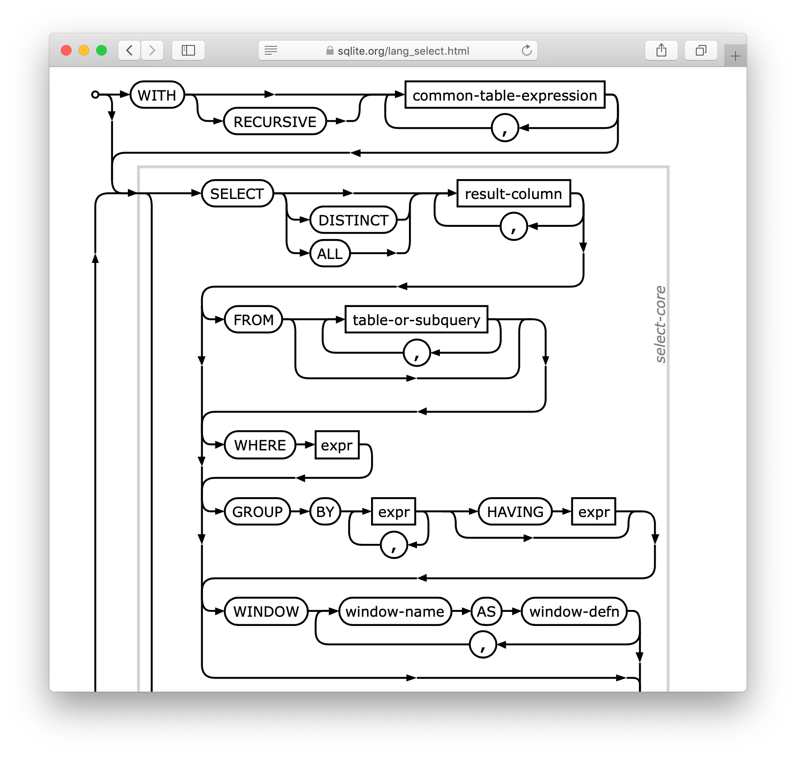
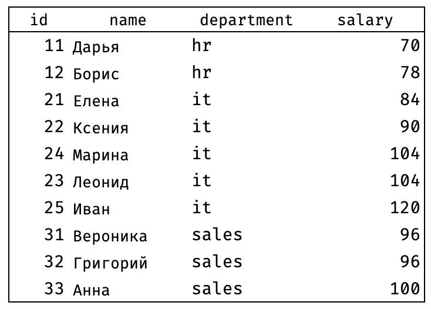
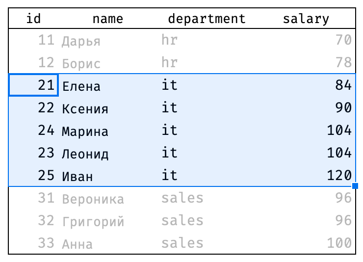

+++
date = 2021-03-15T14:37:23Z
description = "Главное правило для всех, кто пишет обучающие статьи, курсы и вообще что угодно для начинающих."
image = "/assets/projects/sin-2.jpg"
slug = "start-with-example"
tags = ["life", "60-sec"]
title = "Начни с примера"
+++

Главное правило для всех, кто пишет обучающие статьи, курсы и вообще что угодно для начинающих:

<blockquote class="big">
Начинайте с примеров, черт возьми
</blockquote>

Например, вы решили учить людей SQL. И первым делом подсовываете им такую замечательную схему SQL-запроса: 

Не, ну, а чо. Пусть сразу системному подходу учатся, правда?

Нет.

Начните с простых примерчиков. Расскажите про большую эксельку, которую можно фильтровать и сортировать. Покажите примитивные запросы на табличке из 10 записей. Нарисуйте элементарные картинки или сделайте гифку.

<figure>
  
  <figcaption><code>select * from employees</code></figcaption>
</figure>

<figure>
  
  <figcaption><code>where department = 'it'</code></figcaption>
</figure>

Не нужен начинающим «системный подход». Потом сами к нему придут.

Интересно, что на примере с базовым SQL почти все это понимают. Но стоит взять чуть более сложную тему — и привет. Начинают с многотомной классификации, зубодробительных схем внутреннего устройства и прочей жести. А примеры типа на потом оставим, когда «целостная картина» будет.

Не будет у людей целостной картины. Никакой картины не будет. Пока вы не начнете объяснять на примерах.
