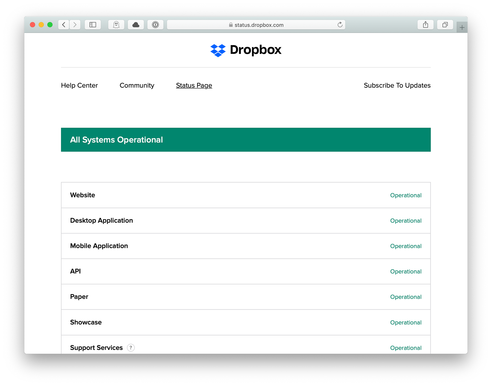
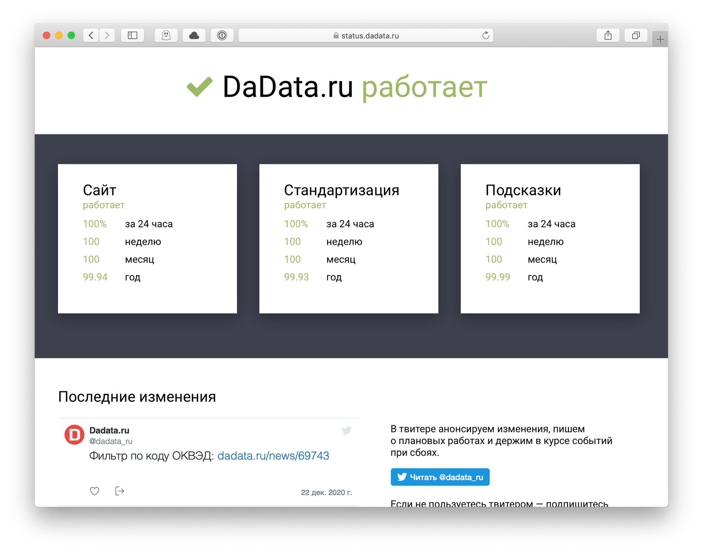

+++
date = 2021-01-08T15:06:47Z
description = "Покажите уже надежность вашего сервиса"
image = "/status-page/cover.png"
slug = "status-page"
tags = ["productology"]
title = "Аптайм на статус-странице"
+++

Есть такая штука у облачных сервисов — «статус-страница». Это отдельный, независимый от основного сайт, на котором написано, работает основной сервис или нет.

Статус-страница полезна, когда основной сервис свалился под ддос-атакой или от веселого пятничного обновления. Так пользователям есть куда пойти, чтобы понять масштаб проблемы и ход решения.

У большинства сервисов статус-страница сделана по такому шаблону:

1. Общий статус (работает / нет)
2. Статус отдельных сервисов (сайт, мобильное приложение, API, ...)
3. Список инцидентов.

<figure>
  
  <figcaption>Пример <a href="https://status.dropbox.com/">Dropbox</a></figcaption>
</figure>

Неплохая структура, отвечает на важный вопрос — «что-то сломалось?» Но не отвечает на второй важный вопрос — «насколько вы вообще надежные?».

Удивительно, но сервисы редко раскрывают общие показатели доступности. Хорошо, если покажут за 90 дней, за год — почти никогда.

Я думаю, нормальный подход — показывать доступность за день, неделю, месяц и год.

<figure>
  
  <figcaption>На «<a href="https://status.dadata.ru/">Дадате</a>» мы так и сделали</figcaption>
</figure>

В любом случае, даже плохая статус-страница лучше, чем никакой. Тем более, что подключить ее несложно — есть куча готовых инструментов. Даже бесплатные, вроде <a href="https://uptimerobot.com/">UptimeRobot</a> или <a href="https://upptime.js.org/">Upptime</a>.

Рекомендую!

<em>Заметка из телеграм-канала <i class="far fa-star color-sin"></i> «<a href="https://t.me/dangry">Интерфейсы без шелухи</a>»</em>

