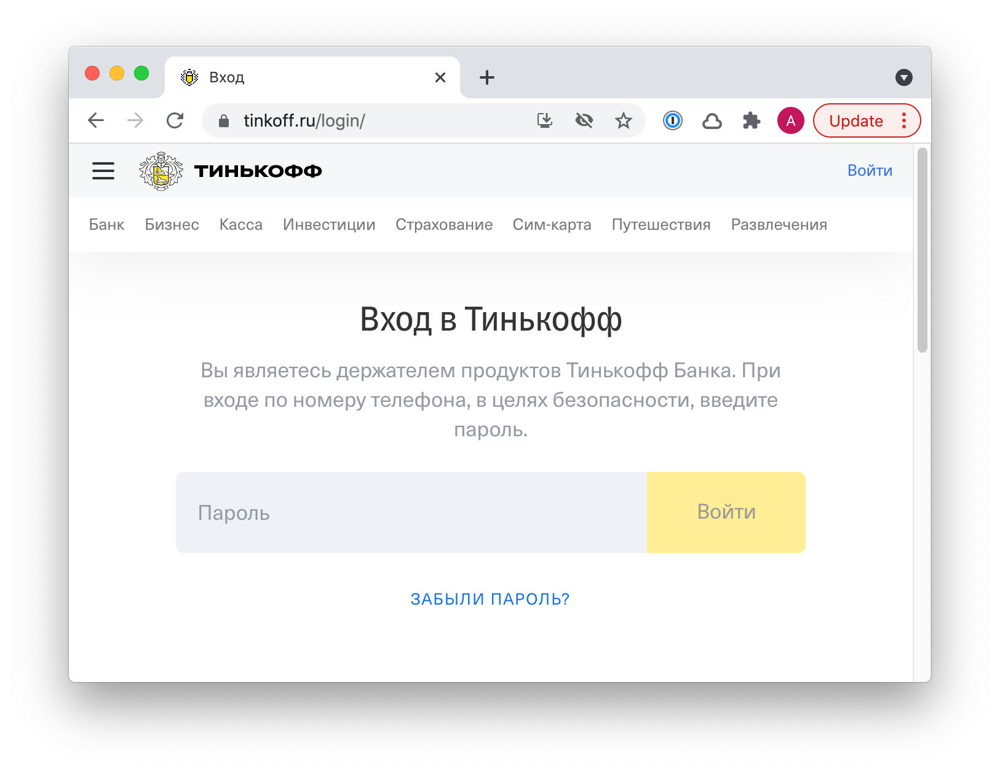

+++
date = 2021-10-07T13:49:33Z
description = "Помогаем Тинькову избавиться от косноязычия на форме входа."
image = "/tinkoff-signin/cover.png"
slug = "tinkoff-signin"
tags = ["interface"]
title = "Вы являетесь дизайнеру в страшном сне"
subscribe = "dangry"
+++

Интернет-банк Тинькова при входе встречает многозначительной надписью:

<figure>
  
</figure>

<blockquote class="big">
Вы являетесь держателем продуктов Тинькофф Банка. При входе по номеру телефона, в целях безопасности, введите пароль.
</blockquote>

Я, конечно, не UX-писатель, но это жуть какая кривая формулировка. Давайте попробуем улучшить.

## 1. Формулируем по-человечески

Меняем суконный язык банковских безопасников на нормальную речь.

<blockquote class="big">
Вы являетесь держателем продуктов Тинькофф Банка. При входе по номеру телефона, в целях безопасности, введите пароль. ↓
</blockquote>

<blockquote class="big">
Вы — клиент Тинькофф Банка. Введите пароль, чтобы войти.
</blockquote>

## 2. Убираем лишнее

Зачем писать человеку, что он клиент? Я и так это знаю, потому и пытаюсь войти в интернет-банк. Убираем.

<blockquote class="big">
Вы — клиент Тинькофф Банка. Введите пароль, чтобы войти. ↓
</blockquote>

<blockquote class="big">Введите пароль, чтобы войти.</blockquote>

## 3. Убираем очевидное

На этой же форме огроменное поле ПАРОЛЬ и кнопка ВОЙТИ. Спорим, человек догадается, чего от него хотят?

<blockquote class="big">Введите пароль, чтобы войти. ↓</blockquote>

<blockquote class="big">Ø</blockquote>

Что осталось:

<figure>
  
</figure>

## Q&A

> А это не юридический затык? У Тинькофа вроде всё хорошо с ux-райтингом во всех других местах.

У Тинькова есть некоторое количество сотрудников, которые умеют писать нормальный текст, и огромная армия тех, кто делать этого не умеет и не желает. Вторые иногда прорываются. Хотя первые в целом отлично справляются, да.

> Мне кажется, предполагать, что человек сразу поймет, куда он входит, слишком смело.

Действительно, он зашел на сайт Тинькова, нажал на «Войти», указал номер телефона. Конечно, он понятия не имеет, что делает.

> А может это было сделано по требованиям accessibility? Чтобы читалка озвучила, например.

Это делается иначе.

> Не уверен, что насчет этого можно сразу рассуждать предположениями. Как реально юзеры реагируют на такую форму можно понять только через исследования.

Не надо проводить исследования, чтобы исправить очевидные проблемы. Исследования не заменяют головной мозг, пользуйтесь им.
